<div align="center">

[](https://github.com/biotec-line)
[](https://github.com/open-bricks)
[](LICENSE)
[](https://www.python.org/)
[](https://samtools.github.io/hts-specs/)
[](https://www.ncbi.nlm.nih.gov/genome/guide/human/)
[](tests/)
[](SECURITY.md)
[](SECURITY.md)
[](SECURITY.md)
[](THIRD_PARTY_LICENSES.md)
[](MARKETING-LOG.txt)
[](llms.txt)

**[English](README.md)** • **[Deutsch](README.de.md)**

</div>

> [!TIP]
> **KI-Agenten & LLM-Kontext**: Dieses Repository stellt maschinenlesbare Architektur- und Auffindbarkeits-Metadaten in [`llms.txt`](llms.txt) sowie das Audit-Logbuch in [`MARKETING-LOG.txt`](MARKETING-LOG.txt) bereit.

---

## Schnellnavigation

1. [Übersicht](#1-übersicht)
2. [Kernfunktionen](#2-kernfunktionen)
3. [Zielgruppen & Auffindbarkeit](#3-zielgruppen--auffindbarkeit)
4. [Vergleichsmatrix gegenüber Alternativen](#4-vergleichsmatrix-gegenüber-alternativen)
5. [Governance- & Laufzeit-Invarianten](#5-governance--laufzeit-invarianten)
6. [Pipeline-Architektur & Datenfluss](#6-pipeline-architektur--datenfluss)
7. [Multi-Format-Ingestion & Build-Erkennung](#7-multi-format-ingestion--build-erkennung)
8. [Multi-Source-Annotation & INFO-Recycling](#8-multi-source-annotation--info-recycling)
9. [Qualitätsfilterung & Gen-Whitelists](#9-qualitätsfilterung--gen-whitelists)
10. [Desktop-GUI & Web Companion PWA](#10-desktop-gui--web-companion-pwa)
11. [Multi-Format-Export & Reporting](#11-multi-format-export--reporting)
12. [Cython-Hotpath-Beschleunigung](#12-cython-hotpath-beschleunigung)
13. [Installation & Schnellstart](#13-installation--schnellstart)
14. [Testsuite & Verifikations-Gates](#14-testsuite--verifikations-gates)
15. [Drittanbieter-Lizenzen & Transparenz](#15-drittanbieter-lizenzen--transparenz)
16. [Sicherheit & Schwachstellen-Meldung](#16-sicherheit--schwachstellen-meldung)
17. [Research-Use-Only-Grenze & Compliance](#17-research-use-only-grenze--compliance)
18. [Lizenz & Maintainer](#18-lizenz--maintainer)

---

<a id="1-übersicht"></a>
<a id="1-uebersicht"></a>
<a id="übersicht"></a>
<a id="uebersicht"></a>
<a id="1-overview"></a>
<a id="overview"></a>
## 1. Übersicht

# VFDistiller — lokales Desktop-Tool für VCF- und Variantenannotation

VFDistiller, auch Variant Fusion Distiller genannt, ist eine lokale Bioinformatik-Desktop-Anwendung für forschungsbezogene genetische Variantendateien. Das Tool konvertiert, filtert, annotiert und exportiert VCF, gVCF, 23andMe-Rohdaten und FASTA-Dateien auf dem eigenen Rechner, mit Windows-first-GUI und optionalen Offline-Ressourcen für Allelfrequenz-Lookups und Referenzgenom-Prüfungen.

> ⚠️ **Research Use Only / Nicht für klinische Diagnostik / Not for Clinical Use**
>
> VFDistiller ist ein **Forschungs- und Bioinformatik-Werkzeug** für die Analyse von VCF-Dateien aus genetischen Tests. Es ist:
>
> - **Kein IVD-Medizinprodukt** im Sinne der IVDR (EU) 2017/746
> - **Nicht CE-IVD-zertifiziert**, nicht durch BfArM oder eine Benannte Stelle geprüft
> - **Nicht für klinische Diagnostik** oder die Interpretation klinischer Testergebnisse (auch nicht im Consumer-Genomik-Kontext)
> - **Keine Gesundheitsempfehlung**, keine Diagnose, keine Prognose, keine Therapieempfehlung
> - Die angezeigten `ClinSig`-Werte (ClinVar) und Variant-Impact-Werte (VEP, AlphaGenome) sind **Datenbank-Annotationen zur Forschungsorientierung**, keine klinische Bewertung
>
> Nutzung ausschließlich für **Bioinformatik-Lehre, -Forschung und -Software-Entwicklung**. Für klinische Interpretation genetischer Befunde konsultieren Sie bitte qualifizierte humangenetische Fachstellen. Unentgeltliche Open-Source-Schenkung (§§ 516 ff. BGB). Haftung auf Vorsatz und grobe Fahrlässigkeit beschränkt (§ 521 BGB, AGPL-3.0 §§ 15–17). Nutzung auf eigenes Risiko.

Bioinformatisches Desktop-Tool zur Verarbeitung, Konvertierung und Annotation forschungsbezogener genetischer Variantendaten aus beliebigen Sequenzierungsquellen. Unterstützt VCF, gVCF, 23andMe-Rohformat und FASTA ohne harte Abhängigkeit von `pysam`, `bcftools` oder `samtools` und bleibt dadurch auf Windows-Workstations praktikabel.


---

<a id="2-kernfunktionen"></a>
<a id="kernfunktionen"></a>
<a id="2-key-capabilities"></a>
<a id="key-capabilities"></a>
## 2. Kernfunktionen

| Kernfunktion | Beschreibung |
|---|---|
| **Lokales Datenschutzmodell** | 100% lokale Datenverarbeitung; Rohsequenzen, generierte VCFs und SQLite-Datenbanken verbleiben auf der lokalen Maschine ohne automatischen Cloud-Egress. |
| **Automatische Log-Redaktion** | Integriertes `redact_for_logfile` schwärzt sensible genomische Koordinaten und rsIDs vor dem Schreiben in Logdateien, um Datenpannen zu verhindern. |
| **Universelle Multi-Format-Ingestion** | Nativer Streaming-Import von VCF v4.2, gVCF, 23andMe-Rohdaten (.txt) und FASTA-Dateien ohne Unix-Tools (`pysam`, `bcftools`, `samtools`). |
| **Automatische Build-Erkennung** | Zuverlässige Erkennung von GRCh37 (hg19) und GRCh38 (hg38) aus Header-Contigs, Chromosomenbezeichnungen und rsID-Positionsmarkern. |
| **Multi-Source-Annotation** | Kombiniert Offline-gnomAD LightDB (SQLite), ClinVar ClinSig, CADD-Scores, Ensembl VEP, ALFA, TOPMed und optionales Google AlphaGenome. |
| **INFO- & FORMAT-Metriken-Erhaltung** | Erhält probenspezifische Qualitätsmetriken (DP, GQ, AD, PL) und recycelt bestehende INFO-Felder über Export-Transformationen hinweg. |
| **Cython-Hotpath-Beschleunigung** | Optionale C-kompilierte Module (`vcf_parser`, `af_validator`, `key_normalizer`, `fasta_lookup`) mit bis zu 5x Gesamtsystem-Beschleunigung. |
| **Multi-Format-Forschungsexport** | Sofortiger Export gefilterter Variantenkohorten als annotiertes VCF v4.2, strukturiertes Excel (`.xlsx`), Standard-CSV und druckbare PDF-Berichte. |
| **Unprivilegierte Ausführung (`RunAsInvoker`)** | Läuft vollständig im Benutzerkontext ohne Administratorrechte, UAC-Prompts oder Hintergrund-Dienste. |

---

<a id="3-zielgruppen--auffindbarkeit"></a>
<a id="zielgruppen--auffindbarkeit"></a>
<a id="3-target-personas--discoverability"></a>
<a id="target-personas--discoverability"></a>
## 3. Zielgruppen & Auffindbarkeit

VFDistiller wurde entwickelt, um die Herausforderungen der genetischen Datenfilterung und Variantenannotation für vier Hauptzielgruppen zu lösen:

| Persona ID | Zielgruppe | Primärer Bedarf | VFDistiller-Lösungsansatz |
|---|---|---|---|
| `[PERSONA-01]` | **Klinische Genetiker & Molekularpathologen (Forschung)** | Schnelle Desktop-Triage und Priorisierung seltener genetischer Varianten und somatischer Mutationen in Forschungskohorten ohne Cloud-Dienste. | Windows-first ttkbootstrap GUI, integrierte Offline-Allelfrequenz-Annotation (gnomAD LightDB SQLite), ClinVar ClinSig, CADD-Scores und lokale Datenhaltung. |
| `[PERSONA-02]` | **Bioinformatik Core-Facility Ingenieure & Pipeline-Entwickler** | Konvertierung und Normierung zwischen Consumer-/Rohformaten (23andMe Rohdaten, FASTA) und Forschungsformaten (VCF, gVCF) auf Windows-Workstations. | Streaming-Parser für VCF/gVCF ohne `bcftools`/`pysam`-Zwang, automatische GRCh37/GRCh38 Build-Erkennung, 5x Beschleunigung durch Cython-Hotpaths. |
| `[PERSONA-03]` | **Seltene-Krankheiten-Forscher & Genom-Analysten** | Transparente Filterung nach Allelfrequenzen (AF < 0.007), CADD-Schwellenwerten, Gen-Whitelists und Read Depth mit flexiblem Multi-Format-Export. | Lokales SQLite-Indexing, anpassbare Filterregeln, INFO-Feld-Recycling und vollständige Erhaltung probenspezifischer FORMAT-Metriken (DP, GQ, AD, PL). |
| `[PERSONA-04]` | **Datenschutzbeauftragte & Klinische Labor-IT** | Höchste Anforderungen an den genetischen Datenschutz (DSGVO Art. 9, Gendiagnostikgesetz GenDG); Ausschluss von Datenabflüssen sensibler Sequenzdaten. | 100% Offline-fähiger Kern, automatische Redaktion von Loci und rsIDs in persistenten Logdateien (`redact_for_logfile`), unprivilegierte `RunAsInvoker`-Ausführung. |

### High-Intent Suchbegriffe

Zur Auffindbarkeit über wissenschaftliche Repositorien, Paketmanager und Suchmaschinen:
- `lokales VCF Varianten-Annotations-Desktop-Tool Windows` — Lokale Filterung und Variantenannotation mit GUI.
- `Offline gnomAD Allelfrequenz-Lookup SQLite Benutzeroberfläche` — Lokaler SQLite-basierter Allelfrequenz-Lookup ohne Webabfragen.
- `23andMe Rohdaten in annotiertes VCF konvertieren Python` — Direkte Konvertierung von Genotypisierungs-Rohdaten in Forschungs-VCF.
- `gVCF Streaming-Parser ohne Unix bcftools Abhängigkeit` — Windows-kompatibler genomischer VCF-Parser.
- `genetische Varianten filtern CADD ClinVar Forschung Lehre` — SNVs und Indels nach CADD-Score und ClinSig priorisieren.
- `datenschutzkonforme Genom-Analyse ohne Cloud-Upload DSGVO` — Zero-Egress Bioinformatik-Workstation-Applikation.
- `VCF FORMAT-Metriken Erhaltung Multiproben-Export Excel PDF` — Gefilterte Variantentabellen nach Excel und PDF mit DP/GQ-Metriken exportieren.
- `Cython beschleunigter VCF-Parser Bioinformatik Desktop-App` — Hochleistungs-C-Erweiterungen für die Variantenverarbeitung.

---

<a id="4-vergleichsmatrix-gegenüber-alternativen"></a>
<a id="4-vergleichsmatrix-gegenueber-alternativen"></a>
<a id="vergleichsmatrix-gegenüber-alternativen"></a>
<a id="vergleichsmatrix-gegenueber-alternativen"></a>
<a id="4-comparative-matrix-vs-alternatives"></a>
<a id="comparative-matrix-vs-alternatives"></a>
## 4. Vergleichsmatrix gegenüber Alternativen

Die folgende Matrix vergleicht VFDistiller mit etablierten Bioinformatik-Werkzeugen und Plattformen anhand von 10 technischen Dimensionen, die direkt unseren Governance-Invarianten entsprechen:

| Technische Dimension | Governance-Invariante | VFDistiller | Unix Shell Pipelines (bcftools/samtools) | Cloud-Varianten-Portale (BaseSpace/VarSome) | Desktop-Browser (IGV) | Annotations-Engines (VEP / SnpEff CLI) |
|:---|:---:|:---:|:---:|:---:|:---:|:---:|
| **1. Offline-First & Zero-Egress** | `INV-LOCAL-01` | **100% Local-First (Lokale Festplatte, SQLite, 0 Telemetrie)** | Hoch (Lokale CLI-Ausführung) | Niedrig (Obligatorischer Cloud-Upload von Genomdaten) | Hoch (Lokale Dateibetrachtung) | Hoch (Lokale Cache-Ausführung) |
| **2. Locus- & rsID-Log-Redaktion** | `INV-PRIVACY-02` | **Integriert (`redact_for_logfile` schützt Privatsphäre)** | Keine (Loci werden unmaskiert geloggt) | Risiko (Genomkoordinaten auf Fremdservern geloggt) | Keine (Lokale Session-Dateien unmaskiert) | Keine (Unmaskiertes Standard-Logging) |
| **3. Interaktive GUI & PWA Companion** | `INV-INSPECT-03` | **Desktop-GUI (ttkbootstrap) + Web Companion PWA** | Keine (Nur Headless-CLI) | Nur Web-Browser-Portal | Reichhaltiger Track-Browser | Keine (Nur Headless-CLI) |
| **4. Multi-Format-Ingestion** | `INV-CONVERT-04` | **VCF v4.2, gVCF, 23andMe, FASTA (Nativ)** | Nur VCF/BCF (Erfordert Konvertierungsskripte) | Nur VCF (Strenge Formatvorgaben) | Nur BAM/VCF-Ansicht (Keine Konvertierung) | Nur VCF |
| **5. Offline-Allelfrequenz-Engine** | `INV-OFFLINE-05` | **gnomAD LightDB SQLite (Schneller lokaler Lookup)** | Erfordert manuelle Tabix-Einrichtung & große VCFs | Abhängig von externen APIs | Entfernte Daten-Streams | Große lokale Cache-Dateien (~20–50 GB) |
| **6. Cython-Hotpath-Beschleunigung** | `INV-ACCEL-06` | **Optionale kompilierte C-Hotpaths (5x) + Fallback** | Native C/C++ Binaries | Remote-Cloud-Cluster | Java-Laufzeit | Perl / Java Laufzeit |
| **7. Multi-Format-Berichtsexport** | `INV-EXPORT-07` | **Erhalt von FORMAT-Metriken; VCF, CSV, Excel, PDF** | Nur VCF / TSV | PDF / Excel (Oft kostenpflichtig/SaaS) | Nur Screenshot / BED-Export | VCF / TXT tabellarische Ausgabe |
| **8. Unprivilegierte Ausführung** | `INV-UNPRIV-08` | **Strikte RunAsInvoker (Keine Admin-Rechte nötig)** | Standard-Benutzer-CLI | Web-Browser-Client | Standard-Benutzeranwendung | Standard-Benutzer-CLI |
| **9. Klare RUO-Abgrenzung** | `INV-COMPLY-09` | **Striktes Research Use Only (IVDR EU 2017/746 Abgrenzung)** | Forschungs-Bioinformatik | Oft uneindeutige klinische Aussagen | Forschungssoftware | Forschungssoftware |
| **10. Sicherheits-SLA & CI-Matrix** | `INV-SLA-10` | **48h Reaktions-SLA / Multi-OS CI-Matrix** | Community-Mailingliste | Kommerzielles Hersteller-SLA | Akademische / GitHub-Wartung | Akademische Release-Zyklen |

---

<a id="5-governance--laufzeit-invarianten"></a>
<a id="5-governance--runtime-invariants"></a>
<a id="governance--laufzeit-invarianten"></a>
<a id="governance--runtime-invariants"></a>
## 5. Governance- & Laufzeit-Invarianten

VFDistiller folgt zehn grundlegenden Governance- und Laufzeit-Invarianten:

- **`INV-LOCAL-01` (100% Local-First & Zero Egress):** Alle genetischen Sequenzdateien, erzeugten VCFs, Genomreferenzen, SQLite-Datenbanken und Konfigurationen verbleiben ausnahmslos auf der lokalen Workstation. Keine Telemetrie, keine Nutzungsstatistiken, keine automatisierten Netzwerkabflüsse.
- **`INV-PRIVACY-02` (Automatische Locus- & rsID-Log-Redaktion):** Sensible Genomkoordinaten und rsIDs werden vor dem Schreiben in persistente Logdateien über `redact_for_logfile` automatisch geschwärzt (DSGVO Art. 9 und GenDG Konformität).
- **`INV-INSPECT-03` (Barrierefreie Desktop-GUI & transparente Filterung):** Vollständige visuelle Inspektion aller Datensätze über die ttkbootstrap Desktop-GUI und Web Companion PWA; Filterkriterien (AF-Schwellenwerte, CADD-Score, ClinSig, Read Depth) sind transparent und frei konfigurierbar.
- **`INV-CONVERT-04` (Multi-Format-Ingestion & Standardkonformität):** Nahtlose Konvertierung und Ingestion von VCF v4.2, gVCF, 23andMe-Rohdaten und FASTA-Dateien ohne Unix-Zwang (`bcftools`, `samtools`, `pysam`).
- **`INV-OFFLINE-05` (Offline-Allelfrequenz- & Annotations-Kapazität):** Schnelle lokale Annotation über komprimierte SQLite LightDB (gnomAD) ohne Internetverbindung, ergänzt um optionale asynchrone REST-Endpunkte (VEP, MyVariant.info).
- **`INV-ACCEL-06` (Optionale Cython-Hotpaths mit Fallback):** C-kompilierte Cython-Module bieten bis zu 5x Geschwindigkeitszuwachs für VCF-Parsing und AF-Validierung, mit automatischem Fallback auf optimiertes Pure-Python.
- **`INV-EXPORT-07` (Formaterhalt & Multi-Report-Generierung):** VCF-Exporte erhalten probenspezifische FORMAT-Metriken (DP, GQ, AD, PL) und Multiprobendaten, mit flexiblem Export nach CSV, Excel (.xlsx) und PDF.
- **`INV-UNPRIV-08` (Unprivilegierte Ausführung — `RunAsInvoker`):** Die Anwendung läuft vollständig im unprivilegierten Benutzerkontext ohne Administratorrechte, Root-Zugriff oder UAC-Elevation.
- **`INV-COMPLY-09` (Strikte Research Use Only Grenze — RUO):** Eindeutige rechtliche Abgrenzung: Reines Forschungs- und Lehrmittel, KEIN In-vitro-Diagnostikum im Sinne der IVDR (EU) 2017/746 und nicht für diagnostische Entscheidungen zertifiziert.
- **`INV-SLA-10` (Open-Source Governance, 48h Sicherheits-SLA & Testabdeckung):** Freie Open-Source-Verteilung unter AGPL-3.0-or-later, vollständiges Drittanbieter-Lizenzaudit, 48-Stunden-Sicherheitsreaktions-SLA und automatisierte Regressionstests.

---

<a id="6-pipeline-architektur--datenfluss"></a>
<a id="pipeline-architektur--datenfluss"></a>
<a id="6-pipeline-architecture--dataflow"></a>
<a id="pipeline-architecture--dataflow"></a>
## 6. Pipeline-Architektur & Datenfluss

```mermaid
flowchart TD
    classDef input fill:#e0f2fe,stroke:#0284c7,stroke-width:1.5px,color:#0c4a6e;
    classDef process fill:#f1f5f9,stroke:#64748b,stroke-width:1.5px,color:#0f172a;
    classDef anno fill:#fef3c7,stroke:#d97706,stroke-width:1.5px,color:#78350f;
    classDef filter fill:#fce7f3,stroke:#db2777,stroke-width:1.5px,color:#831843;
    classDef output fill:#dcfce7,stroke:#16a34a,stroke-width:1.5px,color:#14532d;

    subgraph Inputs ["1. Multi-Format-Eingabe (Lokal)"]
        VCF["VCF / VCF.GZ (v4.2)"]:::input
        GVCF["gVCF (Genomisches VCF)"]:::input
        RAW["23andMe-Rohdaten (.txt)"]:::input
        FASTA["FASTA-Referenz (.fa)"]:::input
    end

    subgraph Core ["2. Ingestion & Build-Erkennung"]
        PARSER["Streaming-Parser / Cython-Hotpath"]:::process
        BUILD["Build-Erkennung<br/>GRCh37 (hg19) / GRCh38 (hg38)"]:::process
        PARSER --> BUILD
    end

    subgraph Annotation ["3. Multi-Source-Annotationsschicht"]
        GNOMAD["gnomAD LightDB (Offline SQLite)"]:::anno
        MYVAR["MyVariant.info (REST)"]:::anno
        VEP["Ensembl VEP (Async aiohttp)"]:::anno
        ALFA["ALFA / TOPMed"]:::anno
        AG["AlphaGenome API (Optional)"]:::anno
    end

    subgraph QualityGate ["4. Qualität & Klinische Filterung"]
        AF_FILT["AF-Schwellenwert (z.B. &lt; 0.007)"]:::filter
        CADD_FILT["CADD-Highlight-Score"]:::filter
        CLIN_FILT["ClinVar / ClinSig & Variant-Impact"]:::filter
        GENE_FILT["Gen-Whitelist / FILTER=PASS"]:::filter
    end

    subgraph Outputs ["5. Interaktive GUI & Multi-Format-Export"]
        GUI["ttkbootstrap Interaktive Tabelle"]:::output
        EXP_VCF["Annotierter VCF-Export"]:::output
        EXP_DOC["CSV / Excel (.xlsx) / PDF-Bericht"]:::output
    end

    Inputs --> PARSER
    BUILD --> Annotation
    Annotation --> QualityGate
    QualityGate --> Outputs
```



### Screenshot-Galerie

| Haupt-Arbeitsbereich | Filter- & Exportsteuerung |
|---|---|
|  |  |

---

<a id="7-multi-format-ingestion--build-erkennung"></a>
<a id="multi-format-ingestion--build-erkennung"></a>
<a id="7-multi-format-ingestion--build-detection"></a>
<a id="multi-format-ingestion--build-detection"></a>
## 7. Multi-Format-Ingestion & Build-Erkennung

VFDistiller liest genetische Variantendateien aus diversen Sequenzier-Pipelines und Consumer-Diensten direkt ein:

- **Standard VCF 4.2 (`.vcf`, `.vcf.gz`):** Streaming-Dekomprimierung und zeilenweises Parsen von Einzel- und Mehrproben-VCFs.
- **Genomic VCF (`gVCF`):** Block-Kompression für Nicht-Varianten und Genotyp-Konfidenzfilterung.
- **23andMe Rohdaten (`.txt`):** Direkte Übersetzung von 4-spaltigen tab-separierten Genotypisierungsdateien (`rsid`, `chromosome`, `position`, `genotype`) in valide VCF-Datensätze mit Referenz-Allel-Validierung gegen lokale FASTA-Referenzen.
- **FASTA-Referenzvalidierung (`.fa`, `.fasta`):** Schnelle indexbasierte (`.fai`) Nukleotid-Sequenzextraktion zur Verifikation von Referenzbasen gegen humanbiologische Assemblierungen.
- **Automatische Build-Erkennung:** Analysiert Header-Contigs, Chromosomenbezeichnungen und Koordinaten, um festzustellen, ob die Daten **GRCh37 (hg19)** oder **GRCh38 (hg38)** entsprechen (manuelle Umschaltung in der GUI jederzeit möglich).

---

<a id="8-multi-source-annotation--info-recycling"></a>
<a id="multi-source-annotation--info-recycling"></a>
<a id="8-multi-source-annotation--info-recycling-de"></a>
<a id="multi-source-annotation--info-recycling-de"></a>
## 8. Multi-Source-Annotation & INFO-Recycling

VFDistiller verbindet Offline-Referenzdaten mit wissenschaftlichen Online-Schnittstellen:

1. **gnomAD LightDB (Offline-SQLite):** Lokale komprimierte Datenbank mit Exom- und Genom-Allelfrequenzen wichtiger globaler Populationen. Lookups erfolgen im Submillisekundenbereich.
2. **INFO-Feld-Recycling:** Bereits vorhandene Annotationen in den Eingangs-VCFs (z. B. SnpEff, ANNOVAR, CADD) werden automatisch erkannt und bei Exporten erhalten.
3. **Asynchrones Ensembl VEP:** Asynchrone REST-Batchabfragen via `aiohttp` für Transkript-Konsequenzen, HGVS-Nomenklatur und Proteinveränderungen ohne Blockierung der Benutzeroberfläche.
4. **MyVariant.info & NCBI ClinVar:** Anreicherung von Varianten mit klinischer Signifikanz (`ClinSig`), Review-Status und Phänotyp-Assoziationen.
5. **AlphaGenome API (Optional):** Optionale Anbindung an Google DeepMinds Genom-KI über persönliche API-Schlüssel.

---

<a id="9-qualitätsfilterung--gen-whitelists"></a>
<a id="9-qualitaetsfilterung--gen-whitelists"></a>
<a id="qualitätsfilterung--gen-whitelists"></a>
<a id="qualitaetsfilterung--gen-whitelists"></a>
<a id="9-quality-filtering--gene-whitelists"></a>
<a id="quality-filtering--gene-whitelists"></a>
## 9. Qualitätsfilterung & Gen-Whitelists

Millionen roher Sequenzvarianten lassen sich gezielt auf relevante Kandidaten eingrenzen:

- **Allelfrequenz-Schwellenwert:** Häufige Polymorphismen ausblenden (z. B. `AF < 0.007` oder individuelle Werte) über globale oder populationsspezifische Frequenzen.
- **Read Depth & Genotyp-Qualität:** Probenbezogene Filterung nach minimaler Lesetiefe (`DP >= 20`) und Genotyp-Qualität (`GQ >= 30`).
- **Pathogenitäts-Hervorhebung:** Sofortige visuelle Markierung von Varianten über CADD-Schwellenwerten (z. B. `CADD > 22.0`) oder mit Pathogenic/Likely Pathogenic Einstufung in ClinVar.
- **Gen-Whitelists & Gen-Panels:** Laden eigener Gensymbol-Listen (z. B. ACMG Secondary Findings v3.2, Kardiomyopathie-Panel), um die Ansicht auf Zielgene zu beschränken.
- **Filter-Status:** Umschaltung zwischen Anzeige aller Varianten oder ausschließlich solcher mit `FILTER=PASS`.

---

<a id="10-desktop-gui--web-companion-pwa"></a>
<a id="desktop-gui--web-companion-pwa"></a>
<a id="10-desktop-gui--web-companion-pwa-de"></a>
<a id="desktop-gui--web-companion-pwa-de"></a>
## 10. Desktop-GUI & Web Companion PWA

- **Moderne ttkbootstrap Oberfläche:** Dunkle und helle Farbschemata, interaktive sortierbare Tabellenansicht und Live-Fortschrittsbalken.
- **System-Tray-Integration:** Über `pystray` realisiert; erlaubt die Minimierung langer Annotationsläufe in den Infobereich der Taskleiste.
- **Web Companion PWA (`web_companion/`):** Progressive Web App Oberfläche mit Web-App-Manifest und Vektor-Assets für lokale Netzwerkvorschauen.
- **Zweisprachigkeit:** Vollständige deutsche und englische Lokalisierung über `locales/translations.json`.

---

<a id="11-multi-format-export--reporting"></a>
<a id="multi-format-export--reporting"></a>
<a id="11-multi-format-export--reporting-de"></a>
<a id="multi-format-export--reporting-de"></a>
## 11. Multi-Format-Export & Reporting

Exportieren Sie gefilterte Variantensätze im passenden Format:

- **Annotiertes VCF 4.2:** Standardisiertes VCF mit neu hinzugefügten Annotationen im INFO-Feld und vollständiger Erhaltung probenspezifischer FORMAT-Felder (`DP`, `GQ`, `AD`, `PL`).
- **Excel-Arbeitsmappe (`.xlsx`):** Strukturierte Tabelle mit automatischer Spaltenbreitenanpassung, bedingter Formatierung und anklickbaren Hyperlinks zu NCBI, ClinVar und Ensembl.
- **Standard-CSV / TSV:** Saubere Textdateien für R, pandas oder externe Pipelines.
- **PDF-Forschungsbericht:** Übersichtlicher druckbarer Bericht via ReportLab mit Pipeline-Parametern, Qualitätsstatistiken und Kandidatentabellen.

---

<a id="12-cython-hotpath-beschleunigung"></a>
<a id="cython-hotpath-beschleunigung"></a>
<a id="12-cython-hotpath-acceleration"></a>
<a id="cython-hotpath-acceleration"></a>
## 12. Cython-Hotpath-Beschleunigung

Optionale C-kompilierte Cython-Module ermöglichen bis zu **5x Gesamtsystem-Beschleunigung** (z. B. 50.000 Varianten in 3 statt 15 Minuten):

| Modul | Speedup | Optimierte Funktionalität |
|---|---|---|
| `vcf_parser.pyx` | **8x** | Schnelles Streaming-VCF-Line-Parsing und Validierung |
| `af_validator.pyx` | **100x** | Schneller numerischer Grenzwertvergleich für Allelfrequenzen |
| `key_normalizer.pyx` | **25x** | Schnelle Normalisierung von Chromosomen und Positions-Keys |
| `fasta_lookup.pyx` | **100x** | Schnelle Nukleotidsequenz-Extraktion aus Referenzdateien |

Ist kein C-Compiler vorhanden, greift VFDistiller automatisch auf reine Python-Fallbacks zurück.

---

<a id="13-installation--schnellstart"></a>
<a id="installation--schnellstart"></a>
<a id="13-installation--quickstart"></a>
<a id="installation--quickstart"></a>
## 13. Installation & Schnellstart

### Voraussetzungen
- Python 3.10+
- Betriebssystem: Windows 10/11 (primär), Linux und macOS (experimentell)

### Installationsschritte

VFDistiller wird **ausschließlich über GitHub** unter AGPL-3.0-or-later verteilt.

```bash
# 1. Repository klonen
git clone https://github.com/biotec-line/VFDistiller.git
cd VFDistiller

# 2. Abhängigkeiten installieren
pip install -r requirements.txt

# 3. Optional: Cython-Beschleunigung kompilieren (erfordert C-Compiler)
cd cython_hotpath
python setup.py build_ext --inplace
cd ..

# 4. Anwendung starten
python Variant_Fusion_pro_V17.py
```

Unter Windows kann der Start direkt über `START.bat` oder die Erstellung der Standalone-EXE über `build_exe.bat` erfolgen.

### Konfiguration & Referenzen

- **Einstellungen:** Beim ersten Start wird `variant_fusion_settings.json` aus dem Template erzeugt.
- **gnomAD LightDB:** Für schnelle Offline-Lookups kann die lokale SQLite-Datenbank über die GUI oder per Skript heruntergeladen werden:
  ```bash
  python "Get gnomAD DB light.py"
  ```
- **FASTA-Referenzen:** Genomreferenzen (GRCh37 / GRCh38) können im Projektverzeichnis abgelegt werden; `.fai`-Indizes werden automatisch generiert.

---

<a id="14-testsuite--verifikations-gates"></a>
<a id="testsuite--verifikations-gates"></a>
<a id="14-test-suite--verification-gates"></a>
<a id="test-suite--verification-gates"></a>
## 14. Testsuite & Verifikations-Gates

Das Repository erzwingt deterministische Qualitäts-Gates:

```bash
# Gesamte Testsuite ausführen (148 passed, 10 subtests)
python -m pytest

# Schnelle Regressionstests
python -m pytest -q

# Plattform-Smoke-Test
python tests/source_platform_smoke.py

# Bytecode-Kompilierung prüfen
python -m compileall -q .

# Linter-Prüfung
ruff check .
```

---

<a id="15-drittanbieter-lizenzen--transparenz"></a>
<a id="drittanbieter-lizenzen--transparenz"></a>
<a id="15-third-party-licenses--transparency"></a>
<a id="third-party-licenses--transparency"></a>
## 15. Drittanbieter-Lizenzen & Transparenz

VFDistiller legt Wert auf offene und transparente Software-Governance. Sämtliche Laufzeit- und Entwicklungsabhängigkeiten sind in [`THIRD_PARTY_LICENSES.md`](THIRD_PARTY_LICENSES.md) und [`THIRD_PARTY_LICENSES.txt`](THIRD_PARTY_LICENSES.txt) auditiert:

- **Keine Copyleft-Auswirkung auf Forschungsdaten:** Vom Anwender eingelesene Sequenzdaten, erzeugte VCFs und Berichte bleiben uneingeschränktes Eigentum des Forschers und unterliegen keinem Copyleft-Zwang.
- **`pystray` (LGPL-3.0-or-later):** Das System-Tray-Modul wird dynamisch verlinkt (LGPLv3 § 4 konform). Anwender haben das Recht, das Modul im Python-Environment auszutauschen oder zu aktualisieren.
- **Unprivilegierte Laufzeit (`RunAsInvoker`):** Die Anwendung arbeitet vollständig im regulären Benutzerkontext ohne Administratorrechte.

---

<a id="16-sicherheit--schwachstellen-meldung"></a>
<a id="sicherheit--schwachstellen-meldung"></a>
<a id="16-security--vulnerability-reporting"></a>
<a id="security--vulnerability-reporting"></a>
## 16. Sicherheit & Schwachstellen-Meldung

Sicherheit und Schutz genetischer Daten sind fundamentale Pfeiler:

- **Local-First & Zero-Egress:** Sensible genetische Daten verlassen zu keinem Zeitpunkt das lokale Gerät.
- **Automatische Log-Redaktion:** Vom `MultiSinkLogger` geschriebene Protokolle werden über `redact_for_logfile` automatisch von Chromosomenkoordinaten, rsIDs und Dateipfaden bereinigt.
- **48-Stunden Sicherheits-SLA:** Jede gemeldete Schwachstelle erhält innerhalb von 48 Stunden eine Eingangsbestätigung sowie eine Triage-Einstufung innerhalb von 5 Werktagen.
- **Meldewege:** Meldungen bitte über GitHub [Security Advisories](https://github.com/biotec-line/VFDistiller/security/advisories) oder per E-Mail an `security@biotec-line.org` bzw. `security@open-bricks.org`. Siehe [`SECURITY.md`](SECURITY.md).

---

<a id="17-research-use-only-grenze--compliance"></a>
<a id="research-use-only-grenze--compliance"></a>
<a id="17-research-use-only-boundary--compliance"></a>
<a id="research-use-only-boundary--compliance"></a>
## 17. Research-Use-Only-Grenze & Compliance

**Vertriebsumstellung & Regulatorische Abgrenzung:**
VFDistiller wurde am 12.04.2026 aus dem Microsoft Store zurückgezogen und wird nun **ausschließlich über GitHub** als reines Open-Source-Forschungs- und Lehrmittel unter AGPL-3.0-or-later vertrieben.

**Hintergrund:** Unter der europäischen Verordnung über In-vitro-Diagnostika (IVDR (EU) 2017/746) hätte die Bereitstellung in einem allgemeinen App-Store in Verbindung mit Genomik-Tools das Risiko einer Einstufung als IVD-Medizinprodukte-Software (IVD-MDSW) bergen können. Die Projektleitung entschied sich für den klaren Rückzug aus dem Store, um eine eindeutige **Research Use Only (RUO)** Grenze zu wahren.

- **Kein IVD-Medizinprodukt:** Nicht durch das BfArM oder eine Benannte Stelle geprüft, keine CE-Kennzeichnung.
- **Nicht für klinische Diagnosen:** Darf nicht für diagnostische, prognostische oder therapeutische Entscheidungen herangezogen werden.
- **Lehr- und Forschungskontext:** Ausschließlich für bioinformatische Lehre, Algorithmen-Entwicklung und Laborforschung bestimmt.

---

<a id="18-lizenz--maintainer"></a>
<a id="lizenz--maintainer"></a>
<a id="18-license--maintainers"></a>
<a id="license--maintainers"></a>
## 18. Lizenz & Maintainer

**[AGPL-3.0-or-later](LICENSE)** (GNU Affero General Public License, Version 3 oder neuer). **Kostenfrei. Dauerhaft.**

- **Copyright (C) 2026 Lukas Geiger** (c/o Um:bruch Think Tank)
- Verwaltet unter der **[biotec-line](https://github.com/biotec-line)** Bioinformatik-Organisation im **[open-bricks](https://github.com/open-bricks)** Dachökosystem.
- Vollständiger Lizenztext: [LICENSE](LICENSE) • Rechtliche Hinweise: [NOTICE](NOTICE)
- Unentgeltliche Open-Source-Schenkung (§§ 516 ff. BGB). Haftung auf Vorsatz und grobe Fahrlässigkeit beschränkt (§ 521 BGB, AGPL-3.0 §§ 15–17). Nutzung auf eigenes Risiko.
