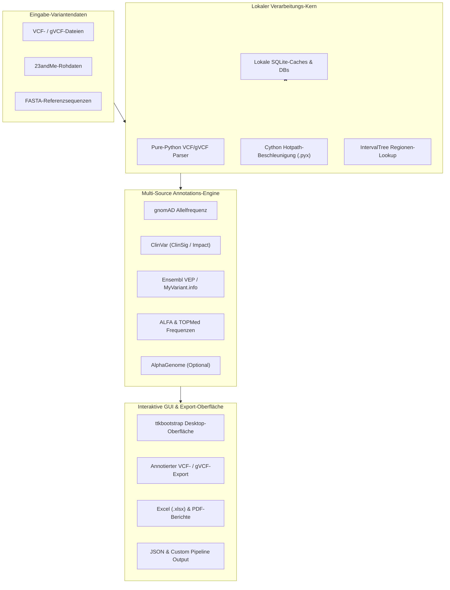
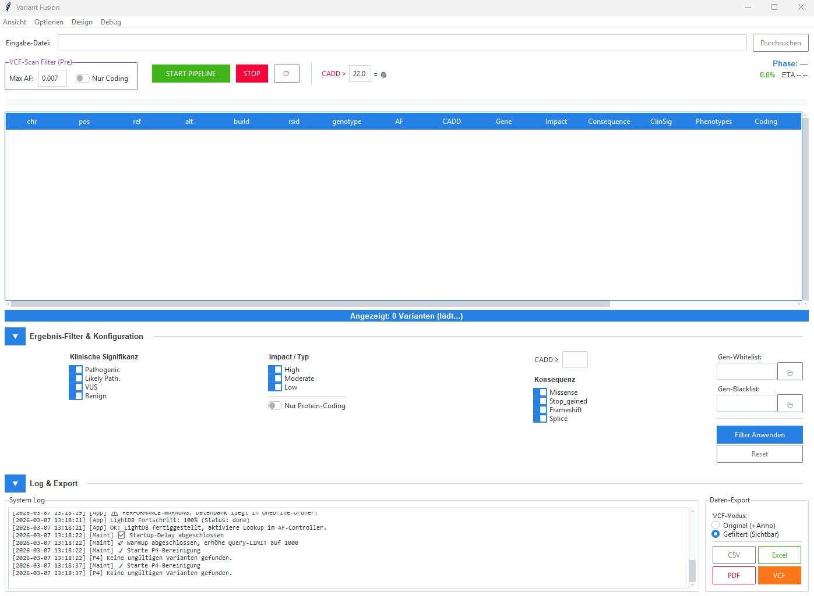

# VFDistiller — lokales Desktop-Tool für VCF- und Variantenannotation

[](https://www.gnu.org/licenses/agpl-3.0.html)
[](https://www.python.org/)
[](tests/)
[](https://github.com/biotec-line/VFDistiller)
[](SECURITY.md)

VFDistiller, auch Variant Fusion Distiller genannt, ist eine lokale
Bioinformatik-Desktop-Anwendung für forschungsbezogene genetische
Variantendateien. Das Tool konvertiert, filtert, annotiert und exportiert VCF,
gVCF, 23andMe-Rohdaten und FASTA-Dateien auf dem eigenen Rechner, mit
Windows-first-GUI und optionalen Offline-Ressourcen für Allelfrequenz-Lookups
und Referenzgenom-Prüfungen.

> ⚠️ **Research Use Only / Nicht für klinische Diagnostik / Not for Clinical Use**
>
> VFDistiller ist ein **Forschungs- und Bioinformatik-Werkzeug** für die Analyse
> von VCF-Dateien aus genetischen Tests. Es ist:
>
> - **Kein IVD-Medizinprodukt** im Sinne der IVDR (EU) 2017/746
> - **Nicht CE-IVD-zertifiziert**, nicht durch BfArM oder eine Benannte Stelle geprüft
> - **Nicht für klinische Diagnostik** oder die Interpretation klinischer
>   Testergebnisse (auch nicht im Consumer-Genomik-Kontext)
> - **Keine Gesundheitsempfehlung**, keine Diagnose, keine Prognose, keine
>   Therapieempfehlung
> - Die angezeigten `ClinSig`-Werte (ClinVar) und Variant-Impact-Werte (VEP,
>   AlphaGenome) sind **Datenbank-Annotationen zur Forschungsorientierung**,
>   keine klinische Bewertung
>
> Nutzung ausschließlich für **Bioinformatik-Lehre, -Forschung und -Software-
> Entwicklung**. Für klinische Interpretation genetischer Befunde konsultieren
> Sie bitte qualifizierte humangenetische Fachstellen.
>
> Unentgeltliche Open-Source-Schenkung (§§ 516 ff. BGB). Haftung auf Vorsatz
> und grobe Fahrlässigkeit beschränkt (§ 521 BGB, AGPL-3.0 §§ 15–17).
> Nutzung auf eigenes Risiko.

Bioinformatisches Desktop-Tool zur Verarbeitung, Konvertierung und Annotation
forschungsbezogener genetischer Variantendaten aus beliebigen
Sequenzierungsquellen. Unterstützt VCF, gVCF, 23andMe-Rohformat und FASTA ohne
harte Abhängigkeit von pysam, bcftools oder samtools und bleibt dadurch auf
Windows-Workstations praktikabel.


## Warum VFDistiller?

- **VCF- und gVCF-Desktop-Workflow** für Forschung, Lehre und
  Bioinformatik-Softwareentwicklung, wenn eine GUI praktischer ist als eine
  reine Shell-Pipeline.
- **Lokales Datenschutzmodell** für sensible genetische Dateien: Rohdaten,
  erzeugte VCFs, SQLite-Caches, Genomreferenzen und API-Keys bleiben lokal.
- **Windows-kompatible Variantenannotation** ohne harte Abhängigkeit von
  Unix-Bioinformatikwerkzeugen wie `bcftools`, `samtools` oder `pysam`.
- **Multi-Source-Annotation** kombiniert wiederverwendete INFO-Felder mit
  gnomAD, MyVariant.info, Ensembl VEP, ALFA, TOPMed, ClinVar-orientierten
  Feldern und optionalen AlphaGenome-Daten.
- **Research-Use-Only-Grenze** ist im Projekt klar markiert: kein
  Diagnoseprodukt, kein Medizinprodukt, keine klinische Zweckbestimmung.

> [!NOTE]
> **LLM- & KI-Integrationsgrenze:** VFDistiller arbeitet zu 100 % lokal-first. Rohdaten, konvertierte VCFs, Genomreferenzen, SQLite-Caches, lokale Einstellungen und API-Schlüssel verbleiben auf der Workstation des Nutzers und werden niemals an externe KI-Endpunkte oder Cloud-Crawler übertragen, außer wenn dies vom Nutzer explizit konfiguriert wird.

## Systemarchitektur



## Screenshot-Galerie

| Hauptarbeitsbereich | Filter- und Exportbereich |
|---|---|
|  |  |

## Vertriebsänderung (2026-04-12)

VFDistiller wurde am 2026-04-12 im Microsoft Store **zurückgezogen** (Listing
auf "nicht verfügbar" gesetzt — echtes Löschen ist im Partner Center nicht
vorgesehen) und wird seitdem **ausschließlich über GitHub** als reines Open-
Source-Forschungs-Tool unter AGPL-3.0-or-later vertrieben. Das Store-Listing
ist nicht mehr öffentlich auffindbar, neue Installationen über den Store sind
nicht mehr möglich. Bereits installierte Kopien laufen lokal weiter, erhalten
aber keine weiteren Updates.

**Hintergrund:** Bei erneuter Prüfung gegen die IVDR (EU) 2017/746 (In-vitro-
Diagnostika-Verordnung) hätte die Kombination aus Store-Vertrieb und
Consumer-Genomik-nahen Features die App in die Nähe einer IVD-MDSW-
Einstufung gerückt. Der Projektverantwortliche hat sich für die sauberste
Lösung entschieden — den Rückzug des Store-Listings — statt
für ein BfArM-Abgrenzungsverfahren (§ 6 MPDG) oder eine aufwendige
CE-IVD-Zertifizierung.

**Konsequenzen:**
- Bereits installierte Store-Versionen laufen lokal weiter; es gibt keine weiteren Updates über den Store.
- Neue Nutzer: Repository klonen, über PyInstaller/uv bauen oder das GitHub-Releases-Archiv verwenden.
- Die Lizenz bleibt unverändert (AGPL-3.0-or-later, eingeführt am 2026-04-12).
- Zweckbestimmung bleibt: **Research Use Only — Bioinformatik-Tool für VCF-Analyse. Kein Medizinprodukt.**

**Repository-Status (2026-06-18):**
- In Git liegen Quellcode, Dokumentation, Tests, Workflow-Metadaten, Packaging-Vorlagen und das App-Icon.
- Genomreferenzen, heruntergeladene Gen-Annotationen, lokale Einstellungen, SQLite-Caches/-Datenbanken, Logs, Build-Ausgaben, Release-Archive und Store-Binaries werden per `.gitignore` ausgeschlossen und bleiben lokal.
- Projekt-Locks und agenteninterne Implementierungspläne werden per `.gitignore` ausgeschlossen und bleiben rein lokal.
- API-Keys werden nicht committed; dafür die generierte `variant_fusion_settings.json` oder lokale Umgebungskonfiguration verwenden.

**Wartungsstand (2026-05-23):**
- `START.bat` startet eine lokale `dist\VFDistiller.exe`, wenn sie vorhanden ist, und fällt sonst auf den Python-Quellcode zurück.
- LightDB-SQLite-Lookups schließen ihre Verbindung jetzt über einen defensiven `finally`-Block, auch bei Cursor- oder Setup-Fehlern.
- Die gepflegte Regressionssuite ist `python -m pytest -q`.

## Features

- **Multi-Format-Import** — VCF, gVCF, 23andMe-Rohformat (.txt), FASTA (.fa/.fasta)
- **Automatische Build-Erkennung** — GRCh37 / GRCh38 aus Header, Contigs oder RSID-Positionen
- **Multi-Source-Annotation** — gnomAD, MyVariant.info, Ensembl VEP, ALFA, TOPMed, AlphaGenome
- **INFO-Recycling** — Vorhandene VCF-Annotationen werden wiederverwendet
- **Filterung** — AF-Schwelle, CADD-Score, Variant Impact, ClinSig, Genlisten, FILTER=PASS, Read Depth
- **Export** — CSV, Excel, PDF, annotiertes VCF (gefiltert oder vollständig)
- **GUI** — ttkbootstrap-Oberfläche mit System-Tray, Fortschrittsanzeige, Themes
- **Performance** — Optionaler Cython-Hotpath (5x Gesamt-Speedup), SQLite-Batch-Writes, async HTTP via aiohttp
- **Hintergrund-Wartung** — Automatisches Nachladen fehlender Annotationen im Leerlauf
- **Mehrsprachig** — Deutsch und Englisch (JSON-basierte Übersetzungen)

## Suchbegriffe

- VCF-Annotation Desktop-App
- gVCF-Filter-GUI
- 23andMe-Rohdaten zu annotiertem VCF
- lokale genetische Variantenanalyse
- Windows-Bioinformatik-Desktop-Tool
- Offline-gnomAD-Allelfrequenz-Lookup
- FASTA-Referenzprüfung mit GUI
- Research-Use-Only-Software für Variantenannotation

## Voraussetzungen

- Python 3.10+
- Windows 10/11 (primär getestet), Linux/macOS experimentell

### Installation

VFDistiller wird **ausschließlich über GitHub** vertrieben (kein Microsoft
Store, kein Paketmanager). Empfohlene Installationswege:

1. **GitHub-Releases** — neuestes Paket-Archiv (falls verfügbar) unter
   [Releases](https://github.com/biotec-line/VFDistiller/releases) herunterladen.
2. **Source-Build** — Repository klonen und Abhängigkeiten installieren:

```bash
git clone https://github.com/biotec-line/VFDistiller.git
cd VFDistiller

# Abhängigkeiten installieren
pip install -r requirements.txt

# Optional: Cython-Beschleunigung (erfordert C-Compiler)
pip install cython
cd cython_hotpath
python setup.py build_ext --inplace
cd ..
```

3. **Lokaler Windows-Build** — `build_exe.bat` oder `python build_release.py`
   ausführen. Der Build folgt `.SOFTWARE/BUILD-VERFAHREN.md`, nutzt das lokale
   Arbeitsverzeichnis `C:\_Local_DEV\codex_build\vfdistiller\`, spiegelt die
   fertige `dist\VFDistiller.exe` zurück ins Projekt und erstellt ein
   versioniertes Release-ZIP in `releases/`.

### Tests

Die gepflegte Regressionssuite aus dem Repository-Root starten:

```bash
python -m pytest -q
```

`pytest.ini` beschränkt die automatische Sammlung auf `tests/`. Die beiden
`test_performance.py`-Dateien sind ausführbare Benchmark-/Correctness-Skripte
und werden bewusst direkt gestartet:

```bash
python test_performance.py
python cython_hotpath/test_performance.py
```

Diese Trennung hält CI auf deterministische Regressionsabdeckung fokussiert,
während die Benchmark-Skripte für manuelle Performance-Prüfungen verfügbar
bleiben.

### Genomreferenzen (optional, für FASTA-Validierung)

Die Genomreferenzen (GRCh37/GRCh38) müssen separat heruntergeladen werden (~3 GB pro Build):

```bash
# GRCh37
wget https://ftp.ensembl.org/pub/grch37/current/fasta/homo_sapiens/dna/Homo_sapiens.GRCh37.dna.primary_assembly.fa.gz
gunzip Homo_sapiens.GRCh37.dna.primary_assembly.fa.gz

# GRCh38
wget https://ftp.ensembl.org/pub/release-112/fasta/homo_sapiens/dna/Homo_sapiens.GRCh38.dna.primary_assembly.fa.gz
gunzip Homo_sapiens.GRCh38.dna.primary_assembly.fa.gz
```

Die Dateien ins Projektverzeichnis legen. Beim ersten Start wird automatisch ein `.fai`-Index erzeugt.

### gnomAD LightDB (optional)

Für schnelle Offline-AF-Lookups kann die gnomAD LightDB heruntergeladen werden. Das Tool bietet beim ersten Start einen Download-Dialog an. Alternativ:

```bash
python "Get gnomAD DB light.py"
```

## Verwendung

### GUI starten

```bash
python Variant_Fusion_pro_V17.py
```

Oder unter Windows:

```
START.bat
```

### Workflow

1. **Datei öffnen** — VCF, gVCF, 23andMe-Textdatei oder FASTA wählen
2. **Build prüfen** — Wird automatisch erkannt, kann manuell überschrieben werden
3. **Pipeline läuft** — Varianten werden geparst, annotiert und gefiltert
4. **Ergebnisse** — Tabellenansicht mit sortierbaren Spalten, Doppelklick öffnet externe Datenbanken
5. **Export** — CSV, Excel, PDF oder annotiertes VCF exportieren

### Konfiguration

Beim ersten Start wird `variant_fusion_settings.json` aus der Vorlage `variant_fusion_settings.json.example` erstellt. Wichtige Einstellungen:

| Einstellung | Beschreibung | Standard |
|---|---|---|
| `af_threshold` | Allele-Frequency-Schwelle | 0.007 |
| `include_none` | Varianten ohne AF anzeigen | false |
| `cadd_highlight_threshold` | CADD-Score-Hervorhebung | 22.0 |
| `stale_days` | Tage bis AF-Refresh | 200 |
| `alphagenom_key` | Google AlphaGenome API-Key | (leer) |
| `quality_settings` | VCF-Record-Level Filter | siehe Example |

### API-Keys

- **AlphaGenome**: Erfordert einen Google AI API-Key. In `variant_fusion_settings.json` unter `alphagenom_key` und `api_settings.phase6_ag.alphagenom.api_key` eintragen.
- **NCBI**: Optional für höhere Rate-Limits. Unter `api_settings.global.ncbi_api_key` eintragen.

## Dependencies

### Core (erforderlich)

| Paket | Lizenz | Zweck |
|---|---|---|
| requests | Apache 2.0 | HTTP-Requests |
| psutil | BSD | CPU/Memory-Monitoring |
| Pillow | PIL License | Icon/Image-Processing |
| intervaltree | Apache 2.0 | Genomische Intervalle |
| ttkbootstrap | MIT | Moderne GUI-Themes |
| pystray | MIT | System-Tray-Icon |
| aiohttp | Apache 2.0 | Async HTTP-Fetching |
| scipy | BSD | Statistik |

### Optional

| Paket | Lizenz | Zweck |
|---|---|---|
| openpyxl | MIT | Excel-Export |
| reportlab | BSD | PDF-Export |
| numpy | BSD | Array-Operationen |
| biopython | Biopython License | Sequenz-Alignment |
| pyfaidx | MIT | FASTA-Indexierung |
| cython | Apache 2.0 | Hot-Path-Kompilierung |

## Cython-Beschleunigung

Optionale C-kompilierte Hot-Paths für kritische Operationen:

| Modul | Speedup | Funktion |
|---|---|---|
| `vcf_parser.pyx` | 8x | VCF-Zeilen-Parsing |
| `af_validator.pyx` | 100x | AF-Validierung |
| `key_normalizer.pyx` | 25x | Variant-Key-Normalisierung |
| `fasta_lookup.pyx` | 100x | FASTA-Sequenz-Lookup |

Gesamt-Pipeline-Speedup: ~5x (50k Varianten: 15 min -> 3 min).

Wenn Cython nicht installiert ist, werden automatisch Python-Fallbacks verwendet.

## Projektstruktur

```
VFDistiller/
├── Variant_Fusion_pro_V17.py .... Hauptprogramm (GUI + Pipeline)
├── requirements.txt ............. Python-Abhängigkeiten
├── variant_fusion_settings.json.example . Konfigurations-Vorlage
├── VFDistiller.spec ............. PyInstaller Build-Konfiguration
├── START.bat .................... Windows-Schnellstart
│
├── cython_hotpath/ .............. Optionale Cython-Module
│   ├── __init__.py .............. CythonAccelerator Hauptklasse
│   ├── vcf_parser.pyx .......... VCF-Parsing
│   ├── af_validator.pyx ......... AF-Validierung
│   ├── key_normalizer.pyx ....... Key-Normalisierung
│   ├── fasta_lookup.pyx ......... FASTA-Lookup
│   ├── setup.py ................. Build-Script
│   └── test_performance.py ...... Benchmarks
│
├── data/annotations/ ............ Laufzeit-/Download-Cache für Gen-Annotationen (ignoriert)
│
├── locales/
│   └── translations.json ........ Übersetzungen (de/en)
│
├── ICO/ICO.ico .................. App-Icon
│
├── lightdb_index_worker.py ...... gnomAD LightDB Hintergrund-Indexierung
├── translator.py ................ Übersetzungs-Engine
├── translator_patch.py .......... Übersetzungs-Patches
├── manage_translations.py ....... Übersetzungs-Verwaltung
├── Get gnomAD DB light.py ....... gnomAD Download-Tool
├── test_performance.py .......... Performance-Tests
│
├── ARCHITECTURE.md .............. Entwickler-Dokumentation
└── README/ ...................... Erweiterte Dokumentation & Lizenzen
    └── licenses/
        ├── LICENSE.txt .......... Hauptlizenz
        └── THIRD_PARTY_LICENSES.txt . Third-Party-Lizenzen
```

## Lizenz

**[AGPL-3.0-or-later](LICENSE)** (GNU Affero General Public License, Version 3
oder jede neuere Version). **Kostenlos. Dauerhaft.**

- Copyright (C) 2026 Lukas Geiger (c/o Um:bruch Think Tank)
- Volltext: [LICENSE](LICENSE), Haftungshinweise: [NOTICE](NOTICE)
- Vorgängerlizenz: Die frühere „VFDistiller License v1.0" wurde abgelöst
  und liegt zur Nachvollziehbarkeit in
  [`docs/archive/`](docs/archive/VFDistiller_License_v1_legacy.md).

Kurz gefasst:

- Nutzen, studieren, modifizieren, weitergeben: **erlaubt**, kostenlos.
- Weitergabe (einschließlich Forks, Re-Packaging, kostenpflichtiger Support):
  **erlaubt**, aber abgeleitete Werke müssen unter AGPL-3.0-or-later bleiben.
- **Network-/SaaS-Nutzung (AGPL § 13):** Wer eine modifizierte Version auf
  einem Server betreibt, mit dem Nutzer über ein Netzwerk interagieren,
  muss diesen Nutzern den Quellcode zugänglich machen.
- **Kein Weiterverkauf dieses Codes als Closed-Source-Produkt.** Jede
  abgeleitete Arbeit bleibt AGPL.
- Die Software ist **nicht medizinisch validiert** und darf nicht für
  klinische Diagnosen oder Therapieentscheidungen verwendet werden
  (siehe RUO-Banner oben und [NOTICE](NOTICE)).

Third-Party-Bibliotheken behalten ihre jeweiligen Lizenzen (MIT, BSD,
Apache 2.0, PIL License, Biopython License). Siehe
[`README/licenses/THIRD_PARTY_LICENSES.txt`](README/licenses/THIRD_PARTY_LICENSES.txt).

> **Vertrieb:** VFDistiller wird ausschließlich über GitHub vertrieben
> (siehe [Vertriebsänderung (2026-04-12)](#vertriebsänderung-2026-04-12)
> oben). Das frühere Microsoft-Store-Listing wurde zurückgezogen.

## Version

V17.0 — Aktuelle Produktionsversion (März 2026).

---

🇬🇧 [English version](README.md)
