<div align="center">

[](https://github.com/biotec-line)
[](https://github.com/open-bricks)
[](LICENSE)
[](https://www.python.org/)
[](https://samtools.github.io/hts-specs/)
[](https://www.ncbi.nlm.nih.gov/genome/guide/human/)
[](tests/)
[](SECURITY.md)
[](SECURITY.md)
[](SECURITY.md)
[](THIRD_PARTY_LICENSES.md)
[](MARKETING-LOG.txt)
[](llms.txt)

**[English](README.md)** • **[Deutsch](README.de.md)** • **[Español](README.es.md)**

</div>

> [!TIP]
> **Contexto para Agentes de IA y LLMs**: Este repositorio proporciona metadatos de arquitectura legibles por máquina en [`llms.txt`](llms.txt) y el historial de auditoría en [`MARKETING-LOG.txt`](MARKETING-LOG.txt).

---

## Navegación Rápida

1. [Resumen](#1-overview)
2. [Capacidades Clave](#2-key-capabilities)
3. [Perfiles Objetivo y Descubrimiento](#3-target-personas--discoverability)
4. [Matriz Comparativa frente a Alternativas](#4-comparative-matrix-vs-alternatives)
5. [Gobernanza e Invariantes de Ejecución](#5-governance--runtime-invariants)
6. [Arquitectura del Pipeline y Flujo de Datos](#6-pipeline-architecture--dataflow)
7. [Ingestión Multiformato y Detección de Ensamblaje](#7-multi-format-ingestion--build-detection)
8. [Anotación Multifuente y Reciclaje de INFO](#8-multi-source-annotation--info-recycling)
9. [Filtrado de Calidad y Listas Blancas de Genes](#9-quality-filtering--gene-whitelists)
10. [Interfaz de Escritorio y PWA Complementaria](#10-desktop-gui--web-companion-pwa)
11. [Exportación Multiformato e Informes](#11-multi-format-export--reporting)
12. [Aceleración de Hotpaths con Cython](#12-cython-hotpath-acceleration)
13. [Instalación e Inicio Rápido](#13-installation--quickstart)
14. [Suite de Pruebas y Puertas de Verificación](#14-test-suite--verification-gates)
15. [Licencias de Terceros y Transparencia](#15-third-party-licenses--transparency)
16. [Seguridad y Reporte de Vulnerabilidades](#16-security--vulnerability-reporting)
17. [Límite Estricto de Solo para Investigación y Cumplimiento](#17-research-use-only-boundary--compliance)
18. [Licencia y Mantenedores](#18-license--maintainers)

---

<a id="1-overview"></a>
<a id="overview"></a>
<a id="1-resumen"></a>
<a id="resumen"></a>
## 1. Resumen

# VFDistiller — herramienta de escritorio local-first para anotación de variantes genéticas y VCF

VFDistiller (Variant Fusion Distiller) es una aplicación de escritorio bioinformática local-first para archivos de variantes genéticas de grado de investigación. Convierte, filtra, anota y exporta datos en formato VCF, gVCF, texto sin formato de 23andMe y FASTA directamente en la máquina del usuario, con una interfaz gráfica para Windows y recursos sin conexión opcionales para la consulta de frecuencias alélicas y validación del genoma de referencia.

> ⚠️ **Research Use Only / Solo para uso en investigación / Nicht für klinische Diagnostik**
>
> VFDistiller es una herramienta de investigación bioinformática. **NO** es un producto sanitario para diagnóstico in vitro (IVDR (UE) 2017/746), **NO** cuenta con marcado CE, **NO** ha sido evaluado por el BfArM ni por ningún organismo notificado y **NO** está destinado a diagnósticos clínicos, pronósticos o decisiones terapéuticas. Las clasificaciones ClinSig y el impacto de variantes son anotaciones de bases de datos de investigación de terceros, no evaluaciones médicas. Donación de código abierto sin coste; responsabilidad limitada a dolo y negligencia grave (§ 521 BGB, AGPL-3.0 §§ 15–17). Úselo bajo su propia responsabilidad.


---

<a id="2-key-capabilities"></a>
<a id="key-capabilities"></a>
<a id="2-capacidades-clave"></a>
<a id="capacidades-clave"></a>
## 2. Capacidades Clave

| Capacidad | Descripción |
|---|---|
| **Arquitectura de Privacidad Local-First** | Procesamiento 100% sin conexión; las secuencias sin procesar, VCFs generados y bases de datos SQLite permanecen localmente sin salida a la nube. |
| **Redacción Automática de Registros** | El mecanismo integrado `redact_for_logfile` elimina automáticamente coordenadas genómicas y rsIDs de los archivos de registro en disco. |
| **Ingestión Multiformato Universal** | Procesamiento fluido de VCF v4.2, gVCF, datos crudos de 23andMe y FASTA sin dependencias exclusivas de Unix (`pysam`, `bcftools`, `samtools`). |
| **Detección Automática del Ensamblaje** | Identificación automática de ensamblajes GRCh37 (hg19) y GRCh38 (hg38) a partir de contigs del encabezado y coordenadas. |
| **Capa de Anotación Multifuente** | Integra gnomAD LightDB sin conexión (SQLite), ClinVar ClinSig, puntuaciones CADD, Ensembl VEP, ALFA, TOPMed y Google AlphaGenome opcional. |
| **Preservación de Métricas INFO y FORMAT** | Conserva las métricas de calidad de genotipo por muestra (DP, GQ, AD, PL) y reutiliza campos INFO existentes en la exportación. |
| **Aceleración de Hotpaths con Cython** | Extensiones compiladas en C (`vcf_parser`, `af_validator`, `key_normalizer`, `fasta_lookup`) que proporcionan hasta un factor de aceleración de 5x. |
| **Exportación Científica Multiformato** | Exportación instantánea a VCF v4.2 anotado, hojas estructuradas de Excel (`.xlsx`), CSV estándar e informes impresos en PDF. |
| **Ejecución No Privilegiada (`RunAsInvoker`)** | Funciona estrictamente en el espacio de usuario sin requerir elevación de administrador, permisos UAC o servicios en segundo plano. |

---

<a id="3-target-personas--discoverability"></a>
<a id="target-personas--discoverability"></a>
<a id="3-perfiles-objetivo--descubrimiento"></a>
<a id="perfiles-objetivo--descubrimiento"></a>
## 3. Perfiles Objetivo y Descubrimiento

VFDistiller está diseñado para resolver los desafíos de filtrado de datos genómicos y anotación de variantes para cuatro perfiles principales:

| ID del Perfil | Público Objetivo | Necesidad Principal | Solución Arquitectónica de VFDistiller |
|---|---|---|---|
| `[PERSONA-01]` | **Genetistas Clínicos y Patólogos Moleculares (Investigación)** | Triaje rápido de variantes y priorización en enfermedades raras y casos somáticos sin dependencias en la nube. | GUI ttkbootstrap orientada a Windows, gnomAD LightDB local (SQLite), ClinVar ClinSig, resaltado CADD y procesamiento sin salida a internet. |
| `[PERSONA-02]` | **Ingenieros de Core Facilities y Desarrolladores de Pipelines** | Conversión directa entre datos direct-to-consumer (23andMe, FASTA) y formatos VCF/gVCF estándar en estaciones Windows. | Parser de streaming VCF/gVCF sin herramientas Unix (`bcftools`/`pysam`), detección automática de build GRCh37/GRCh38 y aceleración Cython 5x. |
| `[PERSONA-03]` | **Investigadores de Enfermedades Raras y Analistas Genómicos** | Filtrado transparente por frecuencia alélica (AF < 0.007), profundidad de lectura, umbrales de patogenicidad y listas de genes. | Indexación SQLite local-first, listas blancas de genes personalizadas, reciclaje de campos INFO y exportación multiformato (Excel, PDF, VCF). |
| `[PERSONA-04]` | **Responsables de Protección de Datos y Laboratorios Clínicos Offline** | Cumplimiento absoluto con normativas de privacidad genética (RGPD / GDPR Art. 9), garantizando que las variantes no salgan en registros externos. | Arquitectura 100% funcional sin conexión, redacción automática de logs (`redact_for_logfile`), modo no privilegiado `RunAsInvoker` y frontera RUO explícita. |

---

<a id="4-comparative-matrix-vs-alternatives"></a>
<a id="comparative-matrix-vs-alternatives"></a>
<a id="4-matriz-comparativa-frente-a-alternativas"></a>
<a id="matriz-comparativa-frente-a-alternativas"></a>
## 4. Matriz Comparativa frente a Alternativas

| Dimensión Técnica | Invariante | VFDistiller | Pipelines Unix (bcftools/samtools) | Portales Cloud (BaseSpace/VarSome) | Visores Desktop (IGV) | Motores de Anotación (VEP/SnpEff CLI) |
|:---|:---:|:---:|:---:|:---:|:---:|:---:|
| **1. Offline-First y Zero Egress** | `INV-LOCAL-01` | **100% Local-First (Disco local, SQLite, sin telemetría)** | Alta (Ejecución CLI local) | Baja (Subida obligatoria de datos genéticos) | Alta (Visualización de archivos locales) | Alta (Ejecución con caché local) |
| **2. Redacción de Logs (Loci y rsID)** | `INV-PRIVACY-02` | **Integrada (`redact_for_logfile` protege privacidad)** | Nula (Loci impresos en logs estándar) | Riesgo (Coordenadas registradas en servidores remotos) | Nula (Sesiones con coordenadas locales) | Nula (Registro sin enmascarar) |
| **3. GUI Interactiva y PWA** | `INV-INSPECT-03` | **GUI Desktop (ttkbootstrap) + PWA Companion** | Nula (Solo CLI) | Solo portal web | Navegador de tracks enriquecido | Nula (Solo CLI) |
| **4. Ingestión Multiformato** | `INV-CONVERT-04` | **VCF v4.2, gVCF, 23andMe, FASTA (Nativo)** | Solo VCF/BCF (Requiere scripts adicionales) | Solo VCF | Solo visualización BAM/VCF | Solo VCF |
| **5. Motor Local de Frecuencias** | `INV-OFFLINE-05` | **gnomAD LightDB SQLite (Consulta local ultra-rápida)** | Requiere configuración manual tabix | Consultas dependientes de API | Flujos de recursos remotos | Archivos de caché grandes (~20–50 GB) |
| **6. Aceleración Cython** | `INV-ACCEL-06` | **Hotpaths en C opcionales (aceleración 5x) + fallback** | Binario C/C++ nativo | Clúster de cálculo remoto | Entorno de ejecución Java | Entorno Perl / Java |
| **7. Exportación Multiformato** | `INV-EXPORT-07` | **Métricas FORMAT preservadas; VCF, CSV, Excel, PDF** | Solo VCF / TSV | PDF / Excel (Frecuentemente de pago) | Solo capturas / BED | Salida tabular VCF / TXT |
| **8. Ejecución No Privilegiada** | `INV-UNPRIV-08` | **RunAsInvoker estricto (Cero privilegios de admin)** | CLI estándar de usuario | Navegador web | Aplicación estándar de usuario | CLI estándar de usuario |
| **9. Límite RUO Explícito** | `INV-COMPLY-09` | **Solo para Investigación (Demarcación IVDR UE 2017/746)** | Herramientas de investigación | Reclamaciones clínicas ambiguas | Software de investigación | Software de investigación |
| **10. SLA de Seguridad y CI** | `INV-SLA-10` | **SLA de respuesta de 48h / Matriz CI Multi-SO** | Listas de correo comunitarias | SLA de proveedor comercial | Mantenimiento académico / GitHub | Ciclos de lanzamiento académicos |

---

<a id="5-governance--runtime-invariants"></a>
<a id="governance--runtime-invariants"></a>
<a id="5-gobernanza--invariantes-de-ejecucion"></a>
<a id="gobernanza--invariantes-de-ejecucion"></a>
## 5. Gobernanza e Invariantes de Ejecución

VFDistiller se desarrolla y mantiene siguiendo diez invariantes de gobernanza y ejecución:

- **`INV-LOCAL-01` (100% Local-First y Cero Egress):** Todos los archivos genómicos, VCFs convertidos, referencias y bases de datos SQLite residen exclusivamente en la estación local. Cero telemetría, cero analíticas, cero salida automatizada a la nube.
- **`INV-PRIVACY-02` (Redacción Automática de Loci y rsID en Logs):** Las coordenadas genómicas sensibles y rsIDs se eliminan automáticamente de los registros persistentes mediante `redact_for_logfile` (cumpliendo con RGPD Art. 9 y GenDG).
- **`INV-INSPECT-03` (GUI de Escritorio Accesible y Filtrado Transparente):** Inspección visual completa de registros de variantes con la GUI ttkbootstrap y la PWA complementaria; los criterios de filtrado son totalmente configurables y auditables.
- **`INV-CONVERT-04` (Ingestión Multiformato y Paridad de Estándares):** Conversión e ingestión fluida de VCF v4.2, gVCF, 23andMe crudo y FASTA sin necesidad de cadenas de herramientas Unix (`bcftools`, `samtools`, `pysam`).
- **`INV-OFFLINE-05` (Capacidad de Anotación y Frecuencias Sin Conexión):** Anotación local rápida con SQLite LightDB (gnomAD) sin requerir internet, complementada con endpoints REST asíncronos opcionales (VEP, MyVariant.info).
- **`INV-ACCEL-06` (Aceleración Cython Opcional con Fallback Automático):** Las extensiones compiladas en C opcionales aceleran el procesamiento hasta un factor de 5x, con retorno transparente a Python puro si no hay compilador C disponible.
- **`INV-EXPORT-07` (Preservación de Formatos e Informes Múltiples):** Las exportaciones VCF conservan las métricas FORMAT de la muestra original (`DP`, `GQ`, `AD`, `PL`), con exportación adicional a CSV, Excel (.xlsx) y PDF.
- **`INV-UNPRIV-08` (Modo de Usuario No Privilegiado — `RunAsInvoker`):** La aplicación opera completamente en el espacio de usuario no privilegiado, sin requerir elevación administrativa, permisos de root ni elevación UAC.
- **`INV-COMPLY-09` (Frontera Estricta de Solo para Investigación — RUO):** Límites legales explícitos que afirman que la aplicación es una herramienta bioinformática y de investigación, NO un producto para diagnóstico in vitro según IVDR (UE) 2017/746.
- **`INV-SLA-10` (Gobernanza Open Source, SLA de Seguridad de 48h y Pruebas):** Distribución gratuita bajo AGPL-3.0-or-later, auditoría completa de licencias de terceros, compromiso de respuesta de seguridad en 48 horas y suite de pruebas de regresión automatizadas.

---

<a id="6-pipeline-architecture--dataflow"></a>
<a id="pipeline-architecture--dataflow"></a>
<a id="6-arquitectura-del-pipeline--flujo-de-datos"></a>
<a id="arquitectura-del-pipeline--flujo-de-datos"></a>
## 6. Arquitectura del Pipeline y Flujo de Datos

```mermaid
flowchart TD
    classDef input fill:#e0f2fe,stroke:#0284c7,stroke-width:1.5px,color:#0c4a6e;
    classDef process fill:#f1f5f9,stroke:#64748b,stroke-width:1.5px,color:#0f172a;
    classDef anno fill:#fef3c7,stroke:#d97706,stroke-width:1.5px,color:#78350f;
    classDef filter fill:#fce7f3,stroke:#db2777,stroke-width:1.5px,color:#831843;
    classDef output fill:#dcfce7,stroke:#16a34a,stroke-width:1.5px,color:#14532d;

    subgraph Inputs ["1. Entrada Multiformato (Local-First)"]
        VCF["VCF / VCF.GZ (v4.2)"]:::input
        GVCF["gVCF (Genomic VCF)"]:::input
        RAW["Datos Crudos 23andMe (.txt)"]:::input
        FASTA["Referencia FASTA (.fa)"]:::input
    end

    subgraph Core ["2. Ingestión y Detección de Ensamblaje"]
        PARSER["Streaming Parser / Cython Hotpath"]:::process
        BUILD["Detección de Ensamblaje<br/>GRCh37 (hg19) / GRCh38 (hg38)"]:::process
        PARSER --> BUILD
    end

    subgraph Annotation ["3. Capa de Anotación Multifuente"]
        GNOMAD["gnomAD LightDB (SQLite Sin Conexión)"]:::anno
        MYVAR["MyVariant.info (REST)"]:::anno
        VEP["Ensembl VEP (Async aiohttp)"]:::anno
        ALFA["ALFA / TOPMed"]:::anno
        AG["API AlphaGenome (Opcional)"]:::anno
    end

    subgraph QualityGate ["4. Calidad y Filtrado Clínico"]
        AF_FILT["Umbral AF (p.ej. &lt; 0.007)"]:::filter
        CADD_FILT["Puntuación Resaltada CADD"]:::filter
        CLIN_FILT["ClinVar / ClinSig e Impacto"]:::filter
        GENE_FILT["Lista Blanca de Genes / FILTER=PASS"]:::filter
    end

    subgraph Outputs ["5. Interfaz Interactiva y Exportación"]
        GUI["Tabla Interactiva ttkbootstrap"]:::output
        EXP_VCF["Exportación VCF Anotado"]:::output
        EXP_DOC["Informes CSV / Excel (.xlsx) / PDF"]:::output
    end

    Inputs --> PARSER
    BUILD --> Annotation
    Annotation --> QualityGate
    QualityGate --> Outputs
```



---

<a id="7-multi-format-ingestion--build-detection"></a>
<a id="multi-format-ingestion--build-detection"></a>
<a id="7-ingestion-multiformato--deteccion-de-ensamblaje"></a>
<a id="ingestion-multiformato--deteccion-de-ensamblaje"></a>
## 7. Ingestión Multiformato y Detección de Ensamblaje

- **VCF 4.2 Estándar (`.vcf`, `.vcf.gz`):** Descompresión en streaming y análisis línea por línea de llamadas monomuestra y multimuestra.
- **VCF Genómico (`gVCF`):** Compresión de bloques no variantes y filtrado por confianza de genotipo.
- **Datos Crudos de 23andMe (`.txt`):** Conversión directa de archivos delimitados por tabulaciones a registros VCF válidos con consulta de alelo de referencia en FASTA local.
- **Validación de Referencia FASTA (`.fa`, `.fasta`):** Extracción rápida de nucleótidos indexada con `.fai` contra ensamblajes del genoma humano.
- **Detección Automática de Ensamblaje:** Analiza los contigs del encabezado VCF y coordenadas para inferir **GRCh37 (hg19)** o **GRCh38 (hg38)**, con opción de ajuste manual en la GUI.

---

<a id="8-multi-source-annotation--info-recycling"></a>
<a id="multi-source-annotation--info-recycling"></a>
<a id="8-anotacion-multifuente--reciclaje-de-info"></a>
<a id="anotacion-multifuente--reciclaje-de-info"></a>
## 8. Anotación Multifuente y Reciclaje de INFO

1. **gnomAD LightDB (SQLite Sin Conexión):** Base de datos local comprimida con frecuencias alélicas de exomas y genomas de poblaciones globales.
2. **Reciclaje de Campos INFO:** Reconoce y conserva automáticamente las anotaciones ya existentes en las etiquetas INFO del VCF de entrada (p. ej. SnpEff, ANNOVAR, CADD).
3. **Ensembl VEP Asíncrono:** Consultas por lotes en segundo plano con `aiohttp` para obtener consecuencias en transcritos, notaciones HGVS y alteraciones proteicas.
4. **MyVariant.info y NCBI ClinVar:** Enriquece variantes con clasificaciones de significancia clínica (`ClinSig`), estado de revisión y fenotipos asociados.
5. **API AlphaGenome (Opcional):** Conector opcional a modelos de IA genómica de Google DeepMind mediante clave API suministrada por el usuario.

---

<a id="9-quality-filtering--gene-whitelists"></a>
<a id="quality-filtering--gene-whitelists"></a>
<a id="9-filtrado-de-calidad--listas-blancas-de-genes"></a>
<a id="filtrado-de-calidad--listas-blancas-de-genes"></a>
## 9. Filtrado de Calidad y Listas Blancas de Genes

- **Umbrales de Frecuencia Alélica:** Filtrado de polimorfismos comunes (p. ej., `AF < 0.007` o valores personalizados).
- **Profundidad de Lectura y Calidad de Genotipo:** Filtrado por muestra para cobertura mínima (`DP >= 20`) y calidad de genotipo (`GQ >= 30`).
- **Resaltado de Patogenicidad:** Marcado visual inmediato de variantes que superan umbrales CADD (p. ej., `CADD > 22.0`) o clasificadas como Patogénicas / Probablemente Patogénicas en ClinVar.
- **Listas Blancas de Genes:** Carga paneles de genes personalizados (p. ej. ACMG Secondary Findings v3.2 o paneles de cardiomiopatías) para restringir el análisis.
- **Puerta de Estado de Filtro:** Alternancia entre todas las variantes o solo aquellas con `FILTER=PASS`.

---

<a id="10-desktop-gui--web-companion-pwa"></a>
<a id="desktop-gui--web-companion-pwa"></a>
<a id="10-interfaz-de-escritorio--pwa-complementaria"></a>
<a id="interfaz-de-escritorio--pwa-complementaria"></a>
## 10. Interfaz de Escritorio y PWA Complementaria

- **Moderna Interfaz ttkbootstrap:** Compatibilidad con temas oscuros y claros, tabla interactiva con columnas ordenables e indicadores de progreso en tiempo real.
- **Integración con Bandeja del Sistema:** Desarrollada con `pystray` para permitir la ejecución silenciosa de análisis largos en segundo plano.
- **PWA Complementaria (`web_companion/`):** Aplicación web progresiva ligera con manifiesto web para visualización previa en red local.
- **Soporte Multilingüe Tier-2:** Localización completa en 6 idiomas (Alemán, Inglés, Español, Chino, Japonés y Ruso) cargada desde `locales/translations.json`.

---

<a id="11-multi-format-export--reporting"></a>
<a id="multi-format-export--reporting"></a>
<a id="11-exportacion-multiformato--informes"></a>
<a id="exportacion-multiformato--informes"></a>
## 11. Exportación Multiformato e Informes

- **VCF 4.2 Anotado:** Archivos VCF estándar con anotaciones en el campo INFO y preservación de métricas FORMAT (`DP`, `GQ`, `AD`, `PL`).
- **Libro de Excel (`.xlsx`):** Hojas de cálculo formateadas con ajuste de columnas, formato condicional e hipervínculos a NCBI, ClinVar y Ensembl.
- **CSV / TSV Estándar:** Archivos delimitados listos para su análisis en R, pandas o pipelines bioinformáticos personalizados.
- **Informe Resumen en PDF:** Informes imprimibles generados con ReportLab que detallan los parámetros del pipeline, métricas de calidad y tablas de variantes candidatas.

---

<a id="12-cython-hotpath-acceleration"></a>
<a id="cython-hotpath-acceleration"></a>
<a id="12-aceleracion-de-hotpaths-con-cython"></a>
<a id="aceleracion-de-hotpaths-con-cython"></a>
## 12. Aceleración de Hotpaths con Cython

Para flujos de trabajo de alto rendimiento, los módulos opcionales compilados en C con Cython ofrecen una aceleración global de hasta **5x**:

| Módulo | Factor de Aceleración | Funcionalidad Optimizada |
|---|---|---|
| `vcf_parser.pyx` | **8x** | Tokenización y validación ultrarrápida de líneas VCF |
| `af_validator.pyx` | **100x** | Comparación numérica de umbrales y verificación de límites |
| `key_normalizer.pyx` | **25x** | Normalización de cromosomas y coordenadas genómicas |
| `fasta_lookup.pyx` | **100x** | Extracción instantánea de nucleótidos de referencia |

Si Cython o un compilador de C no están disponibles, VFDistiller recurre de forma transparente a implementaciones optimizadas en Python puro con 100% de equivalencia funcional.

---

<a id="13-installation--quickstart"></a>
<a id="installation--quickstart"></a>
<a id="13-instalacion--inicio-rapido"></a>
<a id="instalacion--inicio-rapido"></a>
## 13. Instalación e Inicio Rápido

### Requisitos Previos
- Python 3.10+
- Sistemas Operativos Compatibles: Windows 10/11 (objetivo principal), Linux y macOS (experimental / desde código fuente)

### Pasos de Instalación

VFDistiller se distribuye **exclusivamente a través de GitHub** bajo la licencia AGPL-3.0-or-later.

```bash
# 1. Clonar el repositorio
git clone https://github.com/biotec-line/VFDistiller.git
cd VFDistiller

# 2. Instalar dependencias
pip install -r requirements.txt

# 3. Opcional: Compilar aceleración Cython (requiere MSVC en Windows o gcc/clang)
cd cython_hotpath
python setup.py build_ext --inplace
cd ..

# 4. Iniciar la aplicación
python Variant_Fusion_pro_V17.py
```

En estaciones de trabajo Windows, simplemente ejecute `START.bat` o genere el ejecutable independiente mediante `build_exe.bat`.

---

<a id="14-test-suite--verification-gates"></a>
<a id="test-suite--verification-gates"></a>
<a id="14-suite-de-pruebas--puertas-de-verificacion"></a>
<a id="suite-de-pruebas--puertas-de-verificacion"></a>
## 14. Suite de Pruebas y Puertas de Verificación

El repositorio impone puertas de calidad deterministas en todos los lanzamientos:

```bash
# Ejecutar la suite completa de pruebas (165 superadas, 10 subtests)
python -m pytest

# Ejecutar suite de regresión rápida
python -m pytest -q

# Ejecutar prueba de verificación de plataforma
python tests/source_platform_smoke.py

# Verificar compilación de bytecode
python -m compileall -q .

# Ejecutar análisis de linter
ruff check .
```

---

<a id="15-third-party-licenses--transparency"></a>
<a id="third-party-licenses--transparency"></a>
<a id="15-licencias-de-terceros--transparencia"></a>
<a id="licencias-de-terceros--transparencia"></a>
## 15. Licencias de Terceros y Transparencia

VFDistiller está comprometido con la transparencia absoluta del software libre. Todas las dependencias están auditadas en [`THIRD_PARTY_LICENSES.md`](THIRD_PARTY_LICENSES.md) y [`THIRD_PARTY_LICENSES.txt`](THIRD_PARTY_LICENSES.txt):

- **Zero-Copyleft en Datos Genómicos:** Los datos de secuenciación del usuario, VCFs resultantes e informes permanecen 100% bajo la propiedad intelectual del operador y están exentos de cláusulas copyleft.
- **`pystray` (LGPL-3.0-or-later):** La integración en la bandeja del sistema se vincula dinámicamente según la Sección 4 de la LGPLv3.
- **Tiempo de Ejecución No Privilegiado (`RunAsInvoker`):** La aplicación opera sin elevación administrativa.

---

<a id="16-security--vulnerability-reporting"></a>
<a id="security--vulnerability-reporting"></a>
<a id="16-seguridad--reporte-de-vulnerabilidades"></a>
<a id="seguridad--reporte-de-vulnerabilidades"></a>
## 16. Seguridad y Reporte de Vulnerabilidades

- **Local-First y Cero Egress:** Los archivos de pacientes y variantes genéticas nunca abandonan el dispositivo local.
- **Redacción Automática de Logs:** `MultiSinkLogger` elimina automáticamente coordenadas cromosómicas y rsIDs mediante `redact_for_logfile`.
- **SLA de Respuesta de Seguridad de 48 Horas:** Toda vulnerabilidad recibe respuesta inicial en un plazo máximo de 48 horas y evaluación en 5 días laborables.
- **Reporte Privado:** Informe vulnerabilidades mediante [Security Advisories de GitHub](https://github.com/biotec-line/VFDistiller/security/advisories) o por correo electrónico a `security@biotec-line.org` / `security@open-bricks.org`. Más detalles en [`SECURITY.md`](SECURITY.md).

---

<a id="17-research-use-only-boundary--compliance"></a>
<a id="research-use-only-boundary--compliance"></a>
<a id="17-limite-estricto-de-solo-para-investigacion--cumplimiento"></a>
<a id="limite-estricto-de-solo-para-investigacion--cumplimiento"></a>
## 17. Límite Estricto de Solo para Investigación y Cumplimiento

**Frontera Regulatoria:**
VFDistiller se distribuye **exclusivamente a través de GitHub** como herramienta de investigación bioinformática y educativa bajo la licencia AGPL-3.0-or-later.

- **NO es un Producto Sanitario IVD:** El software no está aprobado por el BfArM ni organismos notificados y no dispone de marcado CE.
- **NO apto para Diagnósticos Clínicos:** No debe utilizarse para adoptar decisiones diagnósticas, pronósticas o terapéuticas.
- **Ámbito Académico y de Investigación:** Diseñado únicamente para investigación genómica, validación de flujos de trabajo de laboratorio y docencia académica.

---

<a id="18-license--maintainers"></a>
<a id="license--maintainers"></a>
<a id="18-licencia--mantenedores"></a>
<a id="licencia--mantenedores"></a>
## 18. Licencia y Mantenedores

**[AGPL-3.0-or-later](LICENSE)** (GNU Affero General Public License, versión 3 o posterior). **Libre de costes. Para siempre.**

- **Copyright (C) 2026 Lukas Geiger** (c/o Um:bruch Think Tank)
- Mantenido bajo la organización bioinformática **[biotec-line](https://github.com/biotec-line)** dentro del ecosistema **[open-bricks](https://github.com/open-bricks)**.
- Términos de licencia: [LICENSE](LICENSE) • Aviso legal: [NOTICE](NOTICE)
- Donación de software libre (§§ 516 y ss. BGB). Responsabilidad limitada a dolo y negligencia grave (§ 521 BGB, AGPL-3.0 §§ 15–17). Úselo bajo su propia responsabilidad.
