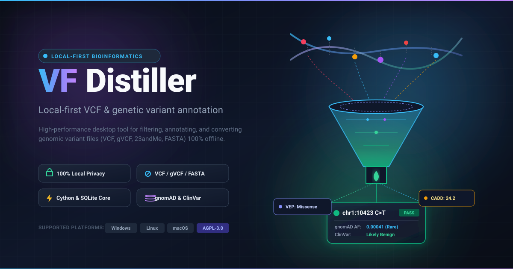
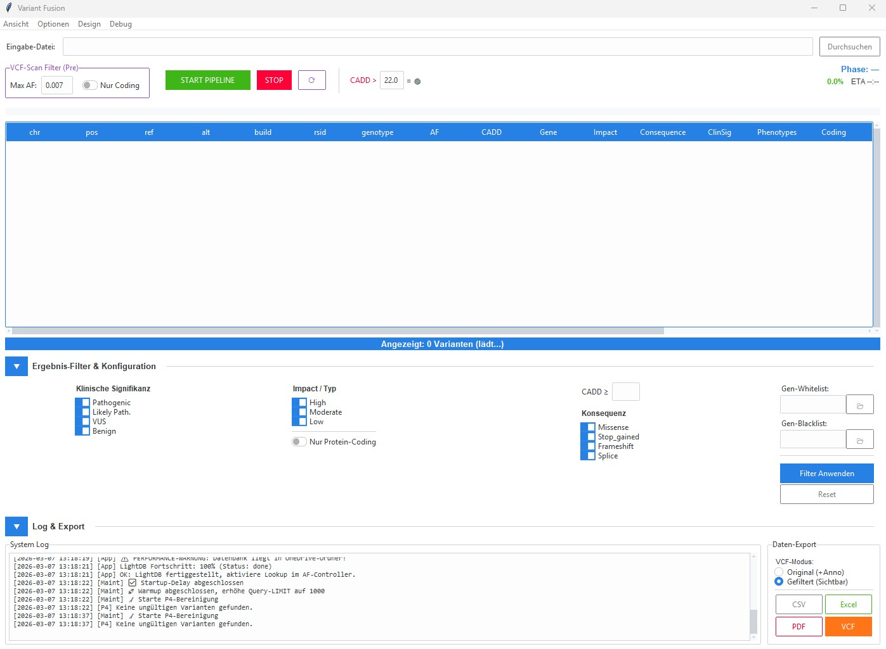

<div align="center">

[](https://github.com/biotec-line)
[](https://github.com/open-bricks)
[](LICENSE)
[](NOTICE)
[](https://www.python.org/)
[](https://samtools.github.io/hts-specs/)
[](https://www.ncbi.nlm.nih.gov/genome/guide/human/)
[](tests/)
[](SECURITY.md)
[](SECURITY.md)
[](SECURITY.md)
[](SECURITY.md)
[](THIRD_PARTY_LICENSES.md)
[](MARKETING-LOG.txt)
[](llms.txt)

**[English](README.md)** • **[Deutsch](README.de.md)** • **[Español](README.es.md)** • **[简体中文](README.zh.md)** • **[日本語](README.ja.md)** • **[Русский](README.ru.md)**

</div>

> 本書は機械支援翻訳です。英語版([README.md](README.md))が正本です。

> [!TIP]
> **AIエージェント & LLM向けコンテキスト**: 本リポジトリは、機械可読なアーキテクチャおよび発見性メタデータを [`llms.txt`](llms.txt) に、監査履歴を [`MARKETING-LOG.txt`](MARKETING-LOG.txt) に提供しています。

---

## クイックナビゲーション

1. [概要](#1-overview)
2. [主な機能](#2-key-capabilities)
3. [想定ペルソナと発見性](#3-target-personas--discoverability)
4. [代替ツールとの比較マトリクス](#4-comparative-matrix-vs-alternatives)
5. [ガバナンスと実行時不変条件](#5-governance--runtime-invariants)
6. [パイプラインアーキテクチャとデータフロー](#6-pipeline-architecture--dataflow)
7. [マルチフォーマット取り込みとビルド検出](#7-multi-format-ingestion--build-detection)
8. [マルチソース・アノテーションとINFOリサイクル](#8-multi-source-annotation--info-recycling)
9. [品質フィルタリングと遺伝子ホワイトリスト](#9-quality-filtering--gene-whitelists)
10. [デスクトップGUIとWebコンパニオンPWA](#10-desktop-gui--web-companion-pwa)
11. [マルチフォーマット・エクスポートとレポート](#11-multi-format-export--reporting)
12. [Cythonホットパス高速化](#12-cython-hotpath-acceleration)
13. [インストールとクイックスタート](#13-installation--quickstart)
14. [テストスイートと検証ゲート](#14-test-suite--verification-gates)
15. [サードパーティライセンスと透明性](#15-third-party-licenses--transparency)
16. [セキュリティと脆弱性報告](#16-security--vulnerability-reporting)
17. [Research Use Only の境界とコンプライアンス](#17-research-use-only-boundary--compliance)
18. [ライセンスとメンテナー](#18-license--maintainers)

---

<a id="sec-01"></a>
<a id="1-overview"></a>
<a id="overview"></a>
<a id="1-uebersicht"></a>
<a id="uebersicht"></a>
## 1. 概要

# VFDistiller — ローカルファースト型 VCF・遺伝子バリアントアノテーション デスクトップツール

VFDistiller(別名 Variant Fusion Distiller)は、研究グレードの遺伝子バリアントファイルを扱う、ローカルファーストのバイオインフォマティクス・デスクトップアプリケーションです。VCF、gVCF、23andMe生データテキスト、FASTAデータの変換、フィルタリング、アノテーション、エクスポートをユーザー自身のマシン上で行います。Windowsを第一に想定したGUIを備え、アレル頻度の照会やリファレンスゲノムの検証のためのオフラインリソースもオプションで利用できます。

> ⚠️ **Research Use Only / Nicht für klinische Diagnostik / Not for Clinical Use(研究専用・臨床診断には使用不可)**
>
> VFDistiller はバイオインフォマティクスの研究ツールです。体外診断用医療機器(IVDR (EU) 2017/746)では**ありません**。CEマークは**取得していません**。BfArM(ドイツ連邦医薬品医療機器庁)や認証機関による審査も**受けていません**。臨床診断、予後予測、治療方針の決定を目的とするものでは**ありません**。表示されるClinSig/バリアントインパクトの値は、第三者の研究用データベースによるアノテーションであり、医学的評価ではありません。バイオインフォマティクス研究、教育、ソフトウェア開発の目的にのみ使用してください。無償のオープンソースの贈与であり、責任は故意および重過失に限定されます(ドイツ民法典 § 521 BGB、AGPL-3.0 §§ 15–17)。自己責任でご使用ください。

あらゆるシーケンスソースから得られる研究グレードの遺伝子バリアントデータを処理・変換・アノテーションするためのバイオインフォマティクス・デスクトップツールです。VCF、gVCF、23andMe生データ形式、FASTAに対応し、`pysam`、`bcftools`、`samtools` を必要としないため、Windowsワークステーション上でも実用的なワークフローを実現します。


---

<a id="sec-02"></a>
<a id="2-key-capabilities"></a>
<a id="key-capabilities"></a>
<a id="2-kernfunktionen"></a>
<a id="kernfunktionen"></a>
## 2. 主な機能

| 機能 | 説明 |
|---|---|
| **ローカルファースト・プライバシーアーキテクチャ** | データ処理は100%オフライン。生のシーケンス入力、生成されたVCF、SQLiteデータベースはすべてローカルマシン上に留まり、クラウドへの自動送信は一切ありません。 |
| **自動ログ墨消し** | 組み込みの `redact_for_logfile` が、機微なゲノム座位とrsIDを永続ディスクログから自動的に除去し、意図しないプライバシー漏洩を防ぎます。 |
| **ユニバーサル・マルチフォーマット取り込み** | VCF v4.2、gVCF、23andMe生データテキスト形式、FASTAファイルを、Unix専用の依存関係(`pysam`、`bcftools`、`samtools`)なしでネイティブにストリーミング取り込みします。 |
| **ゲノムビルドの自動検出** | ヘッダーのコンティグ、染色体表記、rsID座標マーカーから、GRCh37(hg19)とGRCh38(hg38)のビルドをインテリジェントに検出します。 |
| **マルチソース・アノテーション層** | オフラインのgnomAD LightDB(SQLite)、ClinVar ClinSig、CADDスコア、Ensembl VEP、ALFA、TOPMed、およびオプションのGoogle AlphaGenomeを組み合わせます。 |
| **INFO・FORMATメトリクスの保持** | サンプルレベルのジェノタイプ品質メトリクス(DP、GQ、AD、PL)を保持し、エクスポート変換を通じて既存のVCF INFOフィールドを再利用します。 |
| **Cythonホットパス高速化** | オプションのCコンパイル済みホットパス(`vcf_parser`、`af_validator`、`key_normalizer`、`fasta_lookup`)により、エンドツーエンドで最大5倍の高速化を実現します。 |
| **マルチフォーマット研究用エクスポート** | フィルタリング済みバリアントコホートを、アノテーション付きVCF v4.2、構造化Excel(`.xlsx`)、標準CSV、印刷可能なPDFレポートへ即座にエクスポートします。 |
| **非特権実行(`RunAsInvoker`)** | 管理者権限の昇格、UAC昇格プロンプト、バックグラウンドのサービスデーモンを必要とせず、厳密にユーザー空間内で動作します。 |

---

<a id="sec-03"></a>
<a id="3-target-personas--discoverability"></a>
<a id="target-personas--discoverability"></a>
<a id="3-zielgruppen--auffindbarkeit"></a>
<a id="zielgruppen--auffindbarkeit"></a>
## 3. 想定ペルソナと発見性

VFDistiller は、次の4つの主要ペルソナにおけるゲノムデータのフィルタリングとバリアントアノテーションの課題を解決するよう設計されています。

| ペルソナID | 対象ユーザー | 主なニーズ | VFDistiller のアーキテクチャによる主な解決策 |
|---|---|---|---|
| `[PERSONA-01]` | **臨床遺伝専門医・分子病理医(研究用途)** | クラウドに依存せず、希少疾患および体細胞研究症例に対する迅速なデスクトップトリアージとバリアント優先順位付けを行いたい。 | Windows第一のttkbootstrap GUI、統合されたオフラインgnomAD LightDB(SQLite)、ClinVar ClinSig、CADDハイライト、ゼロ送信のローカル処理。 |
| `[PERSONA-02]` | **バイオインフォマティクス・コアファシリティのエンジニア、パイプライン開発者** | Windowsワークステーション上で、コンシューマー/生データ(23andMe、生FASTA)と標準的な研究用VCF/gVCF形式を相互変換したい。 | Unixツール(`bcftools`/`pysam`)を使わないVCF/gVCFのストリーミング解析、GRCh37/GRCh38ビルドの自動検出、5倍のCython高速化、クリーンなPEP 621準拠のPythonアーキテクチャ。 |
| `[PERSONA-03]` | **希少疾患研究者・アカデミックなゲノムアナリスト** | アレル頻度(AF < 0.007)、リードデプス、病原性しきい値、遺伝子ホワイトリストによる透明性のあるフィルタリングを行いたい。 | ローカルファーストのSQLiteインデックス、カスタム遺伝子リストによるフィルタリング、INFOフィールドのリサイクル、FORMATメトリクスを保持したマルチフォーマットエクスポート(Excel、PDFレポート、アノテーション付きVCF)。 |
| `[PERSONA-04]` | **プライバシーを重視するデータスチュワード・オフライン臨床検査室のIT担当者** | 遺伝情報プライバシー規制(GDPR / DSGVO 第9条、GenDG)への完全な準拠、および生のシーケンスバリアントが外部ログに漏れないことの保証。 | 100%オフライン動作可能なアーキテクチャ、自動ログファイル墨消し(`redact_for_logfile` によるrsID/ゲノム座位の除去)、非特権の `RunAsInvoker` 実行、厳格な Research Use Only の境界。 |

### 高意図の検索クエリ

科学リポジトリ、パッケージマネージャー、検索エンジンでの発見性を高めるための例です。
- `local-first VCF variant annotation desktop tool Windows` — ローカルでの遺伝子バリアントのフィルタリング・アノテーションGUI。
- `offline gnomAD allele frequency lookup SQLite GUI` — Web呼び出しを伴わない、SQLiteベースのローカルなアレル頻度アノテーション。
- `23andMe raw data to annotated VCF converter python` — 一般消費者向けジェノタイピングのテキストファイルから研究用VCFへの直接変換。
- `gVCF streaming parser without bcftools pysam dependencies` — Windows互換のゲノムVCFパーサー。
- `research-grade genetic variant filtering tool CADD ClinVar` — CADDスコアとClinSigによるSNVおよびインデルの優先順位付け。
- `privacy-preserving clinical genomics analysis desktop app` — ゼロ送信のゲノミクス・ワークステーションアプリケーション。
- `VCF format metrics preservation multi-sample export excel pdf` — DP/GQメトリクス付きでフィルタリング済みバリアント表をExcelおよびPDFへエクスポート。
- `Cython accelerated VCF parser bioinformatics desktop workstation` — バリアント処理のための高性能なコンパイル済みC拡張。

---

<a id="sec-04"></a>
<a id="4-comparative-matrix-vs-alternatives"></a>
<a id="comparative-matrix-vs-alternatives"></a>
<a id="4-vergleichsmatrix-gegenueber-alternativen"></a>
<a id="vergleichsmatrix-gegenueber-alternativen"></a>
## 4. 代替ツールとの比較マトリクス

以下のマトリクスは、VFDistiller を既存のバイオインフォマティクスツールおよびプラットフォームと、当プロジェクトのガバナンス不変条件に直接対応づけた10の技術的観点で比較したものです。

| 技術的観点 | ガバナンス不変条件 | VFDistiller | Unixシェルパイプライン (bcftools/samtools) | クラウド型バリアントポータル (BaseSpace/VarSome) | デスクトップブラウザ (IGV) | アノテーションエンジン (VEP / SnpEff CLI) |
|:---|:---:|:---:|:---:|:---:|:---:|:---:|
| **1. オフラインファースト & ゼロ送信** | `INV-LOCAL-01` | **100%ローカルファースト(ローカルディスク、SQLite、テレメトリなし)** | 高(ローカルCLI実行) | 低(生の遺伝データのクラウドへのアップロードが必須) | 高(ローカルファイルの閲覧) | 高(ローカルキャッシュでの実行) |
| **2. 座位・rsIDのログ墨消し** | `INV-PRIVACY-02` | **組み込み(`redact_for_logfile` がプライバシーを保護)** | なし(座位が標準出力/標準エラーのログに出力される) | リスクあり(クエリ座標がリモートサーバーに記録される) | なし(生の座標セッションがローカルに保存される) | なし(マスクなしでログ出力) |
| **3. インタラクティブGUI & PWAコンパニオン** | `INV-INSPECT-03` | **デスクトップGUI (ttkbootstrap) + Webコンパニオン PWA** | なし(ヘッドレスCLIのみ) | Webブラウザのポータルのみ | 高機能なゲノムトラックブラウザ | なし(ヘッドレスCLIのみ) |
| **4. マルチフォーマット取り込み** | `INV-CONVERT-04` | **VCF v4.2、gVCF、23andMe、FASTA(ネイティブ対応)** | VCF/BCFのみ(独自の変換スクリプトが必要) | VCFのみ(厳格な書式要件あり) | BAM/VCFの閲覧のみ(変換なし) | VCFのみ |
| **5. オフライン・アレル頻度エンジン** | `INV-OFFLINE-05` | **gnomAD LightDB SQLite(高速なローカル検索)** | tabixの手動セットアップと大容量VCFが必要 | クラウド依存のAPIクエリ | リモートリソースのストリーム | 大容量のローカルキャッシュファイル(約20〜50 GB) |
| **6. Cythonホットパス高速化** | `INV-ACCEL-06` | **オプションのコンパイル済みCホットパス(5倍の高速化)+ フォールバック** | ネイティブC/C++バイナリ | リモートのクラウド計算クラスタ | Javaランタイム | Perl / Javaランタイム |
| **7. マルチフォーマット・レポートエクスポート** | `INV-EXPORT-07` | **FORMATメトリクスを保持。VCF、CSV、Excel、PDF** | VCF / TSVのみ | PDF / Excel(多くは商用の有料プラン限定) | スクリーンショット / BEDエクスポートのみ | VCF / TXT形式の表出力 |
| **8. 非特権実行** | `INV-UNPRIV-08` | **厳格な RunAsInvoker(管理者/root権限は不要)** | 標準ユーザーのCLI | Webブラウザクライアント | 標準ユーザーのアプリケーション | 標準ユーザーのCLI |
| **9. 明示的なRUO境界** | `INV-COMPLY-09` | **厳格な Research Use Only(IVDR EU 2017/746との区分)** | 研究用バイオインフォマティクスツール | 臨床的な主張が曖昧なことが多い | 研究用ソフトウェア | 研究用ソフトウェア |
| **10. セキュリティSLA & CIマトリクス** | `INV-SLA-10` | **48時間の応答SLA / マルチOSのCIマトリクス** | コミュニティのメーリングリスト | 商用ベンダーのSLA | アカデミック / GitHubでのメンテナンス | アカデミックのリリースサイクル |

---

<a id="sec-05"></a>
<a id="5-governance--runtime-invariants"></a>
<a id="governance--runtime-invariants"></a>
<a id="5-governance--laufzeit-invarianten"></a>
<a id="governance--laufzeit-invarianten"></a>
## 5. ガバナンスと実行時不変条件

VFDistiller は、10の基本的なガバナンスおよび実行時の不変条件に従って設計・維持されています。

- **`INV-LOCAL-01`(100%ローカルファースト & ゼロ送信):** すべてのゲノムシーケンスファイル、変換済みVCF、ゲノムリファレンス、SQLiteデータベース、ローカル設定は、ローカルのワークステーション上にのみ存在します。テレメトリなし、アナリティクスなし、クラウドへの自動送信なし。
- **`INV-PRIVACY-02`(座位・rsIDの自動ログ墨消し):** 機微なゲノム座標とrsIDは `redact_for_logfile` によって永続ログから自動的に除去され、GDPR/DSGVO 第9条およびGenDGに従って遺伝情報プライバシーを厳格に保護します。
- **`INV-INSPECT-03`(アクセス可能なデスクトップGUI & 透明性のあるフィルタリング):** ttkbootstrapデスクトップGUIとWebコンパニオンPWAによってバリアントレコードを視覚的に完全に確認できます。フィルタ条件(AFしきい値、CADDスコア、ClinSig、リードデプス)は完全に監査可能で、ユーザーが設定できます。
- **`INV-CONVERT-04`(マルチフォーマット取り込み & 標準との同等性):** Unix専用のツールチェーン(`bcftools`、`samtools`、`pysam`)を必要とせず、VCF v4.2、gVCF、23andMe生データテキスト、FASTAファイルをシームレスに変換・取り込みします。
- **`INV-OFFLINE-05`(オフラインのアレル頻度 & アノテーション機能):** インターネット接続を必須とせず、オフラインのSQLite LightDB(gnomAD)による高速なローカルアノテーションを行い、オプションの非同期RESTエンドポイント(VEP、MyVariant.info)で補完します。
- **`INV-ACCEL-06`(穏当なフォールバックを備えたオプションのCythonホットパス):** オプションのコンパイル済みCython拡張により、VCF解析とAF検証でエンドツーエンドで最大5倍の高速化を実現し、Cコンパイラが利用できない場合は純粋なPythonに穏当にフォールバックします。
- **`INV-EXPORT-07`(形式の保持 & マルチレポート生成):** VCFエクスポートは元のサンプルFORMATメトリクス(DP、GQ、AD、PL)とマルチサンプルの整合性を保持し、CSV、Excel(.xlsx)、PDFレポートへの柔軟なエクスポートに対応します。
- **`INV-UNPRIV-08`(非特権のユーザーモード動作 — `RunAsInvoker`):** アプリケーションは完全に非特権のユーザー空間内で動作し、管理者権限の昇格、root権限、UAC昇格を一切必要としません。
- **`INV-COMPLY-09`(厳格な Research Use Only の境界 — RUO):** 本アプリケーションが研究およびバイオインフォマティクスのツールであり、IVDR (EU) 2017/746における体外診断用医療機器では「ない」こと、また臨床診断の認証を受けて「いない」ことを、明確かつ明示的な法的境界として確認します。
- **`INV-SLA-10`(オープンソース・ガバナンス、48時間のセキュリティSLA & テストカバレッジ):** AGPL-3.0-or-laterの下での無償オープンソース配布、包括的なサードパーティライセンス監査、確約された48時間のセキュリティ応答SLA、自動化された回帰テストスイート。

---

<a id="sec-06"></a>
<a id="6-pipeline-architecture--dataflow"></a>
<a id="pipeline-architecture--dataflow"></a>
<a id="6-pipeline-architektur--datenfluss"></a>
<a id="pipeline-architektur--datenfluss"></a>
## 6. パイプラインアーキテクチャとデータフロー

```mermaid
flowchart TD
    classDef input fill:#e0f2fe,stroke:#0284c7,stroke-width:1.5px,color:#0c4a6e;
    classDef process fill:#f1f5f9,stroke:#64748b,stroke-width:1.5px,color:#0f172a;
    classDef anno fill:#fef3c7,stroke:#d97706,stroke-width:1.5px,color:#78350f;
    classDef filter fill:#fce7f3,stroke:#db2777,stroke-width:1.5px,color:#831843;
    classDef output fill:#dcfce7,stroke:#16a34a,stroke-width:1.5px,color:#14532d;

    subgraph Inputs ["1. Multi-Format Input (Local-First)"]
        VCF["VCF / VCF.GZ (v4.2)"]:::input
        GVCF["gVCF (Genomic VCF)"]:::input
        RAW["23andMe Raw Data (.txt)"]:::input
        FASTA["FASTA Reference (.fa)"]:::input
    end

    subgraph Core ["2. Ingestion & Build Detection"]
        PARSER["Streaming Parser / Cython Hotpath"]:::process
        BUILD["Build Detection<br/>GRCh37 (hg19) / GRCh38 (hg38)"]:::process
        PARSER --> BUILD
    end

    subgraph Annotation ["3. Multi-Source Annotation Layer"]
        GNOMAD["gnomAD LightDB (Offline SQLite)"]:::anno
        MYVAR["MyVariant.info (REST)"]:::anno
        VEP["Ensembl VEP (Async aiohttp)"]:::anno
        ALFA["ALFA / TOPMed"]:::anno
        AG["AlphaGenome API (Optional)"]:::anno
    end

    subgraph QualityGate ["4. Quality & Clinical Filtering"]
        AF_FILT["AF Threshold (e.g. &lt; 0.007)"]:::filter
        CADD_FILT["CADD Highlight Score"]:::filter
        CLIN_FILT["ClinVar / ClinSig & Variant Impact"]:::filter
        GENE_FILT["Gene Whitelist / FILTER=PASS"]:::filter
    end

    subgraph Outputs ["5. Interactive UI & Multi-Format Export"]
        GUI["ttkbootstrap Interactive Table"]:::output
        EXP_VCF["Annotated VCF Export"]:::output
        EXP_DOC["CSV / Excel (.xlsx) / PDF Report"]:::output
    end

    Inputs --> PARSER
    BUILD --> Annotation
    Annotation --> QualityGate
    QualityGate --> Outputs
```



### スクリーンショットギャラリー

| メインワークスペース | フィルタ & エクスポート ワークスペース |
|---|---|
|  |  |

---

<a id="sec-07"></a>
<a id="7-multi-format-ingestion--build-detection"></a>
<a id="multi-format-ingestion--build-detection"></a>
<a id="7-multi-format-ingestion--build-erkennung"></a>
<a id="multi-format-ingestion--build-erkennung"></a>
## 7. マルチフォーマット取り込みとビルド検出

VFDistiller は、中間的な形式変換ツールを介することなく、多様なシーケンシングパイプラインや一般消費者向けサービスからの遺伝子バリアントファイルを取り込みます。

- **標準VCF 4.2(`.vcf`、`.vcf.gz`):** 単一サンプルおよびマルチサンプルのバリアントコールのストリーミング展開と、行単位の解析。
- **ゲノムVCF(`gVCF`):** 非バリアントブロックの圧縮と、ジェノタイプ信頼度によるフィルタリング。
- **23andMe生データ(`.txt`):** 4列のタブ区切りジェノタイピングファイル(`rsid`、`chromosome`、`position`、`genotype`)を、ローカルFASTAに対するリファレンスアレルの照会を伴って、有効なVCFレコードへ直接変換。
- **FASTAリファレンス検証(`.fa`、`.fasta`):** インデックス(`.fai`)に基づく高速な塩基配列の抽出により、ヒトゲノムアセンブリに対してリファレンスアレルを検証。
- **自動ビルド検出:** VCFのコンティグヘッダー、染色体名、座標マッピングを調べ、データが **GRCh37(hg19)** と **GRCh38(hg38)** のどちらに一致するかを判定します。GUIから手動で上書きすることもできます。

---

<a id="sec-08"></a>
<a id="8-multi-source-annotation--info-recycling"></a>
<a id="multi-source-annotation--info-recycling"></a>
<a id="8-multi-source-annotation--info-recycling"></a>
<a id="multi-source-annotation--info-recycling"></a>
## 8. マルチソース・アノテーションとINFOリサイクル

VFDistiller は、オフラインのリファレンスデータセットとオンラインの科学APIを橋渡しします。

1. **gnomAD LightDB(オフラインSQLite):** 世界の主要な祖先集団にわたるエクソームおよびゲノムの集団アレル頻度を収めた、圧縮されたローカルデータベース。検索はミリ秒未満で実行されます。
2. **INFOフィールドのリサイクル:** 入力VCFのINFOタグに既に存在するアノテーション(例: SnpEffアノテーション、ANNOVARタグ、CADDスコア)を自動的に認識し、保持します。
3. **非同期Ensembl VEP:** `aiohttp` による非同期RESTバッチクエリで、ユーザーインターフェースをブロックすることなく、転写産物への影響、HGVS表記、タンパク質変化を取得します。
4. **MyVariant.info & NCBI ClinVar:** バリアントに、臨床的意義の分類(`ClinSig`)、レビューステータス、疾患表現型との関連を付加します。
5. **AlphaGenome API(オプション):** ユーザーが用意したAPIキーを使って、Google DeepMindのゲノムAI予測に接続するオプションのコネクタ。

---

<a id="sec-09"></a>
<a id="9-quality-filtering--gene-whitelists"></a>
<a id="quality-filtering--gene-whitelists"></a>
<a id="9-qualitaetsfilterung--gen-whitelists"></a>
<a id="qualitaetsfilterung--gen-whitelists"></a>
## 9. 品質フィルタリングと遺伝子ホワイトリスト

数百万件の生のシーケンスバリアントを、扱いやすい候補コホートへ簡単に絞り込めます。

- **アレル頻度のしきい値設定:** 全世界または祖先集団別の集団において、一般的な多型を除外します(例: `AF < 0.007` またはカスタムしきい値)。
- **リードデプスとジェノタイプ品質:** 最小リードカバレッジ(`DP >= 20`)とジェノタイプ品質(`GQ >= 30`)によるサンプルレベルのフィルタリング。
- **病原性のハイライト表示:** CADDしきい値を超えるバリアント(例: `CADD > 22.0`)や、ClinVarでPathogenic / Likely Pathogenicとアノテーションされたバリアントを即座に視覚的にハイライトします。
- **遺伝子ホワイトリストと疾患パネル:** カスタムの遺伝子シンボルリスト(例: ACMG Secondary Findings v3.2、心筋症パネル)を読み込み、関心のある遺伝子だけに表示を絞り込みます。
- **フィルタステータスのゲート:** すべてのバリアントを表示するか、`FILTER=PASS` とマークされたものだけを表示するかを切り替えます。

---

<a id="sec-10"></a>
<a id="10-desktop-gui--web-companion-pwa"></a>
<a id="desktop-gui--web-companion-pwa"></a>
<a id="10-desktop-gui--web-companion-pwa"></a>
<a id="desktop-gui--web-companion-pwa"></a>
## 10. デスクトップGUIとWebコンパニオンPWA

- **モダンなttkbootstrapインターフェース:** ダーク/ライトテーマに対応し、並べ替え可能な列を備えたレスポンシブな表形式ビューと、リアルタイムの進捗インジケーターを提供します。
- **システムトレイ連携:** `pystray` により実装され、穏当な機能縮退に対応しています。長時間にわたるバリアントアノテーションのバッチを、バックグラウンドで静かに実行できます。
- **WebコンパニオンPWA(`web_companion/`):** Webマニフェストとベクターアセットを備えた軽量なプログレッシブWebアプリのインターフェースで、ローカルネットワーク上のブラウザプレビューを可能にします。
- **バイリンガル対応:** `locales/translations.json` から読み込まれる、ドイツ語と英語の完全なローカライズ。

---

<a id="sec-11"></a>
<a id="11-multi-format-export--reporting"></a>
<a id="multi-format-export--reporting"></a>
<a id="11-multi-format-export--reporting"></a>
<a id="multi-format-export--reporting"></a>
## 11. マルチフォーマット・エクスポートとレポート

フィルタリング済みのバリアントセットを、下流のワークフローに必要な形式そのままでエクスポートできます。

- **アノテーション付きVCF 4.2:** INFO列に追加されたアノテーションを含む標準化されたVCFファイルを出力し、サンプルレベルのFORMATフィールド(`DP`、`GQ`、`AD`、`PL`)を完全に保持します。
- **Excelスプレッドシート(`.xlsx`):** 列幅の自動調整、条件付き書式、NCBI・ClinVar・Ensemblへのクリック可能なハイパーリンクを備えた、整形済みのマルチタブワークブック。
- **標準CSV / TSV:** R、pandas、または独自のバイオインフォマティクスパイプラインでそのまま使える、クリーンな区切りテキストファイル。
- **PDF研究サマリー:** ReportLabによる整形済みの印刷可能なサマリーレポートで、パイプラインのパラメータ、品質メトリクス、候補バリアントの表を詳述します。

---

<a id="sec-12"></a>
<a id="12-cython-hotpath-acceleration"></a>
<a id="cython-hotpath-acceleration"></a>
<a id="12-cython-hotpath-beschleunigung"></a>
<a id="cython-hotpath-beschleunigung"></a>
## 12. Cythonホットパス高速化

高スループットなバリアント処理のために、オプションのCコンパイル済みCythonモジュールが、パイプライン全体で最大**5倍の高速化**をもたらします(例: 50,000件のバリアントの処理が15分から3分に短縮)。

| モジュール | 高速化率 | 最適化される機能 |
|---|---|---|
| `vcf_parser.pyx` | **8x** | 高速なストリーミングVCF行のトークン化と検証 |
| `af_validator.pyx` | **100x** | 高速な数値しきい値の比較と境界チェック |
| `key_normalizer.pyx` | **25x** | 高速な染色体およびゲノム座標キーの正規化 |
| `fasta_lookup.pyx` | **100x** | リファレンスファイルからの即時の塩基配列抽出 |

CythonまたはCコンパイラが利用できない場合、VFDistiller は自動的かつ透過的に、機能的に100%同等な最適化済みの純粋なPython実装へフォールバックします。

---

<a id="sec-13"></a>
<a id="13-installation--quickstart"></a>
<a id="installation--quickstart"></a>
<a id="13-installation--schnellstart"></a>
<a id="installation--schnellstart"></a>
## 13. インストールとクイックスタート

### 前提条件
- Python 3.10+
- 対応OS: Windows 10/11(主対象)、LinuxおよびmacOS(実験的 / ソースから)

### インストール手順

VFDistiller は AGPL-3.0-or-later の下で、**GitHub経由でのみ**配布されます。

```bash
# 1. Clone the repository
git clone https://github.com/biotec-line/VFDistiller.git
cd VFDistiller

# 2. Install dependencies
pip install -r requirements.txt

# 3. Optional: Compile Cython acceleration (requires MSVC on Windows or gcc/clang)
cd cython_hotpath
python setup.py build_ext --inplace
cd ..

# 4. Launch the application
python Variant_Fusion_pro_V17.py
```

Windowsワークステーションでは、`START.bat` を実行するだけで起動でき、`build_exe.bat` でスタンドアロンの実行ファイルをビルドすることもできます。

### 設定とリファレンスのセットアップ

- **設定:** 初回起動時に、`variant_fusion_settings.json.example` から `variant_fusion_settings.json` が生成されます。
- **gnomAD LightDB:** ローカルのオフラインアレル頻度データベースを構築するには、GUIでインタラクティブなセットアップを起動するか、次を実行します。
  ```bash
  python "Get gnomAD DB light.py"
  ```
- **FASTAリファレンス:** リファレンスゲノム(GRCh37 / GRCh38)はルートディレクトリに配置できます。初回実行時に `.fai` インデックスファイルが自動的に生成されます。

---

<a id="sec-14"></a>
<a id="14-test-suite--verification-gates"></a>
<a id="test-suite--verification-gates"></a>
<a id="14-testsuite--verifikations-gates"></a>
<a id="testsuite--verifikations-gates"></a>
## 14. テストスイートと検証ゲート

本リポジトリでは、すべてのリリースにわたって決定論的な品質ゲートを適用しています。

```bash
# Run complete test suite (216 passed, 10 subtests)
python -m pytest

# Run fast quiet regression suite
python -m pytest -q

# Run platform smoke test
python tests/source_platform_smoke.py

# Run bytecode compilation verification
python -m compileall -q .

# Run linter checks
ruff check .
```

---

<a id="sec-15"></a>
<a id="15-third-party-licenses--transparency"></a>
<a id="third-party-licenses--transparency"></a>
<a id="15-drittanbieter-lizenzen--transparenz"></a>
<a id="drittanbieter-lizenzen--transparenz"></a>
## 15. サードパーティライセンスと透明性

VFDistiller は、オープンソースとしての完全な透明性にコミットしています。すべての実行時依存関係および開発時依存関係は監査され、[`THIRD_PARTY_LICENSES.md`](THIRD_PARTY_LICENSES.md) と [`THIRD_PARTY_LICENSES.txt`](THIRD_PARTY_LICENSES.txt) に文書化されています。

- **ゲノムデータセットへのコピーレフトの非適用:** ユーザーのシーケンシングファイル、変換済みVCF、生成されたレポートは、100%オペレーターの知的財産であり、コピーレフトの主張の対象外です。
- **`pystray`(LGPL-3.0-or-later):** システムトレイ連携は、LGPLv3 第4条に準拠し、未改変の上流ホイールに動的にリンクします。ユーザーには、このモジュールを検査、改変、置換する権利があります。
- **非特権ランタイム(`RunAsInvoker`):** アプリケーションは、管理者権限の昇格なしに、完全にユーザー空間内で動作します。

---

<a id="sec-16"></a>
<a id="16-security--vulnerability-reporting"></a>
<a id="security--vulnerability-reporting"></a>
<a id="16-sicherheit--schwachstellen-meldung"></a>
<a id="sicherheit--schwachstellen-meldung"></a>
## 16. セキュリティと脆弱性報告

セキュリティと遺伝情報のプライバシーは、VFDistiller のアーキテクチャの根幹をなすものです。

- **ローカルファースト & ゼロ送信:** 機微な患者ファイルやバリアントファイルが、お使いのデバイスの外に出ることはありません。
- **自動ログ墨消し:** `MultiSinkLogger` が生成する永続ログからは、染色体位置、rsID、患者のファイルパスが `redact_for_logfile` によって自動的に消去されます。
- **48時間のセキュリティ応答SLA:** 報告されたすべてのセキュリティ脆弱性に対し、48時間以内に初回応答を行い、5営業日以内にトリアージ評価を行います。
- **非公開での報告:** 脆弱性は、GitHubの [Security Advisories](https://github.com/biotec-line/VFDistiller/security/advisories) を通じて、または `security@biotec-line.org` / `security@open-bricks.org` へのメールで報告してください。詳細は [`SECURITY.md`](SECURITY.md) をご覧ください。

---

<a id="sec-17"></a>
<a id="17-research-use-only-boundary--compliance"></a>
<a id="research-use-only-boundary--compliance"></a>
<a id="17-research-use-only-grenze--compliance"></a>
<a id="research-use-only-grenze--compliance"></a>
## 17. Research Use Only の境界とコンプライアンス

**配布方針の変更と規制上の境界:**
VFDistiller は 2026-04-12 に Microsoft Store から撤回され、AGPL-3.0-or-later の下で、研究・教育用のオープンソースツールとして**GitHub経由でのみ**配布されています。

**理由:** 欧州の体外診断用医療機器規則(IVDR (EU) 2017/746)の下では、コンシューマー向けマーケットプレイスでの配布とゲノミクスツールの組み合わせは、体外診断用医療機器ソフトウェア(IVD-MDSW)として意図せず分類されるリスクがありました。プロジェクトリーダーは、明確な **Research Use Only(RUO)** の境界を維持するため、Storeでの掲載を完全に撤回することを選択しました。

- **IVD医療機器では「ありません」:** 本ソフトウェアはBfArMや認証機関による承認を受けておらず、CEマークも取得していません。
- **臨床診断には使用「できません」:** 診断、予後予測、治療に関する意思決定を行うために使用してはなりません。
- **教育・研究の範囲:** バイオインフォマティクス研究、検査室ワークフローのベンチマーク、学術的な教育のみを目的としています。

---

<a id="sec-18"></a>
<a id="18-license--maintainers"></a>
<a id="license--maintainers"></a>
<a id="18-lizenz--maintainer"></a>
<a id="lizenz--maintainer"></a>
## 18. ライセンスとメンテナー

**[AGPL-3.0-or-later](LICENSE)**(GNU Affero General Public License バージョン3、またはそれ以降のいずれかのバージョン)。**無償。永久に。**

- **Copyright (C) 2026 Lukas Geiger**(c/o Um:bruch Think Tank)
- **[open-bricks](https://github.com/open-bricks)** エコシステム内のバイオインフォマティクス組織 **[biotec-line](https://github.com/biotec-line)** の下で維持されています。
- ライセンス全文: [LICENSE](LICENSE) • 法的免責事項: [NOTICE](NOTICE) • レベル1 SBOM: [THIRD_PARTY_LICENSES.md](THIRD_PARTY_LICENSES.md)
- 無償のオープンソースの贈与(ドイツ民法典 §§ 516 ff. BGB)。法定責任は、§ 521 BGB および AGPL-3.0 §§ 15–17 に従い、故意および重過失に限定されます。INV-SLA-10 に基づく拘束力のある48時間のセキュリティ応答SLA。自己責任でご使用ください。
