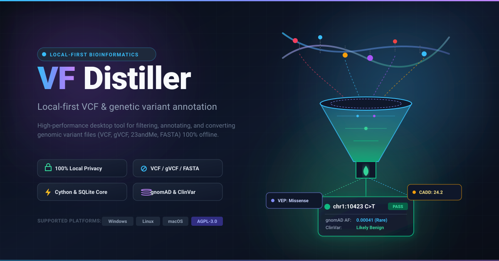

```mermaid
flowchart TD
    classDef input fill:#e0f2fe,stroke:#0284c7,stroke-width:1.5px,color:#0c4a6e;
    classDef process fill:#f1f5f9,stroke:#64748b,stroke-width:1.5px,color:#0f172a;
    classDef anno fill:#fef3c7,stroke:#d97706,stroke-width:1.5px,color:#78350f;
    classDef filter fill:#fce7f3,stroke:#db2777,stroke-width:1.5px,color:#831843;
    classDef output fill:#dcfce7,stroke:#16a34a,stroke-width:1.5px,color:#14532d;

    subgraph Inputs ["1. Multi-Format Input (Local-First)"]
        VCF["VCF / VCF.GZ (v4.2)"]:::input
        GVCF["gVCF (Genomic VCF)"]:::input
        RAW["23andMe Raw Data (.txt)"]:::input
        FASTA["FASTA Reference (.fa)"]:::input
    end

    subgraph Core ["2. Ingestion & Build Detection"]
        PARSER["Streaming Parser / Cython Hotpath"]:::process
        BUILD["Build Detection<br/>GRCh37 (hg19) / GRCh38 (hg38)"]:::process
        PARSER --> BUILD
    end

    subgraph Annotation ["3. Multi-Source Annotation Layer"]
        GNOMAD["gnomAD LightDB (Offline SQLite)"]:::anno
        MYVAR["MyVariant.info (REST)"]:::anno
        VEP["Ensembl VEP (Async aiohttp)"]:::anno
        ALFA["ALFA / TOPMed"]:::anno
        AG["AlphaGenome API (Optional)"]:::anno
    end

    subgraph QualityGate ["4. Quality & Clinical Filtering"]
        AF_FILT["AF Threshold (e.g. &lt; 0.007)"]:::filter
        CADD_FILT["CADD Highlight Score"]:::filter
        CLIN_FILT["ClinVar / ClinSig & Variant Impact"]:::filter
        GENE_FILT["Gene Whitelist / FILTER=PASS"]:::filter
    end

    subgraph Outputs ["5. Interactive UI & Multi-Format Export"]
        GUI["ttkbootstrap Interactive Table"]:::output
        EXP_VCF["Annotated VCF Export"]:::output
        EXP_DOC["CSV / Excel (.xlsx) / PDF Report"]:::output
    end

    Inputs --> PARSER
    BUILD --> Annotation
    Annotation --> QualityGate
    QualityGate --> Outputs
```

<div align="center">

[](https://github.com/biotec-line)
[](https://github.com/open-bricks)
[](LICENSE)
[](https://www.python.org/)
[](https://samtools.github.io/hts-specs/)
[](https://www.ncbi.nlm.nih.gov/genome/guide/human/)
[](tests/)
[](llms.txt)

**[English](README.md)** • **[Deutsch](README.de.md)**

</div>

> [!TIP]
> **AI Agent & LLM Context**: This repository provides machine-readable architecture and discoverability metadata in [`llms.txt`](llms.txt).

# VFDistiller — local-first VCF and genetic variant annotation desktop tool

VFDistiller, also known as Variant Fusion Distiller, is a local-first
bioinformatics desktop application for research-grade genetic variant files.
It converts, filters, annotates, and exports VCF, gVCF, 23andMe raw text, and
FASTA data on the user's own machine, with a Windows-first GUI and optional
offline resources for allele-frequency lookup and reference-genome validation.

> ⚠️ **Research Use Only / Nicht für klinische Diagnostik / Not for Clinical Use**
>
> VFDistiller ist ein **Forschungs- und Bioinformatik-Werkzeug** für die Analyse
> von VCF-Dateien aus genetischen Tests. Es ist:
>
> - **Kein IVD-Medizinprodukt** im Sinne der IVDR (EU) 2017/746
> - **Nicht CE-IVD-zertifiziert**, nicht durch BfArM oder eine Benannte Stelle geprüft
> - **Nicht für klinische Diagnostik** oder die Interpretation klinischer
>   Testergebnisse (auch nicht im Consumer-Genomik-Kontext)
> - **Keine Gesundheitsempfehlung**, keine Diagnose, keine Prognose, keine
>   Therapieempfehlung
> - Die angezeigten `ClinSig`-Werte (ClinVar) und Variant-Impact-Werte (VEP,
>   AlphaGenome) sind **Datenbank-Annotationen zur Forschungsorientierung**,
>   keine klinische Bewertung
>
> Nutzung ausschließlich für **Bioinformatik-Lehre, -Forschung und -Software-
> Entwicklung**. Für klinische Interpretation genetischer Befunde konsultieren
> Sie bitte qualifizierte humangenetische Fachstellen.
>
> Unentgeltliche Open-Source-Schenkung (§§ 516 ff. BGB). Haftung auf Vorsatz
> und grobe Fahrlässigkeit beschränkt (§ 521 BGB, AGPL-3.0 §§ 15–17).
> Nutzung auf eigenes Risiko.
>
> ---
>
> **English summary:** VFDistiller is a bioinformatics research tool. It is
> NOT an in-vitro diagnostic medical device (IVDR (EU) 2017/746), NOT
> CE-marked, NOT reviewed by BfArM or any notified body and NOT intended for
> clinical diagnosis, prognosis or therapy decisions. ClinSig / variant-impact
> values shown are third-party research database annotations, not medical
> assessments. Use for bioinformatics research, teaching and software
> development only. Free open-source donation; liability limited to intent
> and gross negligence (§ 521 BGB, AGPL-3.0 §§ 15–17). Use at your own risk.

A bioinformatics desktop tool for processing, converting, and annotating
research-grade genetic variant data from any sequencing source. Supports VCF,
gVCF, 23andMe raw format, and FASTA without requiring pysam, bcftools, or
samtools, making the workflow practical on Windows workstations.


## Why VFDistiller?

- **VCF and gVCF desktop workflow** for researchers, teaching labs, and
  bioinformatics software development where a GUI is easier than a shell-only
  pipeline.
- **Local-first privacy model** for sensitive genetic files: raw input,
  generated VCFs, SQLite caches, genome references, and API keys stay local.
- **Windows-compatible variant annotation** without a hard dependency on Unix
  bioinformatics tools such as `bcftools`, `samtools`, or `pysam`.
- **Multi-source annotation** combines reusable INFO fields with gnomAD,
  MyVariant.info, Ensembl VEP, ALFA, TOPMed, ClinVar-oriented fields, and
  optional AlphaGenome data.
- **Research Use Only boundary** is explicit throughout the project: this is
  not a clinical diagnostic product and not a medical device.

## Pipeline Architecture



## Screenshot Gallery

| Main workspace | Filter and export workspace |
|---|---|
|  |  |

## Distribution Change (2026-04-12)

VFDistiller was **withdrawn from the Microsoft Store** on 2026-04-12 (listing set
to "unavailable" — Microsoft Partner Center does not support hard delete) and is
now distributed **exclusively via GitHub** as a pure open-source research tool
under AGPL-3.0-or-later. The Store listing is no longer publicly searchable and
no new installations can be acquired through the Store. Existing local
installations continue to run but will receive no further updates.

**Why:** On re-evaluation against the IVDR (EU) 2017/746 (in-vitro diagnostic
regulation), the combination of Store distribution + consumer-genomics-
adjacent features would have placed the app close to IVD-MDSW classification.
The project lead chose the cleanest mitigation — withdrawing the Store listing
entirely — rather than pursuing a BfArM delimitation procedure (§ 6 MPDG)
or expensive CE-IVD certification.

**Consequences:**
- Existing Store installations keep working locally; no further updates via Store.
- New users: clone the repo, build via PyInstaller/uv, or use the GitHub Releases archive.
- No change to the license (AGPL-3.0-or-later, as introduced on 2026-04-12).
- Zweckbestimmung / Intended purpose remains: **Research Use Only — Bioinformatics tool for VCF analysis. Not a medical device.**

**Repository status (2026-06-18):**
- Git tracks source code, documentation, tests, workflow metadata, packaging templates, and the application icon.
- Genome references, downloaded gene annotations, local settings, SQLite caches/databases, logs, build outputs, release archives, and Store binaries are excluded by `.gitignore` and must remain local.
- Project locks and agent-internal implementation plans are excluded by `.gitignore` and must remain local-only.
- API keys are never committed; use the generated `variant_fusion_settings.json` or environment-specific local configuration.

**Maintenance status (2026-05-23):**
- `START.bat` prefers a local `dist\VFDistiller.exe` when present and falls back to the Python source entry point.
- LightDB SQLite lookups close their connection through a defensive `finally` block, including cursor/setup failure paths.
- The maintained regression suite is `python -m pytest -q`.

## Features

- **Multi-Format Import** — VCF, gVCF, 23andMe raw text format (.txt), FASTA (.fa/.fasta)
- **Automatic Build Detection** — GRCh37 / GRCh38 from header, contigs, or RSID positions
- **Multi-Source Annotation** — gnomAD, MyVariant.info, Ensembl VEP, ALFA, TOPMed, AlphaGenome
- **INFO Recycling** — Existing VCF annotations are reused
- **Filtering** — AF threshold, CADD score, Variant Impact, ClinSig, gene lists, FILTER=PASS, Read Depth
- **Export** — CSV, Excel, PDF, annotated VCF (filtered or complete)
- **GUI** — ttkbootstrap interface with System Tray, progress indicator, themes
- **Performance** — Optional Cython hot-path (5x overall speedup), SQLite batch writes, async HTTP via aiohttp
- **Background Maintenance** — Automatic re-fetching of missing annotations during idle
- **Multilingual** — German and English (JSON-based translations)

## Search Phrases

- VCF annotation desktop app
- gVCF filtering GUI
- 23andMe raw data to annotated VCF
- local-first genetic variant analysis
- Windows bioinformatics desktop tool
- offline gnomAD allele frequency lookup
- FASTA reference validation GUI
- Research Use Only variant annotation software

## Prerequisites

- Python 3.10+
- Windows 10/11 (primarily tested), Linux/macOS experimental

### Installation

VFDistiller is distributed **exclusively via GitHub** (no Microsoft Store,
no package manager). Recommended paths:

1. **GitHub Releases** — download the latest packaged archive (if available)
   from [Releases](https://github.com/biotec-line/VFDistiller/releases).
2. **Source build** — clone the repository and install dependencies:

```bash
git clone https://github.com/biotec-line/VFDistiller.git
cd VFDistiller

# Install dependencies
pip install -r requirements.txt

# Optional: Cython acceleration (requires C compiler)
pip install cython
cd cython_hotpath
python setup.py build_ext --inplace
cd ..
```

3. **Local Windows build** — run `build_exe.bat` or `python build_release.py`.
   The build follows `.SOFTWARE/BUILD-VERFAHREN.md`, uses the local work
   directory `C:\_Local_DEV\codex_build\vfdistiller\`, mirrors the finished
   `dist\VFDistiller.exe` back into the project, and creates a versioned
   release ZIP in `releases/`.

### Tests

Run the maintained regression suite from the repository root:

```bash
python -m pytest -q
```

`pytest.ini` limits automated collection to `tests/`. The two
`test_performance.py` files are executable benchmark/correctness scripts and
are intentionally run directly:

```bash
python test_performance.py
python cython_hotpath/test_performance.py
```

This split keeps CI focused on deterministic regression coverage while the
benchmark scripts remain available for manual performance verification.

### Genome References (optional, for FASTA validation)

The genome references (GRCh37/GRCh38) must be downloaded separately (~3 GB per build):

```bash
# GRCh37
wget https://ftp.ensembl.org/pub/grch37/current/fasta/homo_sapiens/dna/Homo_sapiens.GRCh37.dna.primary_assembly.fa.gz
gunzip Homo_sapiens.GRCh37.dna.primary_assembly.fa.gz

# GRCh38
wget https://ftp.ensembl.org/pub/release-112/fasta/homo_sapiens/dna/Homo_sapiens.GRCh38.dna.primary_assembly.fa.gz
gunzip Homo_sapiens.GRCh38.dna.primary_assembly.fa.gz
```

Place the files in the project directory. On first launch, a `.fai` index is automatically generated.

### gnomAD LightDB (optional)

For fast offline AF lookups, the gnomAD LightDB can be downloaded. The tool offers a download dialog on first launch. Alternatively:

```bash
python "Get gnomAD DB light.py"
```

## Usage

### Launch GUI

```bash
python Variant_Fusion_pro_V17.py
```

Or on Windows:

```
START.bat
```

### Workflow

1. **Open file** — Select VCF, gVCF, 23andMe text file, or FASTA
2. **Check build** — Automatically detected, can be manually overridden
3. **Pipeline runs** — Variants are parsed, annotated, and filtered
4. **Results** — Table view with sortable columns, double-click opens external databases
5. **Export** — Export as CSV, Excel, PDF, or annotated VCF

### Configuration

On first launch, `variant_fusion_settings.json` is created from the template `variant_fusion_settings.json.example`. Key settings:

| Setting | Description | Default |
|---|---|---|
| `af_threshold` | Allele frequency threshold | 0.007 |
| `include_none` | Show variants without AF | false |
| `cadd_highlight_threshold` | CADD score highlighting | 22.0 |
| `stale_days` | Days until AF refresh | 200 |
| `alphagenom_key` | Google AlphaGenome API key | (empty) |
| `quality_settings` | VCF record-level filter | see example |

### API Keys

- **AlphaGenome**: Requires a Google AI API key. Enter in `variant_fusion_settings.json` under `alphagenom_key` and `api_settings.phase6_ag.alphagenom.api_key`.
- **NCBI**: Optional for higher rate limits. Enter under `api_settings.global.ncbi_api_key`.

## Dependencies

### Core (required)

| Package | License | Purpose |
|---|---|---|
| requests | Apache 2.0 | HTTP requests |
| psutil | BSD | CPU/Memory monitoring |
| Pillow | PIL License | Icon/Image processing |
| intervaltree | Apache 2.0 | Genomic intervals |
| ttkbootstrap | MIT | Modern GUI themes |
| pystray | MIT | System Tray icon |
| aiohttp | Apache 2.0 | Async HTTP fetching |
| scipy | BSD | Statistics |

### Optional

| Package | License | Purpose |
|---|---|---|
| openpyxl | MIT | Excel export |
| reportlab | BSD | PDF export |
| numpy | BSD | Array operations |
| biopython | Biopython License | Sequence alignment |
| pyfaidx | MIT | FASTA indexing |
| cython | Apache 2.0 | Hot-path compilation |

## Cython Acceleration

Optional C-compiled hot-paths for critical operations:

| Module | Speedup | Function |
|---|---|---|
| `vcf_parser.pyx` | 8x | VCF line parsing |
| `af_validator.pyx` | 100x | AF validation |
| `key_normalizer.pyx` | 25x | Variant key normalization |
| `fasta_lookup.pyx` | 100x | FASTA sequence lookup |

Overall pipeline speedup: ~5x (50k variants: 15 min -> 3 min).

If Cython is not installed, Python fallbacks are used automatically.

## Project Structure

```
VFDistiller/
├── Variant_Fusion_pro_V17.py .... Main program (GUI + Pipeline)
├── requirements.txt ............. Python dependencies
├── variant_fusion_settings.json.example . Configuration template
├── VFDistiller.spec ............. PyInstaller build configuration
├── START.bat .................... Windows quick-start
│
├── cython_hotpath/ .............. Optional Cython modules
│   ├── __init__.py .............. CythonAccelerator main class
│   ├── vcf_parser.pyx .......... VCF parsing
│   ├── af_validator.pyx ......... AF validation
│   ├── key_normalizer.pyx ....... Key normalization
│   ├── fasta_lookup.pyx ......... FASTA lookup
│   ├── setup.py ................. Build script
│   └── test_performance.py ...... Benchmarks
│
├── data/annotations/ ............ Runtime/downloaded gene annotation cache (ignored)
│
├── locales/
│   └── translations.json ........ Translations (de/en)
│
├── ICO/ICO.ico .................. App icon
│
├── lightdb_index_worker.py ...... gnomAD LightDB background indexing
├── translator.py ................ Translation engine
├── translator_patch.py .......... Translation patches
├── manage_translations.py ....... Translation management
├── Get gnomAD DB light.py ....... gnomAD download tool
├── test_performance.py .......... Performance tests
│
├── ARCHITECTURE.md .............. Developer documentation
└── README/ ...................... Extended documentation & licenses
    └── licenses/
        ├── LICENSE.txt .......... Main license
        └── THIRD_PARTY_LICENSES.txt . Third-party licenses
```

## License

**[AGPL-3.0-or-later](LICENSE)** (GNU Affero General Public License, version 3
or any later version). **Free of charge. Forever.**

- Copyright (C) 2026 Lukas Geiger (c/o Um:bruch Think Tank)
- Full text: [LICENSE](LICENSE), disclaimers: [NOTICE](NOTICE)
- Superseded license: the former "VFDistiller License v1.0" has been retired
  and is kept for reference in
  [`docs/archive/`](docs/archive/VFDistiller_License_v1_legacy.md).

In short:

- Use, study, modify, share: **allowed**, at no cost.
- Redistribution (including forks, re-packaging, paid support): **allowed**,
  but derivative works must remain under AGPL-3.0-or-later.
- **Network / SaaS use (AGPL § 13):** If you run a modified version on a
  server that users interact with over a network, you must make the
  corresponding source code available to those users.
- **No resale of this code as a closed-source product.** Any downstream
  work must stay AGPL.
- The software is **not medically validated** and must not be used for
  clinical diagnoses or therapeutic decisions. See the RUO banner above
  and [NOTICE](NOTICE).

Third-party libraries retain their own licenses (MIT, BSD, Apache 2.0,
PIL License, Biopython License). See
[`README/licenses/THIRD_PARTY_LICENSES.txt`](README/licenses/THIRD_PARTY_LICENSES.txt).

> **Distribution:** VFDistiller is distributed exclusively via GitHub
> (see [Distribution Change (2026-04-12)](#distribution-change-2026-04-12)
> above). The former Microsoft Store listing has been retired.

## Version

V17.0 — Current production version (March 2026).

---

🇩🇪 [Deutsche Version](README.de.md)

> ⚠️ **Rechtlicher Hinweis / Legal Notice**
>
> Dieses Projekt ist **kein Medizinprodukt** im Sinne der MDR (EU) 2017/745 / IVDR (EU) 2017/746. Es ist **nicht klinisch validiert**, **nicht durch BfArM oder eine Benannte Stelle geprüft**, **nicht zertifiziert**. Es verarbeitet Daten ausschließlich zu Forschungs- und Softwareentwicklungszwecken. Eine klinische oder diagnostische Nutzung ist ausdrücklich **nicht** die Zweckbestimmung. Entscheidungen über Diagnose und Therapie bleiben qualifizierten Fachpersonen vorbehalten.
>
> This project is **not a medical device** within the meaning of MDR (EU) 2017/745 / IVDR (EU) 2017/746. It is **not clinically validated**, **not approved by BfArM or any Notified Body**, **not certified**. Data is processed exclusively for research and software development purposes. Clinical or diagnostic use is explicitly **not** the intended purpose. Decisions about diagnosis and therapy remain reserved for qualified professionals.
>
> Unentgeltliche Open-Source-Schenkung (§§ 516 ff. BGB). Haftung auf Vorsatz und grobe Fahrlässigkeit beschränkt (§ 521 BGB). Nutzung auf eigenes Risiko. / Unpaid open-source donation. Liability limited to intent and gross negligence. Use at own risk.

