<div align="center">

[](https://github.com/biotec-line)
[](https://github.com/open-bricks)
[](LICENSE)
[](https://www.python.org/)
[](https://samtools.github.io/hts-specs/)
[](https://www.ncbi.nlm.nih.gov/genome/guide/human/)
[](tests/)
[](SECURITY.md)
[](SECURITY.md)
[](SECURITY.md)
[](THIRD_PARTY_LICENSES.md)
[](MARKETING-LOG.txt)
[](llms.txt)

**[English](README.md)** • **[Deutsch](README.de.md)**

</div>

> [!TIP]
> **AI Agent & LLM Context**: This repository provides machine-readable architecture and discoverability metadata in [`llms.txt`](llms.txt) and audit history in [`MARKETING-LOG.txt`](MARKETING-LOG.txt).

---

## Quick Navigation

1. [Overview](#1-overview)
2. [Key Capabilities](#2-key-capabilities)
3. [Target Personas & Discoverability](#3-target-personas--discoverability)
4. [Comparative Matrix vs. Alternatives](#4-comparative-matrix-vs-alternatives)
5. [Governance & Runtime Invariants](#5-governance--runtime-invariants)
6. [Pipeline Architecture & Dataflow](#6-pipeline-architecture--dataflow)
7. [Multi-Format Ingestion & Build Detection](#7-multi-format-ingestion--build-detection)
8. [Multi-Source Annotation & INFO Recycling](#8-multi-source-annotation--info-recycling)
9. [Quality Filtering & Gene Whitelists](#9-quality-filtering--gene-whitelists)
10. [Desktop GUI & Web Companion PWA](#10-desktop-gui--web-companion-pwa)
11. [Multi-Format Export & Reporting](#11-multi-format-export--reporting)
12. [Cython Hotpath Acceleration](#12-cython-hotpath-acceleration)
13. [Installation & Quickstart](#13-installation--quickstart)
14. [Test Suite & Verification Gates](#14-test-suite--verification-gates)
15. [Third-Party Licenses & Transparency](#15-third-party-licenses--transparency)
16. [Security & Vulnerability Reporting](#16-security--vulnerability-reporting)
17. [Research Use Only Boundary & Compliance](#17-research-use-only-boundary--compliance)
18. [License & Maintainers](#18-license--maintainers)

---

<a id="1-overview"></a>
<a id="overview"></a>
<a id="1-uebersicht"></a>
<a id="uebersicht"></a>
## 1. Overview

# VFDistiller — local-first VCF and genetic variant annotation desktop tool

VFDistiller, also known as Variant Fusion Distiller, is a local-first bioinformatics desktop application for research-grade genetic variant files. It converts, filters, annotates, and exports VCF, gVCF, 23andMe raw text, and FASTA data on the user's own machine, with a Windows-first GUI and optional offline resources for allele-frequency lookup and reference-genome validation.

> ⚠️ **Research Use Only / Nicht für klinische Diagnostik / Not for Clinical Use**
>
> VFDistiller is a bioinformatics research tool. It is **NOT** an in-vitro diagnostic medical device (IVDR (EU) 2017/746), **NOT** CE-marked, **NOT** reviewed by BfArM or any notified body and **NOT** intended for clinical diagnosis, prognosis or therapy decisions. ClinSig / variant-impact values shown are third-party research database annotations, not medical assessments. Use for bioinformatics research, teaching and software development only. Free open-source donation; liability limited to intent and gross negligence (§ 521 BGB, AGPL-3.0 §§ 15–17). Use at your own risk.

A bioinformatics desktop tool for processing, converting, and annotating research-grade genetic variant data from any sequencing source. Supports VCF, gVCF, 23andMe raw format, and FASTA without requiring `pysam`, `bcftools`, or `samtools`, making the workflow practical on Windows workstations.


---

<a id="2-key-capabilities"></a>
<a id="key-capabilities"></a>
<a id="2-kernfunktionen"></a>
<a id="kernfunktionen"></a>
## 2. Key Capabilities

| Capability | Description |
|---|---|
| **Local-First Privacy Architecture** | 100% offline data processing; raw sequencing inputs, generated VCFs, and SQLite databases remain on your local machine with zero automated cloud egress. |
| **Automated Log Redaction** | Built-in `redact_for_logfile` automatically strips sensitive genomic loci and rsIDs from persistent disk logs to prevent inadvertent privacy leaks. |
| **Universal Multi-Format Ingestion** | Native streaming ingestion of VCF v4.2, gVCF, 23andMe raw text format, and FASTA files without Unix-only dependencies (`pysam`, `bcftools`, `samtools`). |
| **Automated Genome Build Detection** | Intelligent detection of GRCh37 (hg19) and GRCh38 (hg38) builds from header contigs, chromosome notations, and rsID coordinate markers. |
| **Multi-Source Annotation Layer** | Combines offline gnomAD LightDB (SQLite), ClinVar ClinSig, CADD scores, Ensembl VEP, ALFA, TOPMed, and optional Google AlphaGenome. |
| **INFO & FORMAT Metric Preservation** | Preserves sample-level genotype quality metrics (DP, GQ, AD, PL) and re-uses existing VCF INFO fields across export transformations. |
| **Cython Hotpath Acceleration** | Optional C-compiled hotpaths (`vcf_parser`, `af_validator`, `key_normalizer`, `fasta_lookup`) providing up to 5x end-to-end acceleration. |
| **Multi-Format Research Export** | Instant export of filtered variant cohorts to annotated VCF v4.2, structured Excel (`.xlsx`), standard CSV, and printable PDF reports. |
| **Unprivileged Execution (`RunAsInvoker`)** | Operates strictly in user space without requiring administrator elevation, UAC elevation prompts, or background service daemons. |

---

<a id="3-target-personas--discoverability"></a>
<a id="target-personas--discoverability"></a>
<a id="3-zielgruppen--auffindbarkeit"></a>
<a id="zielgruppen--auffindbarkeit"></a>
## 3. Target Personas & Discoverability

VFDistiller is engineered to solve genomic data filtering and variant annotation challenges for four primary personas:

| Persona ID | Target Audience | Primary Need | Key VFDistiller Architectural Solution |
|---|---|---|---|
| `[PERSONA-01]` | **Clinical Geneticists & Molecular Pathologists (Research)** | Rapid desktop triage and variant prioritization for rare disease and somatic research cases without cloud dependencies. | Windows-first ttkbootstrap GUI, integrated offline gnomAD LightDB (SQLite), ClinVar ClinSig, CADD highlighting, and zero-egress local processing. |
| `[PERSONA-02]` | **Bioinformatics Core Facility Engineers & Pipeline Developers** | Converting between consumer/raw data (23andMe, raw FASTA) and standard research VCF/gVCF formats on Windows workstations. | Streaming VCF/gVCF parsing without Unix tools (`bcftools`/`pysam`), automated GRCh37/GRCh38 build detection, 5x Cython acceleration, and clean PEP 621 Python architecture. |
| `[PERSONA-03]` | **Rare Disease Researchers & Academic Genomic Analysts** | Transparent filtering by allele frequencies (AF < 0.007), read depth, pathogenicity thresholds, and gene whitelists. | Local-first SQLite indexing, custom gene list filtering, INFO field recycling, and multi-format export (Excel, PDF reports, annotated VCF) with preserved FORMAT metrics. |
| `[PERSONA-04]` | **Privacy-Conscious Data Stewards & Offline Clinical Lab IT** | Absolute compliance with genetic privacy directives (GDPR / DSGVO Art. 9, GenDG), ensuring raw sequence variants never leak into external logs. | 100% offline-capable architecture, automated logfile redaction (`redact_for_logfile` eliminating rsIDs/genomic loci), unprivileged `RunAsInvoker` execution, and strict Research Use Only boundary. |

### High-Intent Search Queries

To facilitate discoverability across scientific repositories, package managers, and search engines:
- `local-first VCF variant annotation desktop tool Windows` — Local genetic variant filtering and annotation GUI.
- `offline gnomAD allele frequency lookup SQLite GUI` — Local SQLite-backed allele frequency annotation without web calls.
- `23andMe raw data to annotated VCF converter python` — Direct conversion of direct-to-consumer genotyping text files to research VCF.
- `gVCF streaming parser without bcftools pysam dependencies` — Windows-compatible genomic VCF parser.
- `research-grade genetic variant filtering tool CADD ClinVar` — Prioritize SNVs and indels by CADD score and ClinSig.
- `privacy-preserving clinical genomics analysis desktop app` — Zero-egress genomics workstation application.
- `VCF format metrics preservation multi-sample export excel pdf` — Export filtered variant tables to Excel and PDF with DP/GQ metrics.
- `Cython accelerated VCF parser bioinformatics desktop workstation` — High-performance compiled C-extensions for variant processing.

---

<a id="4-comparative-matrix-vs-alternatives"></a>
<a id="comparative-matrix-vs-alternatives"></a>
<a id="4-vergleichsmatrix-gegenueber-alternativen"></a>
<a id="vergleichsmatrix-gegenueber-alternativen"></a>
## 4. Comparative Matrix vs. Alternatives

The following matrix compares VFDistiller against existing bioinformatics tools and platforms across 10 technical dimensions directly mapped to our governance invariants:

| Technical Dimension | Governance Invariant | VFDistiller | Unix Shell Pipelines (bcftools/samtools) | Cloud Variant Portals (BaseSpace/VarSome) | Desktop Browsers (IGV) | Annotation Engines (VEP / SnpEff CLI) |
|:---|:---:|:---:|:---:|:---:|:---:|:---:|
| **1. Offline-First & Zero Egress** | `INV-LOCAL-01` | **100% Local-First (Local disk, SQLite, zero telemetry)** | High (Local CLI execution) | Low (Mandatory cloud upload of raw genetic data) | High (Local file viewing) | High (Local cache execution) |
| **2. Locus & rsID Log Redaction** | `INV-PRIVACY-02` | **Built-in (`redact_for_logfile` protects privacy)** | None (Loci printed to stdout/stderr logs) | Risk (Query coordinates logged on remote servers) | None (Raw coordinate sessions saved locally) | None (Unmasked logging) |
| **3. Interactive GUI & PWA Companion** | `INV-INSPECT-03` | **Desktop GUI (ttkbootstrap) + Web Companion PWA** | None (Headless CLI only) | Web browser portal only | Rich genome track browser | None (Headless CLI only) |
| **4. Multi-Format Ingestion** | `INV-CONVERT-04` | **VCF v4.2, gVCF, 23andMe, FASTA (Native)** | VCF/BCF only (Requires custom conversion scripts) | VCF only (Strict formatting requirements) | BAM/VCF viewing only (No conversion) | VCF only |
| **5. Offline Allele Frequency Engine** | `INV-OFFLINE-05` | **gnomAD LightDB SQLite (Fast local lookup)** | Requires manual tabix setup & large VCFs | Cloud-dependent API queries | Remote resource streams | Large local cache files (~20–50 GB) |
| **6. Cython Hotpath Acceleration** | `INV-ACCEL-06` | **Optional compiled C-hotpaths (5x speedup) + fallback** | Native C/C++ binary | Remote cloud compute cluster | Java runtime | Perl / Java runtime |
| **7. Multi-Format Report Export** | `INV-EXPORT-07` | **Preserved FORMAT metrics; VCF, CSV, Excel, PDF** | VCF / TSV only | PDF / Excel (Often behind commercial paywall) | Screenshot / BED export only | VCF / TXT tabular output |
| **8. Unprivileged Execution** | `INV-UNPRIV-08` | **Strict RunAsInvoker (Zero admin/root required)** | Standard user CLI | Web browser client | Standard user application | Standard user CLI |
| **9. Explicit RUO Boundary** | `INV-COMPLY-09` | **Strict Research Use Only (IVDR EU 2017/746 demarcation)** | Research bioinformatics tools | Often ambiguous clinical claims | Research software | Research software |
| **10. Security SLA & CI Matrix** | `INV-SLA-10` | **48h Response SLA / Multi-OS CI Matrix** | Community mailing list | Commercial vendor SLA | Academic / GitHub maintenance | Academic release cycles |

---

<a id="5-governance--runtime-invariants"></a>
<a id="governance--runtime-invariants"></a>
<a id="5-governance--laufzeit-invarianten"></a>
<a id="governance--laufzeit-invarianten"></a>
## 5. Governance & Runtime Invariants

VFDistiller is architected and maintained according to ten foundational governance and runtime invariants:

- **`INV-LOCAL-01` (100% Local-First & Zero Egress):** All genomic sequencing files, converted VCFs, genome references, SQLite databases, and local settings reside solely on the local workstation. Zero telemetry, zero analytics, zero automated cloud egress.
- **`INV-PRIVACY-02` (Automated Locus & rsID Log Redaction):** Sensitive genomic coordinates and rsIDs are automatically stripped from persistent logs via `redact_for_logfile`, strictly protecting genetic privacy according to GDPR/DSGVO Art. 9 and GenDG.
- **`INV-INSPECT-03` (Accessible Desktop GUI & Transparent Filtering):** Full visual inspection of variant records via ttkbootstrap desktop GUI and Web Companion PWA; filter criteria (AF thresholds, CADD score, ClinSig, read depth) are completely auditable and user-configurable.
- **`INV-CONVERT-04` (Multi-Format Ingestion & Standards Parity):** Seamless conversion and ingestion of VCF v4.2, gVCF, 23andMe raw text, and FASTA files without requiring Unix-only toolchains (`bcftools`, `samtools`, `pysam`).
- **`INV-OFFLINE-05` (Offline Allele Frequency & Annotation Capability):** Fast local annotation using offline SQLite LightDB (gnomAD) without mandatory internet connectivity, supplemented by optional async REST endpoints (VEP, MyVariant.info).
- **`INV-ACCEL-06` (Optional Cython Hotpath with Graceful Fallback):** Optional compiled Cython extensions provide up to 5x end-to-end acceleration for VCF parsing and AF validation, falling back gracefully to pure Python when no C compiler is available.
- **`INV-EXPORT-07` (Format Preservation & Multi-Report Generation):** VCF exports preserve original sample FORMAT metrics (DP, GQ, AD, PL) and multi-sample integrity, with flexible export to CSV, Excel (.xlsx), and PDF reports.
- **`INV-UNPRIV-08` (Unprivileged User-Mode Operation — `RunAsInvoker`):** The application runs entirely within unprivileged user space, requiring zero administrative elevation, root rights, or UAC elevation.
- **`INV-COMPLY-09` (Strict Research Use Only Boundary — RUO):** Clear and explicit legal boundaries affirming the application is a research and bioinformatics tool, NOT an in-vitro diagnostic medical device under IVDR (EU) 2017/746 and NOT certified for clinical diagnosis.
- **`INV-SLA-10` (Open-Source Governance, 48h Security SLA & Test Coverage):** Free open-source distribution under AGPL-3.0-or-later, comprehensive third-party license audit, committed 48-hour security response SLA, and automated regression test suites.

---

<a id="6-pipeline-architecture--dataflow"></a>
<a id="pipeline-architecture--dataflow"></a>
<a id="6-pipeline-architektur--datenfluss"></a>
<a id="pipeline-architektur--datenfluss"></a>
## 6. Pipeline Architecture & Dataflow

```mermaid
flowchart TD
    classDef input fill:#e0f2fe,stroke:#0284c7,stroke-width:1.5px,color:#0c4a6e;
    classDef process fill:#f1f5f9,stroke:#64748b,stroke-width:1.5px,color:#0f172a;
    classDef anno fill:#fef3c7,stroke:#d97706,stroke-width:1.5px,color:#78350f;
    classDef filter fill:#fce7f3,stroke:#db2777,stroke-width:1.5px,color:#831843;
    classDef output fill:#dcfce7,stroke:#16a34a,stroke-width:1.5px,color:#14532d;

    subgraph Inputs ["1. Multi-Format Input (Local-First)"]
        VCF["VCF / VCF.GZ (v4.2)"]:::input
        GVCF["gVCF (Genomic VCF)"]:::input
        RAW["23andMe Raw Data (.txt)"]:::input
        FASTA["FASTA Reference (.fa)"]:::input
    end

    subgraph Core ["2. Ingestion & Build Detection"]
        PARSER["Streaming Parser / Cython Hotpath"]:::process
        BUILD["Build Detection<br/>GRCh37 (hg19) / GRCh38 (hg38)"]:::process
        PARSER --> BUILD
    end

    subgraph Annotation ["3. Multi-Source Annotation Layer"]
        GNOMAD["gnomAD LightDB (Offline SQLite)"]:::anno
        MYVAR["MyVariant.info (REST)"]:::anno
        VEP["Ensembl VEP (Async aiohttp)"]:::anno
        ALFA["ALFA / TOPMed"]:::anno
        AG["AlphaGenome API (Optional)"]:::anno
    end

    subgraph QualityGate ["4. Quality & Clinical Filtering"]
        AF_FILT["AF Threshold (e.g. &lt; 0.007)"]:::filter
        CADD_FILT["CADD Highlight Score"]:::filter
        CLIN_FILT["ClinVar / ClinSig & Variant Impact"]:::filter
        GENE_FILT["Gene Whitelist / FILTER=PASS"]:::filter
    end

    subgraph Outputs ["5. Interactive UI & Multi-Format Export"]
        GUI["ttkbootstrap Interactive Table"]:::output
        EXP_VCF["Annotated VCF Export"]:::output
        EXP_DOC["CSV / Excel (.xlsx) / PDF Report"]:::output
    end

    Inputs --> PARSER
    BUILD --> Annotation
    Annotation --> QualityGate
    QualityGate --> Outputs
```



### Screenshot Gallery

| Main Workspace | Filter & Export Workspace |
|---|---|
|  |  |

---

<a id="7-multi-format-ingestion--build-detection"></a>
<a id="multi-format-ingestion--build-detection"></a>
<a id="7-multi-format-ingestion--build-erkennung"></a>
<a id="multi-format-ingestion--build-erkennung"></a>
## 7. Multi-Format Ingestion & Build Detection

VFDistiller ingests genetic variant files from diverse sequencing pipelines and direct-to-consumer services without intermediate format converters:

- **Standard VCF 4.2 (`.vcf`, `.vcf.gz`):** Streaming decompression and line-by-line parsing of single- and multi-sample variant calls.
- **Genomic VCF (`gVCF`):** Non-variant block compression and genotype confidence filtering.
- **23andMe Raw Data (`.txt`):** Direct translation of 4-column tab-delimited genotyping files (`rsid`, `chromosome`, `position`, `genotype`) into valid VCF records with reference allele lookup against local FASTA.
- **FASTA Reference Validation (`.fa`, `.fasta`):** Fast index-based (`.fai`) nucleotide sequence extraction to verify reference alleles against Human Genome assemblies.
- **Automatic Build Detection:** Inspects VCF contig headers, chromosome names, and coordinate mappings to determine whether data matches **GRCh37 (hg19)** or **GRCh38 (hg38)**, with manual override available in the GUI.

---

<a id="8-multi-source-annotation--info-recycling"></a>
<a id="multi-source-annotation--info-recycling"></a>
<a id="8-multi-source-annotation--info-recycling"></a>
<a id="multi-source-annotation--info-recycling"></a>
## 8. Multi-Source Annotation & INFO Recycling

VFDistiller bridges offline reference datasets and online scientific APIs:

1. **gnomAD LightDB (Offline SQLite):** Compressed local database containing exome and genome population allele frequencies across major global ancestries. Lookups execute in sub-millisecond time.
2. **INFO Field Recycling:** Automatically recognizes and preserves existing annotations already present in input VCF INFO tags (e.g. SnpEff annotations, ANNOVAR tags, CADD scores).
3. **Async Ensembl VEP:** Asynchronous REST batch queries via `aiohttp` to retrieve transcript consequences, HGVS notations, and protein alterations without blocking the user interface.
4. **MyVariant.info & NCBI ClinVar:** Enriches variants with clinical significance classifications (`ClinSig`), review status, and disease phenotype associations.
5. **AlphaGenome API (Optional):** Optional connector to Google DeepMind's genomic AI predictions using user-supplied API keys.

---

<a id="9-quality-filtering--gene-whitelists"></a>
<a id="quality-filtering--gene-whitelists"></a>
<a id="9-qualitaetsfilterung--gen-whitelists"></a>
<a id="qualitaetsfilterung--gen-whitelists"></a>
## 9. Quality Filtering & Gene Whitelists

Easily narrow millions of raw sequencing variants down to a manageable cohort of candidates:

- **Allele Frequency Thresholding:** Filter out common polymorphisms (e.g., `AF < 0.007` or custom thresholds) across global or ancestry-specific populations.
- **Read Depth & Genotype Quality:** Sample-level filtering on minimum read coverage (`DP >= 20`) and genotype quality (`GQ >= 30`).
- **Pathogenicity Highlighting:** Instant visual highlighting of variants exceeding CADD thresholds (e.g. `CADD > 22.0`) or annotated as Pathogenic / Likely Pathogenic in ClinVar.
- **Gene Whitelists & Disease Panels:** Load custom gene symbol lists (e.g. ACMG Secondary Findings v3.2, cardiomyopathy panel) to restrict the view to genes of interest.
- **Filter Status Gate:** Toggle between viewing all variants or only those marked as `FILTER=PASS`.

---

<a id="10-desktop-gui--web-companion-pwa"></a>
<a id="desktop-gui--web-companion-pwa"></a>
<a id="10-desktop-gui--web-companion-pwa"></a>
<a id="desktop-gui--web-companion-pwa"></a>
## 10. Desktop GUI & Web Companion PWA

- **Modern ttkbootstrap Interface:** Dark and light theme support, responsive tabular view with sortable columns, and real-time progress indicators.
- **System Tray Integration:** Built via `pystray` with graceful degradation; allows long-running variant annotation batches to run quietly in the background.
- **Web Companion PWA (`web_companion/`):** Lightweight Progressive Web App interface with web manifest and vector assets, enabling local network browser previews.
- **Bilingual Support:** Complete German and English localization loaded seamlessly from `locales/translations.json`.

---

<a id="11-multi-format-export--reporting"></a>
<a id="multi-format-export--reporting"></a>
<a id="11-multi-format-export--reporting"></a>
<a id="multi-format-export--reporting"></a>
## 11. Multi-Format Export & Reporting

Export your filtered variant sets in the exact format required for your downstream workflows:

- **Annotated VCF 4.2:** Outputs standardized VCF files containing added annotations in the INFO column, with full preservation of sample-level FORMAT fields (`DP`, `GQ`, `AD`, `PL`).
- **Excel Spreadsheet (`.xlsx`):** Formatted multi-tab workbook with auto-fitted column widths, conditional formatting, and clickable hyperlinks to NCBI, ClinVar, and Ensembl.
- **Standard CSV / TSV:** Clean, delimited text files ready for R, pandas, or custom bioinformatics pipelines.
- **PDF Research Summary:** Formatted printable summary report via ReportLab, detailing pipeline parameters, quality metrics, and candidate variant tables.

---

<a id="12-cython-hotpath-acceleration"></a>
<a id="cython-hotpath-acceleration"></a>
<a id="12-cython-hotpath-beschleunigung"></a>
<a id="cython-hotpath-beschleunigung"></a>
## 12. Cython Hotpath Acceleration

For high-throughput variant processing, optional C-compiled Cython modules deliver up to **5x overall pipeline speedup** (e.g., 50,000 variants processed in 3 minutes instead of 15 minutes):

| Module | Speedup | Optimized Functionality |
|---|---|---|
| `vcf_parser.pyx` | **8x** | High-speed streaming VCF line tokenization and validation |
| `af_validator.pyx` | **100x** | Fast numerical threshold comparison and boundary checking |
| `key_normalizer.pyx` | **25x** | Fast chromosome and genomic coordinate key normalization |
| `fasta_lookup.pyx` | **100x** | Instant nucleotide sequence extraction from reference files |

If Cython or a C compiler is unavailable, VFDistiller automatically and transparently falls back to optimized pure-Python implementations with 100% functional equivalence.

---

<a id="13-installation--quickstart"></a>
<a id="installation--quickstart"></a>
<a id="13-installation--schnellstart"></a>
<a id="installation--schnellstart"></a>
## 13. Installation & Quickstart

### Prerequisites
- Python 3.10+
- Supported OS: Windows 10/11 (primary target), Linux and macOS (experimental / source)

### Installation Steps

VFDistiller is distributed **exclusively via GitHub** under AGPL-3.0-or-later.

```bash
# 1. Clone the repository
git clone https://github.com/biotec-line/VFDistiller.git
cd VFDistiller

# 2. Install dependencies
pip install -r requirements.txt

# 3. Optional: Compile Cython acceleration (requires MSVC on Windows or gcc/clang)
cd cython_hotpath
python setup.py build_ext --inplace
cd ..

# 4. Launch the application
python Variant_Fusion_pro_V17.py
```

On Windows workstations, you can simply run `START.bat` or build the standalone executable via `build_exe.bat`.

### Configuration & Reference Setup

- **Settings:** On first launch, `variant_fusion_settings.json` is generated from `variant_fusion_settings.json.example`.
- **gnomAD LightDB:** To populate the local offline allele frequency database, launch the interactive setup in the GUI or run:
  ```bash
  python "Get gnomAD DB light.py"
  ```
- **FASTA References:** Reference genomes (GRCh37 / GRCh38) can be placed in the root directory; on first run, `.fai` index files are generated automatically.

---

<a id="14-test-suite--verification-gates"></a>
<a id="test-suite--verification-gates"></a>
<a id="14-testsuite--verifikations-gates"></a>
<a id="testsuite--verifikations-gates"></a>
## 14. Test Suite & Verification Gates

The repository enforces deterministic quality gates across all releases:

```bash
# Run complete test suite (148 passed, 10 subtests)
python -m pytest

# Run fast quiet regression suite
python -m pytest -q

# Run platform smoke test
python tests/source_platform_smoke.py

# Run bytecode compilation verification
python -m compileall -q .

# Run linter checks
ruff check .
```

---

<a id="15-third-party-licenses--transparency"></a>
<a id="third-party-licenses--transparency"></a>
<a id="15-drittanbieter-lizenzen--transparenz"></a>
<a id="drittanbieter-lizenzen--transparenz"></a>
## 15. Third-Party Licenses & Transparency

VFDistiller is committed to complete open-source transparency. All runtime and development dependencies are audited and documented in [`THIRD_PARTY_LICENSES.md`](THIRD_PARTY_LICENSES.md) and [`THIRD_PARTY_LICENSES.txt`](THIRD_PARTY_LICENSES.txt):

- **Zero-Copyleft on Genomic Datasets:** User sequencing files, converted VCFs, and generated reports remain 100% the intellectual property of the operator and are exempt from copyleft claims.
- **`pystray` (LGPL-3.0-or-later):** The system tray integration links dynamically to unmodified upstream wheels in compliance with LGPLv3 Section 4. Users have the right to inspect, modify, and replace this module.
- **Unprivileged Runtime (`RunAsInvoker`):** The application runs entirely within user space without administrative elevation.

---

<a id="16-security--vulnerability-reporting"></a>
<a id="security--vulnerability-reporting"></a>
<a id="16-sicherheit--schwachstellen-meldung"></a>
<a id="sicherheit--schwachstellen-meldung"></a>
## 16. Security & Vulnerability Reporting

Security and genetic privacy are fundamental to VFDistiller's architecture:

- **Local-First & Zero-Egress:** Sensitive patient and variant files never leave your device.
- **Automated Log Redaction:** Persistent logs generated by `MultiSinkLogger` automatically scrub chromosome positions, rsIDs, and patient filepaths via `redact_for_logfile`.
- **48-Hour Security Response SLA:** All reported security vulnerabilities receive an initial response within 48 hours and a triage assessment within 5 business days.
- **Private Reporting:** Report vulnerabilities via GitHub [Security Advisories](https://github.com/biotec-line/VFDistiller/security/advisories) or email `security@biotec-line.org` / `security@open-bricks.org`. For full details, see [`SECURITY.md`](SECURITY.md).

---

<a id="17-research-use-only-boundary--compliance"></a>
<a id="research-use-only-boundary--compliance"></a>
<a id="17-research-use-only-grenze--compliance"></a>
<a id="research-use-only-grenze--compliance"></a>
## 17. Research Use Only Boundary & Compliance

**Distribution Change & Regulatory Boundary:**
VFDistiller was withdrawn from the Microsoft Store on 2026-04-12 and is distributed **exclusively via GitHub** as an open-source research and educational tool under AGPL-3.0-or-later.

**Why:** Under the European In-Vitro Diagnostic Medical Device Regulation (IVDR (EU) 2017/746), distribution via a consumer marketplace combined with genomics tooling risked inadvertent classification as in-vitro diagnostic medical device software (IVD-MDSW). The project lead chose to withdraw the Store listing entirely to maintain a clean **Research Use Only (RUO)** boundary.

- **NOT an IVD Medical Device:** The software is not approved by the BfArM or any notified body and is not CE-marked.
- **NOT for Clinical Diagnoses:** Must not be used to make diagnostic, prognostic, or therapeutic decisions.
- **Educational and Research Scope:** Intended solely for bioinformatics research, laboratory workflow benchmarking, and academic teaching.

---

<a id="18-license--maintainers"></a>
<a id="license--maintainers"></a>
<a id="18-lizenz--maintainer"></a>
<a id="lizenz--maintainer"></a>
## 18. License & Maintainers

**[AGPL-3.0-or-later](LICENSE)** (GNU Affero General Public License, version 3 or any later version). **Free of charge. Forever.**

- **Copyright (C) 2026 Lukas Geiger** (c/o Um:bruch Think Tank)
- Maintained under the **[biotec-line](https://github.com/biotec-line)** bioinformatics organization within the **[open-bricks](https://github.com/open-bricks)** ecosystem.
- Full license terms: [LICENSE](LICENSE) • Legal disclaimer: [NOTICE](NOTICE)
- Unpaid open-source donation (§§ 516 ff. BGB). Liability limited to intent and gross negligence (§ 521 BGB, AGPL-3.0 §§ 15–17). Use at own risk.
