<div align="center">

[](https://github.com/biotec-line)
[](https://github.com/open-bricks)
[](LICENSE)
[](NOTICE)
[](https://www.python.org/)
[](https://samtools.github.io/hts-specs/)
[](https://www.ncbi.nlm.nih.gov/genome/guide/human/)
[](tests/)
[](SECURITY.md)
[](SECURITY.md)
[](SECURITY.md)
[](SECURITY.md)
[](THIRD_PARTY_LICENSES.md)
[](MARKETING-LOG.txt)
[](llms.txt)

**[English](README.md)** • **[Deutsch](README.de.md)** • **[Español](README.es.md)** • **[简体中文](README.zh.md)** • **[日本語](README.ja.md)** • **[Русский](README.ru.md)**

</div>

> Машинно-ассистированный перевод; авторитетной является английская версия ([README.md](README.md)).

> [!TIP]
> **Контекст для ИИ-агентов и LLM**: В этом репозитории машиночитаемые метаданные об архитектуре и обнаружимости находятся в файле [`llms.txt`](llms.txt), а история аудита — в файле [`MARKETING-LOG.txt`](MARKETING-LOG.txt).

---

## Быстрая навигация

1. [Обзор](#1-overview)
2. [Ключевые возможности](#2-key-capabilities)
3. [Целевые персоны и обнаружимость](#3-target-personas--discoverability)
4. [Сравнительная матрица с альтернативами](#4-comparative-matrix-vs-alternatives)
5. [Управление и инварианты времени выполнения](#5-governance--runtime-invariants)
6. [Архитектура конвейера и потоки данных](#6-pipeline-architecture--dataflow)
7. [Приём данных в нескольких форматах и определение сборки](#7-multi-format-ingestion--build-detection)
8. [Многоисточниковая аннотация и повторное использование INFO](#8-multi-source-annotation--info-recycling)
9. [Фильтрация по качеству и белые списки генов](#9-quality-filtering--gene-whitelists)
10. [Настольный GUI и веб-компаньон PWA](#10-desktop-gui--web-companion-pwa)
11. [Экспорт в нескольких форматах и отчётность](#11-multi-format-export--reporting)
12. [Ускорение горячих путей с помощью Cython](#12-cython-hotpath-acceleration)
13. [Установка и быстрый старт](#13-installation--quickstart)
14. [Набор тестов и проверочные шлюзы](#14-test-suite--verification-gates)
15. [Лицензии сторонних компонентов и прозрачность](#15-third-party-licenses--transparency)
16. [Безопасность и сообщения об уязвимостях](#16-security--vulnerability-reporting)
17. [Граница «Только для исследований» и соответствие требованиям](#17-research-use-only-boundary--compliance)
18. [Лицензия и мейнтейнеры](#18-license--maintainers)

---

<a id="sec-01"></a>
<a id="1-overview"></a>
<a id="overview"></a>
<a id="1-uebersicht"></a>
<a id="uebersicht"></a>
## 1. Обзор

# VFDistiller — настольный инструмент для локальной (local-first) аннотации VCF и генетических вариантов

VFDistiller, также известный как Variant Fusion Distiller, — это настольное биоинформатическое приложение по принципу local-first для файлов генетических вариантов исследовательского уровня. Оно конвертирует, фильтрует, аннотирует и экспортирует данные VCF, gVCF, текстовые «сырые» данные 23andMe и FASTA на собственном компьютере пользователя; приложение имеет GUI, ориентированный в первую очередь на Windows, и необязательные офлайн-ресурсы для поиска частот аллелей и валидации референсного генома.

> ⚠️ **Research Use Only / Nicht für klinische Diagnostik / Not for Clinical Use** (Только для исследований / Не для клинической диагностики / Не для клинического применения)
>
> VFDistiller — это биоинформатический исследовательский инструмент. Он **НЕ** является медицинским изделием для диагностики in vitro (IVDR (EU) 2017/746), **НЕ** имеет маркировки CE, **НЕ** проверялся BfArM или каким-либо уполномоченным органом (notified body) и **НЕ** предназначен для клинической диагностики, прогнозирования или принятия решений о терапии. Отображаемые значения ClinSig / влияния варианта являются аннотациями сторонних исследовательских баз данных, а не медицинскими заключениями. Используйте только для биоинформатических исследований, обучения и разработки программного обеспечения. Бесплатное пожертвование с открытым исходным кодом; ответственность ограничена умыслом и грубой неосторожностью (§ 521 BGB, AGPL-3.0 §§ 15–17). Используйте на свой страх и риск.

Настольный биоинформатический инструмент для обработки, конвертации и аннотации генетических данных исследовательского уровня из любого источника секвенирования. Поддерживает VCF, gVCF, «сырой» формат 23andMe и FASTA без необходимости в `pysam`, `bcftools` или `samtools`, что делает рабочий процесс практичным на рабочих станциях под Windows.


---

<a id="sec-02"></a>
<a id="2-key-capabilities"></a>
<a id="key-capabilities"></a>
<a id="2-kernfunktionen"></a>
<a id="kernfunktionen"></a>
## 2. Ключевые возможности

| Возможность | Описание |
|---|---|
| **Архитектура конфиденциальности local-first** | 100% офлайн-обработка данных; «сырые» входные данные секвенирования, сгенерированные VCF и базы данных SQLite остаются на вашем локальном компьютере без какой-либо автоматической передачи в облако. |
| **Автоматическое редактирование (редактура) логов** | Встроенная функция `redact_for_logfile` автоматически удаляет чувствительные геномные локусы и rsID из постоянных дисковых логов, предотвращая непреднамеренные утечки конфиденциальных данных. |
| **Универсальный приём данных в нескольких форматах** | Нативный потоковый приём VCF v4.2, gVCF, текстового формата 23andMe и файлов FASTA без зависимостей, доступных только в Unix (`pysam`, `bcftools`, `samtools`). |
| **Автоматическое определение сборки генома** | Интеллектуальное определение сборок GRCh37 (hg19) и GRCh38 (hg38) по контигам в заголовках, обозначениям хромосом и маркерам координат rsID. |
| **Многоисточниковый слой аннотации** | Объединяет офлайн-базу gnomAD LightDB (SQLite), ClinVar ClinSig, оценки CADD, Ensembl VEP, ALFA, TOPMed и необязательно Google AlphaGenome. |
| **Сохранение метрик INFO и FORMAT** | Сохраняет метрики качества генотипа на уровне образца (DP, GQ, AD, PL) и повторно использует существующие поля INFO в VCF при преобразованиях экспорта. |
| **Ускорение горячих путей с помощью Cython** | Необязательные скомпилированные в C горячие пути (`vcf_parser`, `af_validator`, `key_normalizer`, `fasta_lookup`), дающие ускорение до 5x на всём конвейере. |
| **Экспорт исследовательских данных в нескольких форматах** | Мгновенный экспорт отфильтрованных когорт вариантов в аннотированный VCF v4.2, структурированный Excel (`.xlsx`), стандартный CSV и печатные PDF-отчёты. |
| **Выполнение без повышенных привилегий (`RunAsInvoker`)** | Работает строго в пользовательском пространстве без необходимости в правах администратора, запросах повышения UAC или фоновых служб-демонов. |

---

<a id="sec-03"></a>
<a id="3-target-personas--discoverability"></a>
<a id="target-personas--discoverability"></a>
<a id="3-zielgruppen--auffindbarkeit"></a>
<a id="zielgruppen--auffindbarkeit"></a>
## 3. Целевые персоны и обнаружимость

VFDistiller разработан для решения задач фильтрации геномных данных и аннотации вариантов для четырёх основных персон:

| ID персоны | Целевая аудитория | Основная потребность | Ключевое архитектурное решение VFDistiller |
|---|---|---|---|
| `[PERSONA-01]` | **Клинические генетики и молекулярные патологи (исследования)** | Быстрый настольный триаж и приоритизация вариантов для исследований редких заболеваний и соматических случаев без зависимости от облака. | GUI на ttkbootstrap с приоритетом Windows, встроенная офлайн-база gnomAD LightDB (SQLite), ClinVar ClinSig, подсветка CADD и локальная обработка без передачи данных вовне (zero-egress). |
| `[PERSONA-02]` | **Инженеры центров биоинформатики (core facility) и разработчики конвейеров** | Конвертация между потребительскими/«сырыми» данными (23andMe, «сырой» FASTA) и стандартными исследовательскими форматами VCF/gVCF на рабочих станциях под Windows. | Потоковый разбор VCF/gVCF без Unix-инструментов (`bcftools`/`pysam`), автоматическое определение сборки GRCh37/GRCh38, ускорение Cython в 5 раз и чистая архитектура Python по PEP 621. |
| `[PERSONA-03]` | **Исследователи редких заболеваний и академические геномные аналитики** | Прозрачная фильтрация по частотам аллелей (AF < 0.007), глубине прочтения, порогам патогенности и белым спискам генов. | Локальное индексирование SQLite, фильтрация по пользовательским спискам генов, повторное использование полей INFO и экспорт в нескольких форматах (Excel, PDF-отчёты, аннотированный VCF) с сохранением метрик FORMAT. |
| `[PERSONA-04]` | **Специалисты по защите данных и ИТ-персонал офлайн-клинических лабораторий** | Абсолютное соответствие директивам о генетической конфиденциальности (GDPR / DSGVO Art. 9, GenDG), гарантирующее, что «сырые» варианты последовательностей никогда не попадают во внешние логи. | Полностью офлайн-совместимая архитектура, автоматическое редактирование логов (`redact_for_logfile` удаляет rsID/геномные локусы), выполнение без повышенных привилегий `RunAsInvoker` и строгая граница «Только для исследований». |

### Поисковые запросы с высоким намерением

Для улучшения обнаружимости в научных репозиториях, менеджерах пакетов и поисковых системах:
- `local-first VCF variant annotation desktop tool Windows` — Локальный GUI для фильтрации и аннотации генетических вариантов.
- `offline gnomAD allele frequency lookup SQLite GUI` — Локальная аннотация частот аллелей на базе SQLite без обращений к веб-сервисам.
- `23andMe raw data to annotated VCF converter python` — Прямая конвертация текстовых файлов потребительского генотипирования в исследовательский VCF.
- `gVCF streaming parser without bcftools pysam dependencies` — Совместимый с Windows парсер геномных VCF.
- `research-grade genetic variant filtering tool CADD ClinVar` — Приоритизация SNV и инделов по оценке CADD и ClinSig.
- `privacy-preserving clinical genomics analysis desktop app` — Настольное приложение для геномной рабочей станции без передачи данных вовне (zero-egress).
- `VCF format metrics preservation multi-sample export excel pdf` — Экспорт отфильтрованных таблиц вариантов в Excel и PDF с метриками DP/GQ.
- `Cython accelerated VCF parser bioinformatics desktop workstation` — Высокопроизводительные скомпилированные C-расширения для обработки вариантов.

---

<a id="sec-04"></a>
<a id="4-comparative-matrix-vs-alternatives"></a>
<a id="comparative-matrix-vs-alternatives"></a>
<a id="4-vergleichsmatrix-gegenueber-alternativen"></a>
<a id="vergleichsmatrix-gegenueber-alternativen"></a>
## 4. Сравнительная матрица с альтернативами

Приведённая ниже матрица сравнивает VFDistiller с существующими биоинформатическими инструментами и платформами по 10 техническим измерениям, напрямую сопоставленным с нашими инвариантами управления:

| Техническое измерение | Инвариант управления | VFDistiller | Конвейеры Unix shell (bcftools/samtools) | Облачные порталы вариантов (BaseSpace/VarSome) | Настольные браузеры (IGV) | Движки аннотации (VEP / SnpEff CLI) |
|:---|:---:|:---:|:---:|:---:|:---:|:---:|
| **1. Офлайн-приоритет и отсутствие исходящих данных** | `INV-LOCAL-01` | **100% local-first (локальный диск, SQLite, нулевая телеметрия)** | Высокая (локальное выполнение CLI) | Низкая (обязательная загрузка «сырых» генетических данных в облако) | Высокая (локальный просмотр файлов) | Высокая (выполнение с локальным кэшем) |
| **2. Редактирование локусов и rsID в логах** | `INV-PRIVACY-02` | **Встроено (`redact_for_logfile` защищает конфиденциальность)** | Нет (локусы выводятся в stdout/stderr логи) | Риск (координаты запросов логируются на удалённых серверах) | Нет (сессии с «сырыми» координатами сохраняются локально) | Нет (логирование без маскирования) |
| **3. Интерактивный GUI и компаньон PWA** | `INV-INSPECT-03` | **Настольный GUI (ttkbootstrap) + веб-компаньон PWA** | Нет (только CLI без интерфейса) | Только веб-портал в браузере | Богатый браузер геномных треков | Нет (только CLI без интерфейса) |
| **4. Приём данных в нескольких форматах** | `INV-CONVERT-04` | **VCF v4.2, gVCF, 23andMe, FASTA (нативно)** | Только VCF/BCF (требуются собственные скрипты конвертации) | Только VCF (строгие требования к форматированию) | Только просмотр BAM/VCF (без конвертации) | Только VCF |
| **5. Офлайн-движок частот аллелей** | `INV-OFFLINE-05` | **gnomAD LightDB SQLite (быстрый локальный поиск)** | Требует ручной настройки tabix и больших VCF | API-запросы, зависящие от облака | Потоки удалённых ресурсов | Большие локальные файлы кэша (~20–50 ГБ) |
| **6. Ускорение горячих путей с помощью Cython** | `INV-ACCEL-06` | **Необязательные скомпилированные C-горячие пути (ускорение 5x) + резервный режим** | Нативный бинарный файл C/C++ | Удалённый облачный вычислительный кластер | Среда выполнения Java | Среда выполнения Perl / Java |
| **7. Экспорт отчётов в нескольких форматах** | `INV-EXPORT-07` | **Сохранение метрик FORMAT; VCF, CSV, Excel, PDF** | Только VCF / TSV | PDF / Excel (часто за коммерческой платной стеной) | Только экспорт скриншотов / BED | Табличный вывод VCF / TXT |
| **8. Выполнение без повышенных привилегий** | `INV-UNPRIV-08` | **Строгий RunAsInvoker (права admin/root не требуются)** | CLI стандартного пользователя | Клиент веб-браузера | Приложение стандартного пользователя | CLI стандартного пользователя |
| **9. Явная граница RUO** | `INV-COMPLY-09` | **Строго «Только для исследований» (разграничение по IVDR EU 2017/746)** | Исследовательские биоинформатические инструменты | Часто неоднозначные клинические заявления | Исследовательское ПО | Исследовательское ПО |
| **10. SLA по безопасности и матрица CI** | `INV-SLA-10` | **SLA ответа 48 ч / мультиплатформенная матрица CI** | Рассылка сообщества | Коммерческое SLA вендора | Академическая поддержка / поддержка на GitHub | Академические циклы релизов |

---

<a id="sec-05"></a>
<a id="5-governance--runtime-invariants"></a>
<a id="governance--runtime-invariants"></a>
<a id="5-governance--laufzeit-invarianten"></a>
<a id="governance--laufzeit-invarianten"></a>
## 5. Управление и инварианты времени выполнения

VFDistiller спроектирован и поддерживается в соответствии с десятью основополагающими инвариантами управления и времени выполнения:

- **`INV-LOCAL-01` (100% local-first и отсутствие исходящих данных):** Все файлы геномного секвенирования, сконвертированные VCF, референсные геномы, базы данных SQLite и локальные настройки находятся исключительно на локальной рабочей станции. Нулевая телеметрия, нулевая аналитика, нулевая автоматическая передача в облако.
- **`INV-PRIVACY-02` (автоматическое редактирование локусов и rsID в логах):** Чувствительные геномные координаты и rsID автоматически удаляются из постоянных логов с помощью `redact_for_logfile`, что строго защищает генетическую конфиденциальность в соответствии с GDPR/DSGVO Art. 9 и GenDG.
- **`INV-INSPECT-03` (доступный настольный GUI и прозрачная фильтрация):** Полный визуальный просмотр записей вариантов через настольный GUI на ttkbootstrap и веб-компаньон PWA; критерии фильтрации (пороги AF, оценка CADD, ClinSig, глубина прочтения) полностью поддаются аудиту и настраиваются пользователем.
- **`INV-CONVERT-04` (приём данных в нескольких форматах и паритет со стандартами):** Бесшовная конвертация и приём файлов VCF v4.2, gVCF, текстовых данных 23andMe и FASTA без необходимости в наборах инструментов только для Unix (`bcftools`, `samtools`, `pysam`).
- **`INV-OFFLINE-05` (офлайн-частоты аллелей и возможность аннотации):** Быстрая локальная аннотация с использованием офлайн-базы SQLite LightDB (gnomAD) без обязательного подключения к интернету, дополняемая необязательными асинхронными REST-эндпоинтами (VEP, MyVariant.info).
- **`INV-ACCEL-06` (необязательный горячий путь Cython с плавным откатом):** Необязательные скомпилированные расширения Cython обеспечивают ускорение до 5x на всём конвейере при разборе VCF и валидации AF, плавно откатываясь на чистый Python, если C-компилятор недоступен.
- **`INV-EXPORT-07` (сохранение формата и генерация нескольких отчётов):** Экспорт VCF сохраняет исходные метрики FORMAT образцов (DP, GQ, AD, PL) и целостность многообразцовых данных, с гибким экспортом в CSV, Excel (.xlsx) и PDF-отчёты.
- **`INV-UNPRIV-08` (работа в пользовательском режиме без повышенных привилегий — `RunAsInvoker`):** Приложение работает полностью в непривилегированном пользовательском пространстве и не требует административного повышения, прав root или повышения UAC.
- **`INV-COMPLY-09` (строгая граница «Только для исследований» — RUO):** Чёткие и явные юридические границы, подтверждающие, что приложение является исследовательским и биоинформатическим инструментом, а НЕ медицинским изделием для диагностики in vitro по IVDR (EU) 2017/746 и НЕ сертифицировано для клинической диагностики.
- **`INV-SLA-10` (управление открытым исходным кодом, SLA по безопасности 48 ч и покрытие тестами):** Бесплатное распространение с открытым исходным кодом под AGPL-3.0-or-later, всесторонний аудит лицензий сторонних компонентов, закреплённое SLA на реагирование по безопасности в 48 часов и автоматизированные наборы регрессионных тестов.

---

<a id="sec-06"></a>
<a id="6-pipeline-architecture--dataflow"></a>
<a id="pipeline-architecture--dataflow"></a>
<a id="6-pipeline-architektur--datenfluss"></a>
<a id="pipeline-architektur--datenfluss"></a>
## 6. Архитектура конвейера и потоки данных

```mermaid
flowchart TD
    classDef input fill:#e0f2fe,stroke:#0284c7,stroke-width:1.5px,color:#0c4a6e;
    classDef process fill:#f1f5f9,stroke:#64748b,stroke-width:1.5px,color:#0f172a;
    classDef anno fill:#fef3c7,stroke:#d97706,stroke-width:1.5px,color:#78350f;
    classDef filter fill:#fce7f3,stroke:#db2777,stroke-width:1.5px,color:#831843;
    classDef output fill:#dcfce7,stroke:#16a34a,stroke-width:1.5px,color:#14532d;

    subgraph Inputs ["1. Multi-Format Input (Local-First)"]
        VCF["VCF / VCF.GZ (v4.2)"]:::input
        GVCF["gVCF (Genomic VCF)"]:::input
        RAW["23andMe Raw Data (.txt)"]:::input
        FASTA["FASTA Reference (.fa)"]:::input
    end

    subgraph Core ["2. Ingestion & Build Detection"]
        PARSER["Streaming Parser / Cython Hotpath"]:::process
        BUILD["Build Detection<br/>GRCh37 (hg19) / GRCh38 (hg38)"]:::process
        PARSER --> BUILD
    end

    subgraph Annotation ["3. Multi-Source Annotation Layer"]
        GNOMAD["gnomAD LightDB (Offline SQLite)"]:::anno
        MYVAR["MyVariant.info (REST)"]:::anno
        VEP["Ensembl VEP (Async aiohttp)"]:::anno
        ALFA["ALFA / TOPMed"]:::anno
        AG["AlphaGenome API (Optional)"]:::anno
    end

    subgraph QualityGate ["4. Quality & Clinical Filtering"]
        AF_FILT["AF Threshold (e.g. &lt; 0.007)"]:::filter
        CADD_FILT["CADD Highlight Score"]:::filter
        CLIN_FILT["ClinVar / ClinSig & Variant Impact"]:::filter
        GENE_FILT["Gene Whitelist / FILTER=PASS"]:::filter
    end

    subgraph Outputs ["5. Interactive UI & Multi-Format Export"]
        GUI["ttkbootstrap Interactive Table"]:::output
        EXP_VCF["Annotated VCF Export"]:::output
        EXP_DOC["CSV / Excel (.xlsx) / PDF Report"]:::output
    end

    Inputs --> PARSER
    BUILD --> Annotation
    Annotation --> QualityGate
    QualityGate --> Outputs
```



### Галерея скриншотов

| Основное рабочее пространство | Рабочее пространство фильтров и экспорта |
|---|---|
|  |  |

---

<a id="sec-07"></a>
<a id="7-multi-format-ingestion--build-detection"></a>
<a id="multi-format-ingestion--build-detection"></a>
<a id="7-multi-format-ingestion--build-erkennung"></a>
<a id="multi-format-ingestion--build-erkennung"></a>
## 7. Приём данных в нескольких форматах и определение сборки

VFDistiller принимает файлы генетических вариантов из различных конвейеров секвенирования и сервисов прямого-потребителю (direct-to-consumer) без промежуточных конвертеров формата:

- **Стандартный VCF 4.2 (`.vcf`, `.vcf.gz`):** Потоковая распаковка и построчный разбор вызовов вариантов для одного и нескольких образцов.
- **Геномный VCF (`gVCF`):** Сжатие блоков без вариантов и фильтрация по достоверности генотипа.
- **«Сырые» данные 23andMe (`.txt`):** Прямая трансляция 4-колоночных табулированных файлов генотипирования (`rsid`, `chromosome`, `position`, `genotype`) в корректные записи VCF с поиском референсного аллеля по локальному FASTA.
- **Валидация референса FASTA (`.fa`, `.fasta`):** Быстрое извлечение нуклеотидных последовательностей на основе индекса (`.fai`) для проверки референсных аллелей по сборкам генома человека.
- **Автоматическое определение сборки:** Анализирует заголовки контигов VCF, названия хромосом и сопоставления координат, чтобы определить, соответствуют ли данные **GRCh37 (hg19)** или **GRCh38 (hg38)**; в GUI доступно ручное переопределение.

---

<a id="sec-08"></a>
<a id="8-multi-source-annotation--info-recycling"></a>
<a id="multi-source-annotation--info-recycling"></a>
<a id="8-multi-source-annotation--info-recycling"></a>
<a id="multi-source-annotation--info-recycling"></a>
## 8. Многоисточниковая аннотация и повторное использование INFO

VFDistiller связывает офлайн-референсные наборы данных и онлайн-научные API:

1. **gnomAD LightDB (офлайн SQLite):** Сжатая локальная база данных, содержащая популяционные частоты аллелей экзомов и геномов для основных мировых предковых групп. Поиск выполняется за доли миллисекунды.
2. **Повторное использование полей INFO:** Автоматически распознаёт и сохраняет существующие аннотации, уже присутствующие в тегах INFO входного VCF (например, аннотации SnpEff, теги ANNOVAR, оценки CADD).
3. **Асинхронный Ensembl VEP:** Асинхронные пакетные REST-запросы через `aiohttp` для получения последствий для транскриптов, нотаций HGVS и изменений белков без блокировки пользовательского интерфейса.
4. **MyVariant.info и NCBI ClinVar:** Обогащает варианты классификациями клинической значимости (`ClinSig`), статусом рецензирования и связями с фенотипами заболеваний.
5. **AlphaGenome API (необязательно):** Необязательный коннектор к геномным ИИ-предсказаниям Google DeepMind с использованием API-ключей, предоставляемых пользователем.

---

<a id="sec-09"></a>
<a id="9-quality-filtering--gene-whitelists"></a>
<a id="quality-filtering--gene-whitelists"></a>
<a id="9-qualitaetsfilterung--gen-whitelists"></a>
<a id="qualitaetsfilterung--gen-whitelists"></a>
## 9. Фильтрация по качеству и белые списки генов

Легко сокращайте миллионы «сырых» вариантов секвенирования до управляемой когорты кандидатов:

- **Пороговая фильтрация по частоте аллелей:** Отсекайте распространённые полиморфизмы (например, `AF < 0.007` или пользовательские пороги) в глобальных или специфичных для предковых групп популяциях.
- **Глубина прочтения и качество генотипа:** Фильтрация на уровне образца по минимальному покрытию прочтениями (`DP >= 20`) и качеству генотипа (`GQ >= 30`).
- **Подсветка патогенности:** Мгновенная визуальная подсветка вариантов, превышающих пороги CADD (например, `CADD > 22.0`) или аннотированных в ClinVar как Pathogenic / Likely Pathogenic.
- **Белые списки генов и панели заболеваний:** Загрузка пользовательских списков символов генов (например, ACMG Secondary Findings v3.2, панель кардиомиопатий) для ограничения просмотра интересующими генами.
- **Шлюз статуса фильтра:** Переключение между просмотром всех вариантов и только помеченных как `FILTER=PASS`.

---

<a id="sec-10"></a>
<a id="10-desktop-gui--web-companion-pwa"></a>
<a id="desktop-gui--web-companion-pwa"></a>
<a id="10-desktop-gui--web-companion-pwa"></a>
<a id="desktop-gui--web-companion-pwa"></a>
## 10. Настольный GUI и веб-компаньон PWA

- **Современный интерфейс ttkbootstrap:** Поддержка тёмной и светлой тем, адаптивное табличное представление с сортируемыми столбцами и индикаторы прогресса в реальном времени.
- **Интеграция с системным треем:** Реализована через `pystray` с плавной деградацией; позволяет длительным пакетам аннотации вариантов тихо работать в фоновом режиме.
- **Веб-компаньон PWA (`web_companion/`):** Лёгкий интерфейс прогрессивного веб-приложения с веб-манифестом и векторными ресурсами, позволяющий предварительный просмотр в браузере по локальной сети.
- **Двуязычная поддержка:** Полная немецкая и английская локализация, бесшовно загружаемая из `locales/translations.json`.

---

<a id="sec-11"></a>
<a id="11-multi-format-export--reporting"></a>
<a id="multi-format-export--reporting"></a>
<a id="11-multi-format-export--reporting"></a>
<a id="multi-format-export--reporting"></a>
## 11. Экспорт в нескольких форматах и отчётность

Экспортируйте отфильтрованные наборы вариантов именно в том формате, который требуется для ваших последующих рабочих процессов:

- **Аннотированный VCF 4.2:** Выводит стандартизированные файлы VCF с добавленными аннотациями в столбце INFO и полным сохранением полей FORMAT на уровне образца (`DP`, `GQ`, `AD`, `PL`).
- **Электронная таблица Excel (`.xlsx`):** Форматированная книга с несколькими вкладками, автоподбором ширины столбцов, условным форматированием и кликабельными гиперссылками на NCBI, ClinVar и Ensembl.
- **Стандартный CSV / TSV:** Чистые текстовые файлы с разделителями, готовые для R, pandas или собственных биоинформатических конвейеров.
- **Исследовательская сводка в PDF:** Форматированный печатный сводный отчёт, создаваемый с помощью ReportLab, с описанием параметров конвейера, метрик качества и таблиц вариантов-кандидатов.

---

<a id="sec-12"></a>
<a id="12-cython-hotpath-acceleration"></a>
<a id="cython-hotpath-acceleration"></a>
<a id="12-cython-hotpath-beschleunigung"></a>
<a id="cython-hotpath-beschleunigung"></a>
## 12. Ускорение горячих путей с помощью Cython

Для высокопроизводительной обработки вариантов необязательные скомпилированные в C модули Cython обеспечивают **ускорение всего конвейера до 5x** (например, 50 000 вариантов обрабатываются за 3 минуты вместо 15 минут):

| Модуль | Ускорение | Оптимизируемая функциональность |
|---|---|---|
| `vcf_parser.pyx` | **8x** | Высокоскоростная потоковая токенизация и валидация строк VCF |
| `af_validator.pyx` | **100x** | Быстрое числовое сравнение с порогами и проверка границ |
| `key_normalizer.pyx` | **25x** | Быстрая нормализация ключей хромосом и геномных координат |
| `fasta_lookup.pyx` | **100x** | Мгновенное извлечение нуклеотидных последовательностей из референсных файлов |

Если Cython или C-компилятор недоступны, VFDistiller автоматически и прозрачно переключается на оптимизированные реализации на чистом Python со 100% функциональной эквивалентностью.

---

<a id="sec-13"></a>
<a id="13-installation--quickstart"></a>
<a id="installation--quickstart"></a>
<a id="13-installation--schnellstart"></a>
<a id="installation--schnellstart"></a>
## 13. Установка и быстрый старт

### Требования
- Python 3.10+
- Поддерживаемые ОС: Windows 10/11 (основная целевая платформа), Linux и macOS (экспериментально / из исходного кода)

### Шаги установки

VFDistiller распространяется **исключительно через GitHub** под лицензией AGPL-3.0-or-later.

```bash
# 1. Clone the repository
git clone https://github.com/biotec-line/VFDistiller.git
cd VFDistiller

# 2. Install dependencies
pip install -r requirements.txt

# 3. Optional: Compile Cython acceleration (requires MSVC on Windows or gcc/clang)
cd cython_hotpath
python setup.py build_ext --inplace
cd ..

# 4. Launch the application
python Variant_Fusion_pro_V17.py
```

На рабочих станциях под Windows можно просто запустить `START.bat` или собрать автономный исполняемый файл с помощью `build_exe.bat`.

### Конфигурация и настройка референсов

- **Настройки:** При первом запуске файл `variant_fusion_settings.json` создаётся из `variant_fusion_settings.json.example`.
- **gnomAD LightDB:** Чтобы заполнить локальную офлайн-базу частот аллелей, запустите интерактивную настройку в GUI или выполните:
  ```bash
  python "Get gnomAD DB light.py"
  ```
- **Референсы FASTA:** Референсные геномы (GRCh37 / GRCh38) можно поместить в корневой каталог; при первом запуске индексные файлы `.fai` создаются автоматически.

---

<a id="sec-14"></a>
<a id="14-test-suite--verification-gates"></a>
<a id="test-suite--verification-gates"></a>
<a id="14-testsuite--verifikations-gates"></a>
<a id="testsuite--verifikations-gates"></a>
## 14. Набор тестов и проверочные шлюзы

Репозиторий обеспечивает детерминированные шлюзы качества во всех релизах:

```bash
# Run complete test suite (216 passed, 10 subtests)
python -m pytest

# Run fast quiet regression suite
python -m pytest -q

# Run platform smoke test
python tests/source_platform_smoke.py

# Run bytecode compilation verification
python -m compileall -q .

# Run linter checks
ruff check .
```

---

<a id="sec-15"></a>
<a id="15-third-party-licenses--transparency"></a>
<a id="third-party-licenses--transparency"></a>
<a id="15-drittanbieter-lizenzen--transparenz"></a>
<a id="drittanbieter-lizenzen--transparenz"></a>
## 15. Лицензии сторонних компонентов и прозрачность

VFDistiller привержен полной прозрачности открытого исходного кода. Все зависимости времени выполнения и разработки проверены и задокументированы в файлах [`THIRD_PARTY_LICENSES.md`](THIRD_PARTY_LICENSES.md) и [`THIRD_PARTY_LICENSES.txt`](THIRD_PARTY_LICENSES.txt):

- **Отсутствие копилефта для геномных наборов данных:** Пользовательские файлы секвенирования, сконвертированные VCF и сгенерированные отчёты на 100% остаются интеллектуальной собственностью оператора и не подпадают под требования копилефта.
- **`pystray` (LGPL-3.0-or-later):** Интеграция с системным треем динамически связывается с немодифицированными upstream-пакетами wheel в соответствии с разделом 4 LGPLv3. Пользователи имеют право изучать, изменять и заменять этот модуль.
- **Выполнение без повышенных привилегий (`RunAsInvoker`):** Приложение работает полностью в пользовательском пространстве без административного повышения прав.

---

<a id="sec-16"></a>
<a id="16-security--vulnerability-reporting"></a>
<a id="security--vulnerability-reporting"></a>
<a id="16-sicherheit--schwachstellen-meldung"></a>
<a id="sicherheit--schwachstellen-meldung"></a>
## 16. Безопасность и сообщения об уязвимостях

Безопасность и генетическая конфиденциальность — основа архитектуры VFDistiller:

- **Local-first и отсутствие исходящих данных:** Чувствительные файлы пациентов и вариантов никогда не покидают ваше устройство.
- **Автоматическое редактирование логов:** Постоянные логи, создаваемые `MultiSinkLogger`, автоматически очищаются от позиций хромосом, rsID и путей к файлам пациентов с помощью `redact_for_logfile`.
- **SLA на реагирование по безопасности 48 часов:** На все сообщения об уязвимостях безопасности предоставляется первичный ответ в течение 48 часов и оценка триажа в течение 5 рабочих дней.
- **Конфиденциальные сообщения:** Сообщайте об уязвимостях через GitHub [Security Advisories](https://github.com/biotec-line/VFDistiller/security/advisories) или по электронной почте `security@biotec-line.org` / `security@open-bricks.org`. Подробности см. в [`SECURITY.md`](SECURITY.md).

---

<a id="sec-17"></a>
<a id="17-research-use-only-boundary--compliance"></a>
<a id="research-use-only-boundary--compliance"></a>
<a id="17-research-use-only-grenze--compliance"></a>
<a id="research-use-only-grenze--compliance"></a>
## 17. Граница «Только для исследований» и соответствие требованиям

**Изменение распространения и регуляторная граница:**
VFDistiller был снят с Microsoft Store 2026-04-12 и распространяется **исключительно через GitHub** как инструмент для исследований и обучения с открытым исходным кодом под лицензией AGPL-3.0-or-later.

**Почему:** В соответствии с Европейским регламентом о медицинских изделиях для диагностики in vitro (IVDR (EU) 2017/746) распространение через потребительский маркетплейс в сочетании с геномным инструментарием создавало риск непреднамеренной классификации как программного обеспечения — медицинского изделия для диагностики in vitro (IVD-MDSW). Руководитель проекта решил полностью снять листинг в Store, чтобы сохранить чёткую границу **«Только для исследований» (Research Use Only, RUO)**.

- **НЕ является медицинским изделием IVD:** Программное обеспечение не одобрено BfArM или каким-либо уполномоченным органом (notified body) и не имеет маркировки CE.
- **НЕ для клинических диагнозов:** Не должно использоваться для принятия диагностических, прогностических или терапевтических решений.
- **Образовательная и исследовательская сфера применения:** Предназначено исключительно для биоинформатических исследований, бенчмаркинга лабораторных рабочих процессов и академического обучения.

---

<a id="sec-18"></a>
<a id="18-license--maintainers"></a>
<a id="license--maintainers"></a>
<a id="18-lizenz--maintainer"></a>
<a id="lizenz--maintainer"></a>
## 18. Лицензия и мейнтейнеры

**[AGPL-3.0-or-later](LICENSE)** (GNU Affero General Public License, версия 3 или любая более поздняя версия). **Бесплатно. Навсегда.**

- **Copyright (C) 2026 Lukas Geiger** (c/o Um:bruch Think Tank)
- Поддерживается в рамках биоинформатической организации **[biotec-line](https://github.com/biotec-line)** в экосистеме **[open-bricks](https://github.com/open-bricks)**.
- Полные условия лицензии: [LICENSE](LICENSE) • Юридическая оговорка: [NOTICE](NOTICE) • SBOM уровня 1: [THIRD_PARTY_LICENSES.md](THIRD_PARTY_LICENSES.md)
- Безвозмездное пожертвование с открытым исходным кодом (§§ 516 ff. BGB). Законная ответственность ограничена умыслом и грубой неосторожностью в соответствии с § 521 BGB и §§ 15–17 AGPL-3.0. Обязательное SLA на реагирование по безопасности 48 ч согласно INV-SLA-10. Используйте на свой страх и риск.
