<div align="center">

[](https://github.com/biotec-line)
[](https://github.com/open-bricks)
[](LICENSE)
[](NOTICE)
[](https://www.python.org/)
[](https://samtools.github.io/hts-specs/)
[](https://www.ncbi.nlm.nih.gov/genome/guide/human/)
[](tests/)
[](SECURITY.md)
[](SECURITY.md)
[](SECURITY.md)
[](SECURITY.md)
[](THIRD_PARTY_LICENSES.md)
[](MARKETING-LOG.txt)
[](llms.txt)

**[English](README.md)** • **[Deutsch](README.de.md)** • **[Español](README.es.md)** • **[简体中文](README.zh.md)** • **[日本語](README.ja.md)** • **[Русский](README.ru.md)**

</div>

> 本文为机器辅助翻译;以英文版([README.md](README.md))为准。

> [!TIP]
> **AI 智能体与 LLM 上下文**:本仓库在 [`llms.txt`](llms.txt) 中提供机器可读的架构与可发现性元数据,并在 [`MARKETING-LOG.txt`](MARKETING-LOG.txt) 中提供审计历史。

---

## 快速导航

1. [概述](#1-overview)
2. [核心功能](#2-key-capabilities)
3. [目标用户画像与可发现性](#3-target-personas--discoverability)
4. [与替代方案的对比矩阵](#4-comparative-matrix-vs-alternatives)
5. [治理与运行时不变量](#5-governance--runtime-invariants)
6. [流水线架构与数据流](#6-pipeline-architecture--dataflow)
7. [多格式导入与基因组版本检测](#7-multi-format-ingestion--build-detection)
8. [多来源注释与 INFO 复用](#8-multi-source-annotation--info-recycling)
9. [质量过滤与基因白名单](#9-quality-filtering--gene-whitelists)
10. [桌面 GUI 与 Web 配套 PWA](#10-desktop-gui--web-companion-pwa)
11. [多格式导出与报告](#11-multi-format-export--reporting)
12. [Cython 热点路径加速](#12-cython-hotpath-acceleration)
13. [安装与快速入门](#13-installation--quickstart)
14. [测试套件与验证关卡](#14-test-suite--verification-gates)
15. [第三方许可证与透明度](#15-third-party-licenses--transparency)
16. [安全与漏洞报告](#16-security--vulnerability-reporting)
17. [仅限研究用途的边界与合规](#17-research-use-only-boundary--compliance)
18. [许可证与维护者](#18-license--maintainers)

---

<a id="sec-01"></a>
<a id="1-overview"></a>
<a id="overview"></a>
<a id="1-uebersicht"></a>
<a id="uebersicht"></a>
## 1. 概述

# VFDistiller — 本地优先的 VCF 与遗传变异注释桌面工具

VFDistiller(又称 Variant Fusion Distiller)是一款本地优先的生物信息学桌面应用,面向研究级遗传变异文件。它可在用户自己的机器上转换、过滤、注释和导出 VCF、gVCF、23andMe 原始文本以及 FASTA 数据,提供以 Windows 为先的 GUI,并可选配离线资源,用于等位基因频率查询和参考基因组验证。

> ⚠️ **仅限研究用途 / Nicht für klinische Diagnostik / 不得用于临床**
>
> VFDistiller 是一款生物信息学研究工具。它**不是**体外诊断医疗器械(IVDR (EU) 2017/746),**未**获得 CE 标志,**未**经 BfArM 或任何公告机构审查,也**不**用于临床诊断、预后判断或治疗决策。所显示的 ClinSig / 变异影响值是第三方研究数据库的注释,而非医学评估。仅可用于生物信息学研究、教学和软件开发。免费的开源赠与;责任仅限于故意和重大过失(§ 521 BGB,AGPL-3.0 第 15–17 条)。使用风险自负。

这是一款生物信息学桌面工具,用于处理、转换和注释来自任意测序来源的研究级遗传变异数据。支持 VCF、gVCF、23andMe 原始格式和 FASTA,无需 `pysam`、`bcftools` 或 `samtools`,使该工作流在 Windows 工作站上切实可行。


---

<a id="sec-02"></a>
<a id="2-key-capabilities"></a>
<a id="key-capabilities"></a>
<a id="2-kernfunktionen"></a>
<a id="kernfunktionen"></a>
## 2. 核心功能

| 功能 | 说明 |
|---|---|
| **本地优先的隐私架构** | 100% 离线数据处理;原始测序输入、生成的 VCF 和 SQLite 数据库均保留在您的本地机器上,不会自动向云端传出任何数据。 |
| **自动日志脱敏** | 内置的 `redact_for_logfile` 会自动从持久化磁盘日志中去除敏感的基因组位点和 rsID,以防止无意的隐私泄露。 |
| **通用多格式导入** | 原生流式导入 VCF v4.2、gVCF、23andMe 原始文本格式和 FASTA 文件,无需仅限 Unix 的依赖(`pysam`、`bcftools`、`samtools`)。 |
| **自动基因组版本检测** | 根据头部 contig、染色体命名方式和 rsID 坐标标记,智能检测 GRCh37 (hg19) 与 GRCh38 (hg38) 版本。 |
| **多来源注释层** | 整合离线 gnomAD LightDB (SQLite)、ClinVar ClinSig、CADD 评分、Ensembl VEP、ALFA、TOPMed,以及可选的 Google AlphaGenome。 |
| **INFO 与 FORMAT 指标保留** | 保留样本级基因型质量指标(DP、GQ、AD、PL),并在导出转换过程中复用已有的 VCF INFO 字段。 |
| **Cython 热点路径加速** | 可选的 C 编译热点路径(`vcf_parser`、`af_validator`、`key_normalizer`、`fasta_lookup`),端到端最高可加速 5 倍。 |
| **多格式研究导出** | 可即时将过滤后的变异队列导出为带注释的 VCF v4.2、结构化 Excel (`.xlsx`)、标准 CSV 和可打印的 PDF 报告。 |
| **无特权执行(`RunAsInvoker`)** | 严格在用户空间运行,无需管理员提升、UAC 提权提示或后台服务守护进程。 |

---

<a id="sec-03"></a>
<a id="3-target-personas--discoverability"></a>
<a id="target-personas--discoverability"></a>
<a id="3-zielgruppen--auffindbarkeit"></a>
<a id="zielgruppen--auffindbarkeit"></a>
## 3. 目标用户画像与可发现性

VFDistiller 旨在为四类主要用户画像解决基因组数据过滤和变异注释方面的挑战:

| 画像 ID | 目标受众 | 主要需求 | VFDistiller 的关键架构解决方案 |
|---|---|---|---|
| `[PERSONA-01]` | **临床遗传学家与分子病理学家(研究用途)** | 针对罕见病和体细胞研究病例,在不依赖云端的前提下进行快速桌面分诊和变异优先级排序。 | 以 Windows 为先的 ttkbootstrap GUI、集成的离线 gnomAD LightDB (SQLite)、ClinVar ClinSig、CADD 高亮,以及零外传的本地处理。 |
| `[PERSONA-02]` | **生物信息学核心平台工程师与流水线开发者** | 在 Windows 工作站上,将消费级/原始数据(23andMe、原始 FASTA)与标准研究用 VCF/gVCF 格式相互转换。 | 无需 Unix 工具(`bcftools`/`pysam`)的流式 VCF/gVCF 解析、自动 GRCh37/GRCh38 版本检测、5 倍 Cython 加速,以及整洁的 PEP 621 Python 架构。 |
| `[PERSONA-03]` | **罕见病研究人员与学术基因组分析师** | 按等位基因频率(AF < 0.007)、读取深度、致病性阈值和基因白名单进行透明过滤。 | 本地优先的 SQLite 索引、自定义基因列表过滤、INFO 字段复用,以及保留 FORMAT 指标的多格式导出(Excel、PDF 报告、带注释的 VCF)。 |
| `[PERSONA-04]` | **注重隐私的数据管理员与离线临床实验室 IT** | 绝对符合遗传隐私指令(GDPR / DSGVO 第 9 条、GenDG),确保原始测序变异绝不泄露到外部日志中。 | 100% 可离线运行的架构、自动日志脱敏(`redact_for_logfile` 消除 rsID/基因组位点)、无特权 `RunAsInvoker` 执行,以及严格的仅限研究用途边界。 |

### 高意图搜索查询

为便于在科学仓库、包管理器和搜索引擎中被发现:
- `local-first VCF variant annotation desktop tool Windows` — 本地遗传变异过滤与注释 GUI。
- `offline gnomAD allele frequency lookup SQLite GUI` — 基于本地 SQLite 的等位基因频率注释,无需网络调用。
- `23andMe raw data to annotated VCF converter python` — 将直接面向消费者的基因分型文本文件直接转换为研究用 VCF。
- `gVCF streaming parser without bcftools pysam dependencies` — 兼容 Windows 的基因组 VCF 解析器。
- `research-grade genetic variant filtering tool CADD ClinVar` — 按 CADD 评分和 ClinSig 对 SNV 与 indel 进行优先级排序。
- `privacy-preserving clinical genomics analysis desktop app` — 零外传的基因组学工作站应用。
- `VCF format metrics preservation multi-sample export excel pdf` — 将过滤后的变异表连同 DP/GQ 指标导出为 Excel 和 PDF。
- `Cython accelerated VCF parser bioinformatics desktop workstation` — 用于变异处理的高性能编译型 C 扩展。

---

<a id="sec-04"></a>
<a id="4-comparative-matrix-vs-alternatives"></a>
<a id="comparative-matrix-vs-alternatives"></a>
<a id="4-vergleichsmatrix-gegenueber-alternativen"></a>
<a id="vergleichsmatrix-gegenueber-alternativen"></a>
## 4. 与替代方案的对比矩阵

下表从 10 个与我们的治理不变量直接对应的技术维度,将 VFDistiller 与现有生物信息学工具和平台进行比较:

| 技术维度 | 治理不变量 | VFDistiller | Unix Shell 流水线 (bcftools/samtools) | 云端变异门户 (BaseSpace/VarSome) | 桌面浏览器 (IGV) | 注释引擎 (VEP / SnpEff CLI) |
|:---|:---:|:---:|:---:|:---:|:---:|:---:|
| **1. 离线优先与零外传** | `INV-LOCAL-01` | **100% 本地优先(本地磁盘、SQLite、零遥测)** | 高(本地 CLI 执行) | 低(强制将原始遗传数据上传至云端) | 高(本地文件查看) | 高(本地缓存执行) |
| **2. 位点与 rsID 日志脱敏** | `INV-PRIVACY-02` | **内置(`redact_for_logfile` 保护隐私)** | 无(位点被输出到 stdout/stderr 日志) | 风险(查询坐标被记录在远程服务器上) | 无(原始坐标会话保存在本地) | 无(未脱敏的日志) |
| **3. 交互式 GUI 与 PWA 配套** | `INV-INSPECT-03` | **桌面 GUI (ttkbootstrap) + Web 配套 PWA** | 无(仅无界面 CLI) | 仅 Web 浏览器门户 | 功能丰富的基因组轨道浏览器 | 无(仅无界面 CLI) |
| **4. 多格式导入** | `INV-CONVERT-04` | **VCF v4.2、gVCF、23andMe、FASTA(原生)** | 仅 VCF/BCF(需要自定义转换脚本) | 仅 VCF(格式要求严格) | 仅 BAM/VCF 查看(不支持转换) | 仅 VCF |
| **5. 离线等位基因频率引擎** | `INV-OFFLINE-05` | **gnomAD LightDB SQLite(快速本地查询)** | 需要手动配置 tabix 和庞大的 VCF | 依赖云端的 API 查询 | 远程资源流 | 庞大的本地缓存文件(约 20–50 GB) |
| **6. Cython 热点路径加速** | `INV-ACCEL-06` | **可选的编译型 C 热点路径(5 倍加速)+ 回退机制** | 原生 C/C++ 二进制 | 远程云计算集群 | Java 运行时 | Perl / Java 运行时 |
| **7. 多格式报告导出** | `INV-EXPORT-07` | **保留 FORMAT 指标;VCF、CSV、Excel、PDF** | 仅 VCF / TSV | PDF / Excel(通常需付费) | 仅截图 / BED 导出 | VCF / TXT 表格输出 |
| **8. 无特权执行** | `INV-UNPRIV-08` | **严格的 RunAsInvoker(无需管理员/root)** | 标准用户 CLI | Web 浏览器客户端 | 标准用户应用程序 | 标准用户 CLI |
| **9. 明确的 RUO 边界** | `INV-COMPLY-09` | **严格的仅限研究用途(IVDR EU 2017/746 划界)** | 研究型生物信息学工具 | 临床声明通常含糊不清 | 研究软件 | 研究软件 |
| **10. 安全 SLA 与 CI 矩阵** | `INV-SLA-10` | **48 小时响应 SLA / 多操作系统 CI 矩阵** | 社区邮件列表 | 商业供应商 SLA | 学术 / GitHub 维护 | 学术发布周期 |

---

<a id="sec-05"></a>
<a id="5-governance--runtime-invariants"></a>
<a id="governance--runtime-invariants"></a>
<a id="5-governance--laufzeit-invarianten"></a>
<a id="governance--laufzeit-invarianten"></a>
## 5. 治理与运行时不变量

VFDistiller 依据十项基础性的治理与运行时不变量进行设计和维护:

- **`INV-LOCAL-01`(100% 本地优先与零外传):** 所有基因组测序文件、转换后的 VCF、基因组参考、SQLite 数据库和本地设置仅存放于本地工作站。零遥测、零分析、零自动云端外传。
- **`INV-PRIVACY-02`(自动位点与 rsID 日志脱敏):** 敏感的基因组坐标和 rsID 通过 `redact_for_logfile` 自动从持久化日志中去除,依据 GDPR/DSGVO 第 9 条和 GenDG 严格保护遗传隐私。
- **`INV-INSPECT-03`(可访问的桌面 GUI 与透明过滤):** 通过 ttkbootstrap 桌面 GUI 和 Web 配套 PWA 对变异记录进行完整的可视化检查;过滤条件(AF 阈值、CADD 评分、ClinSig、读取深度)完全可审计且可由用户配置。
- **`INV-CONVERT-04`(多格式导入与标准一致性):** 无需仅限 Unix 的工具链(`bcftools`、`samtools`、`pysam`),即可无缝转换和导入 VCF v4.2、gVCF、23andMe 原始文本和 FASTA 文件。
- **`INV-OFFLINE-05`(离线等位基因频率与注释能力):** 使用离线 SQLite LightDB (gnomAD) 进行快速本地注释,无需强制联网,并可由可选的异步 REST 端点(VEP、MyVariant.info)作为补充。
- **`INV-ACCEL-06`(可选的 Cython 热点路径与优雅回退):** 可选的编译型 Cython 扩展为 VCF 解析和 AF 验证提供最高 5 倍的端到端加速;在没有 C 编译器时优雅回退到纯 Python。
- **`INV-EXPORT-07`(格式保留与多报告生成):** VCF 导出保留原始样本 FORMAT 指标(DP、GQ、AD、PL)和多样本完整性,并可灵活导出为 CSV、Excel (.xlsx) 和 PDF 报告。
- **`INV-UNPRIV-08`(无特权用户态运行 — `RunAsInvoker`):** 应用程序完全在无特权的用户空间内运行,无需任何管理员提升、root 权限或 UAC 提权。
- **`INV-COMPLY-09`(严格的仅限研究用途边界 — RUO):** 清晰而明确的法律边界,确认本应用是研究和生物信息学工具,依据 IVDR (EU) 2017/746 **不是**体外诊断医疗器械,也**未**获认证用于临床诊断。
- **`INV-SLA-10`(开源治理、48 小时安全 SLA 与测试覆盖):** 以 AGPL-3.0-or-later 免费开源分发、全面的第三方许可证审计、承诺的 48 小时安全响应 SLA,以及自动化回归测试套件。

---

<a id="sec-06"></a>
<a id="6-pipeline-architecture--dataflow"></a>
<a id="pipeline-architecture--dataflow"></a>
<a id="6-pipeline-architektur--datenfluss"></a>
<a id="pipeline-architektur--datenfluss"></a>
## 6. 流水线架构与数据流

```mermaid
flowchart TD
    classDef input fill:#e0f2fe,stroke:#0284c7,stroke-width:1.5px,color:#0c4a6e;
    classDef process fill:#f1f5f9,stroke:#64748b,stroke-width:1.5px,color:#0f172a;
    classDef anno fill:#fef3c7,stroke:#d97706,stroke-width:1.5px,color:#78350f;
    classDef filter fill:#fce7f3,stroke:#db2777,stroke-width:1.5px,color:#831843;
    classDef output fill:#dcfce7,stroke:#16a34a,stroke-width:1.5px,color:#14532d;

    subgraph Inputs ["1. Multi-Format Input (Local-First)"]
        VCF["VCF / VCF.GZ (v4.2)"]:::input
        GVCF["gVCF (Genomic VCF)"]:::input
        RAW["23andMe Raw Data (.txt)"]:::input
        FASTA["FASTA Reference (.fa)"]:::input
    end

    subgraph Core ["2. Ingestion & Build Detection"]
        PARSER["Streaming Parser / Cython Hotpath"]:::process
        BUILD["Build Detection<br/>GRCh37 (hg19) / GRCh38 (hg38)"]:::process
        PARSER --> BUILD
    end

    subgraph Annotation ["3. Multi-Source Annotation Layer"]
        GNOMAD["gnomAD LightDB (Offline SQLite)"]:::anno
        MYVAR["MyVariant.info (REST)"]:::anno
        VEP["Ensembl VEP (Async aiohttp)"]:::anno
        ALFA["ALFA / TOPMed"]:::anno
        AG["AlphaGenome API (Optional)"]:::anno
    end

    subgraph QualityGate ["4. Quality & Clinical Filtering"]
        AF_FILT["AF Threshold (e.g. &lt; 0.007)"]:::filter
        CADD_FILT["CADD Highlight Score"]:::filter
        CLIN_FILT["ClinVar / ClinSig & Variant Impact"]:::filter
        GENE_FILT["Gene Whitelist / FILTER=PASS"]:::filter
    end

    subgraph Outputs ["5. Interactive UI & Multi-Format Export"]
        GUI["ttkbootstrap Interactive Table"]:::output
        EXP_VCF["Annotated VCF Export"]:::output
        EXP_DOC["CSV / Excel (.xlsx) / PDF Report"]:::output
    end

    Inputs --> PARSER
    BUILD --> Annotation
    Annotation --> QualityGate
    QualityGate --> Outputs
```



### 截图画廊

| 主工作区 | 过滤与导出工作区 |
|---|---|
|  |  |

---

<a id="sec-07"></a>
<a id="7-multi-format-ingestion--build-detection"></a>
<a id="multi-format-ingestion--build-detection"></a>
<a id="7-multi-format-ingestion--build-erkennung"></a>
<a id="multi-format-ingestion--build-erkennung"></a>
## 7. 多格式导入与基因组版本检测

VFDistiller 无需中间格式转换器,即可导入来自各类测序流水线和直接面向消费者服务的遗传变异文件:

- **标准 VCF 4.2(`.vcf`、`.vcf.gz`):** 对单样本和多样本变异检出结果进行流式解压和逐行解析。
- **基因组 VCF(`gVCF`):** 非变异区块压缩和基因型置信度过滤。
- **23andMe 原始数据(`.txt`):** 将 4 列制表符分隔的基因分型文件(`rsid`、`chromosome`、`position`、`genotype`)直接转换为有效的 VCF 记录,并针对本地 FASTA 查询参考等位基因。
- **FASTA 参考验证(`.fa`、`.fasta`):** 基于索引(`.fai`)的快速核苷酸序列提取,用于对照人类基因组组装验证参考等位基因。
- **自动版本检测:** 检查 VCF contig 头部、染色体名称和坐标映射,以判断数据与 **GRCh37 (hg19)** 还是 **GRCh38 (hg38)** 相符,并可在 GUI 中手动覆盖。

---

<a id="sec-08"></a>
<a id="8-multi-source-annotation--info-recycling"></a>
<a id="multi-source-annotation--info-recycling"></a>
<a id="8-multi-source-annotation--info-recycling"></a>
<a id="multi-source-annotation--info-recycling"></a>
## 8. 多来源注释与 INFO 复用

VFDistiller 在离线参考数据集与在线科学 API 之间架起桥梁:

1. **gnomAD LightDB(离线 SQLite):** 压缩的本地数据库,包含主要全球祖先群体的外显子组和基因组人群等位基因频率。查询在亚毫秒级时间内完成。
2. **INFO 字段复用:** 自动识别并保留输入 VCF 的 INFO 标签中已有的注释(例如 SnpEff 注释、ANNOVAR 标签、CADD 评分)。
3. **异步 Ensembl VEP:** 通过 `aiohttp` 进行异步 REST 批量查询,以获取转录本后果、HGVS 命名和蛋白质改变,且不会阻塞用户界面。
4. **MyVariant.info 与 NCBI ClinVar:** 为变异补充临床意义分类(`ClinSig`)、审核状态以及疾病表型关联。
5. **AlphaGenome API(可选):** 可选的连接器,使用用户自备的 API 密钥接入 Google DeepMind 的基因组 AI 预测。

---

<a id="sec-09"></a>
<a id="9-quality-filtering--gene-whitelists"></a>
<a id="quality-filtering--gene-whitelists"></a>
<a id="9-qualitaetsfilterung--gen-whitelists"></a>
<a id="qualitaetsfilterung--gen-whitelists"></a>
## 9. 质量过滤与基因白名单

轻松将数百万条原始测序变异缩小为易于管理的候选队列:

- **等位基因频率阈值过滤:** 在全球或特定祖先群体中滤除常见多态性(例如 `AF < 0.007` 或自定义阈值)。
- **读取深度与基因型质量:** 对最小读取覆盖度(`DP >= 20`)和基因型质量(`GQ >= 30`)进行样本级过滤。
- **致病性高亮:** 对超过 CADD 阈值(例如 `CADD > 22.0`)或在 ClinVar 中被注释为 Pathogenic / Likely Pathogenic 的变异进行即时可视化高亮。
- **基因白名单与疾病 panel:** 加载自定义基因符号列表(例如 ACMG 次要发现 v3.2、心肌病 panel),将视图限定在感兴趣的基因。
- **FILTER 状态开关:** 在查看全部变异与仅查看标记为 `FILTER=PASS` 的变异之间切换。

---

<a id="sec-10"></a>
<a id="10-desktop-gui--web-companion-pwa"></a>
<a id="desktop-gui--web-companion-pwa"></a>
<a id="10-desktop-gui--web-companion-pwa"></a>
<a id="desktop-gui--web-companion-pwa"></a>
## 10. 桌面 GUI 与 Web 配套 PWA

- **现代 ttkbootstrap 界面:** 支持深色和浅色主题、带可排序列的响应式表格视图,以及实时进度指示。
- **系统托盘集成:** 通过 `pystray` 构建并支持优雅降级;允许长时间运行的变异注释批处理任务在后台安静运行。
- **Web 配套 PWA(`web_companion/`):** 轻量级渐进式 Web 应用界面,带有 Web 清单和矢量资源,支持局域网浏览器预览。
- **双语支持:** 从 `locales/translations.json` 无缝加载完整的德语和英语本地化。

---

<a id="sec-11"></a>
<a id="11-multi-format-export--reporting"></a>
<a id="multi-format-export--reporting"></a>
<a id="11-multi-format-export--reporting"></a>
<a id="multi-format-export--reporting"></a>
## 11. 多格式导出与报告

将过滤后的变异集导出为下游工作流所需的确切格式:

- **带注释的 VCF 4.2:** 输出标准化的 VCF 文件,在 INFO 列中包含新增注释,并完整保留样本级 FORMAT 字段(`DP`、`GQ`、`AD`、`PL`)。
- **Excel 电子表格(`.xlsx`):** 格式化的多标签页工作簿,具备自动适配列宽、条件格式,以及指向 NCBI、ClinVar 和 Ensembl 的可点击超链接。
- **标准 CSV / TSV:** 整洁的分隔文本文件,可直接用于 R、pandas 或自定义生物信息学流水线。
- **PDF 研究摘要:** 通过 ReportLab 生成格式化的可打印摘要报告,详述流水线参数、质量指标和候选变异表。

---

<a id="sec-12"></a>
<a id="12-cython-hotpath-acceleration"></a>
<a id="cython-hotpath-acceleration"></a>
<a id="12-cython-hotpath-beschleunigung"></a>
<a id="cython-hotpath-beschleunigung"></a>
## 12. Cython 热点路径加速

对于高吞吐量的变异处理,可选的 C 编译 Cython 模块可带来最高 **5 倍的整体流水线加速**(例如,处理 50,000 个变异仅需 3 分钟而非 15 分钟):

| 模块 | 加速比 | 优化的功能 |
|---|---|---|
| `vcf_parser.pyx` | **8x** | 高速流式 VCF 行分词与验证 |
| `af_validator.pyx` | **100x** | 快速数值阈值比较与边界检查 |
| `key_normalizer.pyx` | **25x** | 快速染色体与基因组坐标键规范化 |
| `fasta_lookup.pyx` | **100x** | 从参考文件中即时提取核苷酸序列 |

如果 Cython 或 C 编译器不可用,VFDistiller 会自动且透明地回退到经过优化的纯 Python 实现,功能上 100% 等价。

---

<a id="sec-13"></a>
<a id="13-installation--quickstart"></a>
<a id="installation--quickstart"></a>
<a id="13-installation--schnellstart"></a>
<a id="installation--schnellstart"></a>
## 13. 安装与快速入门

### 先决条件
- Python 3.10+
- 支持的操作系统:Windows 10/11(主要目标平台),Linux 和 macOS(实验性 / 源码方式)

### 安装步骤

VFDistiller **仅通过 GitHub** 以 AGPL-3.0-or-later 分发。

```bash
# 1. Clone the repository
git clone https://github.com/biotec-line/VFDistiller.git
cd VFDistiller

# 2. Install dependencies
pip install -r requirements.txt

# 3. Optional: Compile Cython acceleration (requires MSVC on Windows or gcc/clang)
cd cython_hotpath
python setup.py build_ext --inplace
cd ..

# 4. Launch the application
python Variant_Fusion_pro_V17.py
```

在 Windows 工作站上,您可以直接运行 `START.bat`,或通过 `build_exe.bat` 构建独立可执行文件。

### 配置与参考资源设置

- **设置:** 首次启动时,会根据 `variant_fusion_settings.json.example` 生成 `variant_fusion_settings.json`。
- **gnomAD LightDB:** 要填充本地离线等位基因频率数据库,请在 GUI 中启动交互式设置,或运行:
  ```bash
  python "Get gnomAD DB light.py"
  ```
- **FASTA 参考:** 参考基因组(GRCh37 / GRCh38)可放置在根目录中;首次运行时会自动生成 `.fai` 索引文件。

---

<a id="sec-14"></a>
<a id="14-test-suite--verification-gates"></a>
<a id="test-suite--verification-gates"></a>
<a id="14-testsuite--verifikations-gates"></a>
<a id="testsuite--verifikations-gates"></a>
## 14. 测试套件与验证关卡

本仓库在所有发布版本中强制执行确定性的质量关卡:

```bash
# Run complete test suite (216 passed, 10 subtests)
python -m pytest

# Run fast quiet regression suite
python -m pytest -q

# Run platform smoke test
python tests/source_platform_smoke.py

# Run bytecode compilation verification
python -m compileall -q .

# Run linter checks
ruff check .
```

---

<a id="sec-15"></a>
<a id="15-third-party-licenses--transparency"></a>
<a id="third-party-licenses--transparency"></a>
<a id="15-drittanbieter-lizenzen--transparenz"></a>
<a id="drittanbieter-lizenzen--transparenz"></a>
## 15. 第三方许可证与透明度

VFDistiller 致力于实现完全的开源透明。所有运行时和开发依赖均经过审计,并记录在 [`THIRD_PARTY_LICENSES.md`](THIRD_PARTY_LICENSES.md) 和 [`THIRD_PARTY_LICENSES.txt`](THIRD_PARTY_LICENSES.txt) 中:

- **基因组数据集不受 Copyleft 约束:** 用户的测序文件、转换后的 VCF 和生成的报告 100% 属于操作者的知识产权,不受 Copyleft 主张的约束。
- **`pystray`(LGPL-3.0-or-later):** 系统托盘集成以动态方式链接未经修改的上游 wheel,符合 LGPLv3 第 4 条。用户有权检查、修改和替换该模块。
- **无特权运行时(`RunAsInvoker`):** 应用程序完全在用户空间内运行,无需管理员提升。

---

<a id="sec-16"></a>
<a id="16-security--vulnerability-reporting"></a>
<a id="security--vulnerability-reporting"></a>
<a id="16-sicherheit--schwachstellen-meldung"></a>
<a id="sicherheit--schwachstellen-meldung"></a>
## 16. 安全与漏洞报告

安全和遗传隐私是 VFDistiller 架构的基石:

- **本地优先与零外传:** 敏感的患者和变异文件绝不会离开您的设备。
- **自动日志脱敏:** `MultiSinkLogger` 生成的持久化日志会通过 `redact_for_logfile` 自动清除染色体位置、rsID 和患者文件路径。
- **48 小时安全响应 SLA:** 所有报告的安全漏洞将在 48 小时内收到初步响应,并在 5 个工作日内完成分诊评估。
- **私密报告:** 请通过 GitHub [Security Advisories](https://github.com/biotec-line/VFDistiller/security/advisories) 或发送电子邮件至 `security@biotec-line.org` / `security@open-bricks.org` 报告漏洞。完整详情请参阅 [`SECURITY.md`](SECURITY.md)。

---

<a id="sec-17"></a>
<a id="17-research-use-only-boundary--compliance"></a>
<a id="research-use-only-boundary--compliance"></a>
<a id="17-research-use-only-grenze--compliance"></a>
<a id="research-use-only-grenze--compliance"></a>
## 17. 仅限研究用途的边界与合规

**分发方式变更与监管边界:**
VFDistiller 已于 2026-04-12 从 Microsoft Store 下架,现**仅通过 GitHub** 以 AGPL-3.0-or-later 作为开源研究与教育工具分发。

**原因:** 根据欧洲体外诊断医疗器械法规(IVDR (EU) 2017/746),通过消费者应用市场分发并结合基因组学工具,存在被无意中归类为体外诊断医疗器械软件(IVD-MDSW)的风险。项目负责人选择完全撤下商店上架,以保持清晰的**仅限研究用途(RUO)**边界。

- **不是 IVD 医疗器械:** 本软件未获 BfArM 或任何公告机构批准,也未获得 CE 标志。
- **不得用于临床诊断:** 不得用于做出诊断、预后或治疗决策。
- **教育与研究范围:** 仅用于生物信息学研究、实验室工作流基准测试和学术教学。

---

<a id="sec-18"></a>
<a id="18-license--maintainers"></a>
<a id="license--maintainers"></a>
<a id="18-lizenz--maintainer"></a>
<a id="lizenz--maintainer"></a>
## 18. 许可证与维护者

**[AGPL-3.0-or-later](LICENSE)**(GNU Affero 通用公共许可证第 3 版或任何更高版本)。**免费,永远如此。**

- **版权所有 (C) 2026 Lukas Geiger**(c/o Um:bruch Think Tank)
- 由 **[open-bricks](https://github.com/open-bricks)** 生态系统内的 **[biotec-line](https://github.com/biotec-line)** 生物信息学组织维护。
- 完整许可条款:[LICENSE](LICENSE) • 法律免责声明:[NOTICE](NOTICE) • 一级 SBOM:[THIRD_PARTY_LICENSES.md](THIRD_PARTY_LICENSES.md)
- 无偿开源赠与(BGB 第 516 条及以下)。法定责任依据 BGB 第 521 条及 AGPL-3.0 第 15–17 条,仅限于故意和重大过失。依据 INV-SLA-10 的有约束力的 48 小时安全响应 SLA。使用风险自负。
